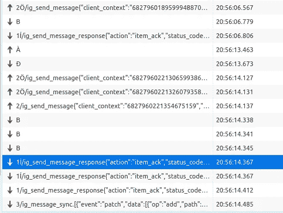
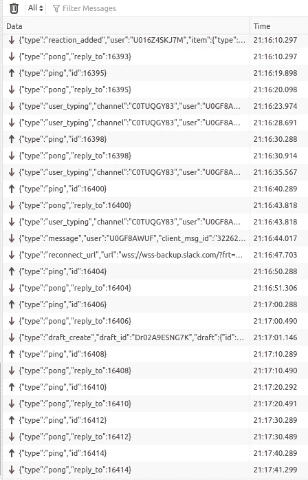
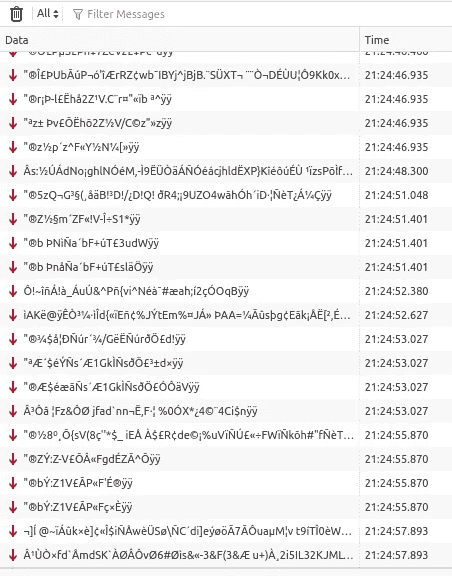
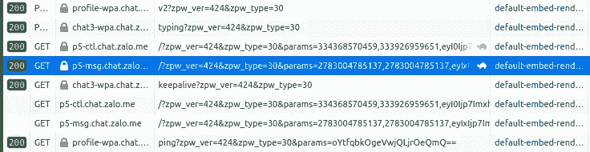

# 即时消息或实时通信:幕后

> 原文：<https://medium.com/codex/instant-messaging-or-real-time-communication-behind-the-scene-8495eb169dff?source=collection_archive---------3----------------------->

对于许多人来说，尤其是使用 Node.js 的人，这个话题并不新鲜。有很多类似“使用 Node.js 创建一个简单的聊天应用程序”、“使用 Node.js Express 和 Socket.io 的实时聊天应用程序”等教程。它们以某种方式使聊天应用程序成为我们中任何一个渴望用 Node.js 开始我们旅程的人的“hello world”。它们存在的好处是给你自信。在某种程度上，如果你能在这么短的时间内(可能是 1 小时)开发出像 Facebook Messenger 这样的东西，你怎么会不自信呢？)?不好的是*没那么容易*。

事实是，无论付出了多少努力，实时通信(RTC)仍然是业界和学术界的热门话题。由于许多失控的影响，在不稳定的网络连接、重复/冲突连接、重复消息等方面。，获得真正的实时体验是具有挑战性的(不，这不是你在完成 hello-world 教程时的感觉。在这篇文章中，我将向你概述脸书、Slack、Discord、Telegram 等大公司所考虑的实际问题。

请注意，由于它只与实时通信有关，我建议您看一看双向通信、WebSocket、服务器发送的事件、短/长轮询、MQTT 等基本概念。此外，它不是关于数据库系统设计或选择或编码，只是 RTC。

# 来自大人物

如果你的老板让你建立一个像 Facebook Messenger，或者 Whatsapp 这样的聊天系统，你会怎么做？以下是你可能需要浏览的列表:

*   找教程？
*   系统设计电子书
*   为 educative.io 上的数百万用户设计一款聊天应用
*   希望脸书工程博客泄露了一些关于他们工作的信息
*   谷歌“如何制作一款聊天应用”，结果超过 30 亿条。

但是有一个基本步骤你应该做，无论是从开始还是在所有这些步骤之后:打开他们的 web 应用程序，检查浏览器和服务器之间的数据交换。这就是我将在下一节向您展示的，基于聊天后端的主要特性:

*   列出线索，列出消息
*   发送消息
*   接收消息
*   打字
*   看见

准备好了吗？我们走吧。

## 脸书信使报

**技术** : MQTT over WebSocket

**功能**:发送/接收信息、打字、请求等。全网插座

看看 WebSocket 请求对它们的*edge-chat.messenger.com*的响应数据。所有加载数据、列表项、发送/接收消息、打字的请求都是通过发布消息和订阅 Websocket 来执行的，而不是通过 API。

## 照片墙

同样的公司，同样的技术。但不是同一起源，因此有所不同。

**技术** : MQTT over Websocket + API

**功能**:通过 Websocket 发送/接收消息和输入，列出项目，已查看，列出在线用户等。超过 API。

## 电报

**技术** : Websocket

**特色**:遍布网络插座

## 松弛的

**技术** : Websocket + API

**功能**:通过 Websocket 接收消息和打字，列表项，通过 API 发送消息。

## 不调和

**技术** : Websocket + API

**功能**:通过 Websocket 接收消息，列表项，发送消息，打字，通过 API 查看。

## 扎罗

**技术** : API 和 HTTP 长轮询

**功能**:通过 HTTP 长轮询接收消息，列表项，发送消息，打字，通过 API 查看。

# 轮到我们了

所以我们得出了一些观察结果:

*   大家伙完全依赖 WebSocket/TCP
*   不是很大的家伙结合 Websocket 从服务器接收消息和 API 向服务器发送消息。
*   扎罗案件——不知道

以下是我的一些想法:

*   虽然使用 Websocket 的性能要比调用 HTTP 请求好得多，但是扩展 Websocket 服务器是一项重要的任务，因为它是一个有状态的通信协议，因为它保持单个持久连接打开。因此，它仅用于服务器向客户端发送消息。如果你把它用于其他逻辑任务，比如记录来自客户的消息，你是在要求它做它不应该做的事情。
*   HTTP API 对于从客户端发送消息很有用，因为扩展无状态 API 比扩展 Websocket 容易得多。此外，它可以重用现有的中间件层进行身份验证、授权、速率限制等。
*   对于那些能够构建可伸缩 Websocket 系统的人来说，为了优化消息传输，最好将 HTTP 请求完全转移到使用 Websocket。它需要同步请求数据的整个机制，即使对于非实时任务也是如此。
*   Instagram 是脸书买的，而不是最初开发的，这是可以理解的，脸书的同步系统(基于 Websocket)和现有的 Instagram one 之间肯定有差距。
*   对于 Slack、Discord 之类的应用，它们利用 HTTP APIs 的可扩展性，只使用 Websocket 从服务器发送消息或用于打字之类的高速率请求。
*   Zalo 采用的方法可以用 3 个优势来解释:I)支持非常旧的浏览器，具有 HTTP 长轮询兼容性，而不是 Websocket，ii) Web Zalo 可能是 mobile Zalo 的额外版本，iii)比 Websocket 更容易扩展 API。

下一次，如果你听到有人建议完全使用 Websocket 来发送和接收消息，这个人一定是:

*   对于实时要求来说是新的，并且缺乏实践经验，最终，系统难以扩展并且不能处理流量需求的增加。
*   或者对脸书或 Telegram 这样的大型系统有非常丰富的经验。

# 幕后

在这最后一节，让我们(理论上)体验一下 hello-world 的老师们从未有机会告诉你的事情(a**中的痛苦)。

## Socket.io？

这个库似乎是一个神奇的灵丹妙药，因为它帮助我们从无聊的任务，如建立服务器，乒乓，保持活力，存储会话，等等等等。如果使用实时 Node.js，你们所有人都可以从它开始。不幸的是，有些事情你会面临深深地卷入其中。

*   **没有 QoS 机制**。当客户端的网络不像预期的那样稳定时，您很快就会感到不适。由于连接性不断上升和下降，消息丢失，并且*socket . io*——没有保证 QoS，不可信。
*   **缩放**？当一个 Websocket 节点过载时，您将扩大或缩小它。你通常都是这么做的，对吗？此时，Redis 适配器将通过 Redis pubsub 成为节点间的桥梁。事情是这样的，pubsub 根据物理节点的数量计算回调的机制在附加到其他发出消息的进程时导致了一些麻烦。此外，因为 Redis pubsub 是在整个 Redis 服务器上使用的，而不是在数据库号上，所以来自不同环境的消息很容易混淆。
*   **断版**。到目前为止，socket.io 仍在开发中，一些功能仅在最新版本上可用。在我们采用它的时候，Typescript 和 Adapters 部分还没有完成，在开发阶段有很多错误。
*   **回叫确认**。我不喜欢回调，就是这样。我只使用 *fire* 和 *forget* events，不再使用，因为我不认为我完全能够处理过度使用回调的任何后果。
*   **ping/pong**不稳定:即使连接良好， *socket.io* 客户端在一段时间后仍然频繁断开连接，无论是更改 ping/pong 默认超时还是增加负载平衡器的超时。所有这些问题都是公开的，如果你有，那只是你运气不好。

总的来说， *socket.io* 做的是最基础的工作。要在一个有稳定性需求的实际项目中采用它，还有很多工作要做，即 QoS 保证、扩展、跟踪这个跟踪那个。最具挑战性的部分是在断开连接时同步客户端和服务器的状态。

## **MQTT**

MQTT 因其传输数据量小而在物联网应用中广受欢迎，因此适用于不可靠的智能设备网络。它采用发布/订阅机制设计，具有良好的内置特性，如 QoS、持续会话、最后意愿消息。这是脸书为他们的实时应用程序使用的协议——MQTT over web socket。

我们尝试了，因为我们希望我们的应用程序达到世界之巅。但是，同样，这并不容易。

*   改变我们的心态。MQTT 中没有房间或路由后端这样的概念。Room 是在 *socket.io* 的后端进行管理，方便创建聊天室，插入新用户，自动向聊天室发送消息。使用 MQTT，您需要自己管理房间，自己向每个主题发送消息，因为主题如何被收听取决于客户端。对某个主题的订阅只有在连接建立之后才会发生，而您在强制客户端取消订阅或订阅新主题方面受到限制。
*   **缩放？**不，这只是营销或广告，不管你怎么称呼，当像 Mosquitto、VerneMQ 或 EMQ X 这样的人说他们可以很好地扩展时。当我们为具有高流量需求的集群尝试了几个这样的消息代理时，出现了许多问题，它们太难了，无法一一修复。这就是生活，你使用他们的产品，你依赖他们，如果他们不解决问题，我们能说什么？
*   **冲突连接。这在客户端非常棘手。为了利用持久会话特性，我们需要保持客户端 ID 不变——如果应用程序没有很好地编码，这是一项具有挑战性的任务。很多时候，即使只定义了一个 MQTT 连接实例，我们也不知道怎么会存在几个具有相同 ID 的实例。结果客户端互相踢开，没有一个可以连接。在这种情况下，只有前端人员可以解决问题。**
*   **安全。**满足 MQTT 系统和 *socket.io* 系统的安全需求更加困难，主要是因为主题和订阅模式的组织。

如果您注意到了，您可能会发现 MQTT 比 API 方法更容易受到攻击。安全问题不仅来自我们的实现，也来自第三方消息代理。我们团队已经修复了 EMQ X 上的一个安全问题，该问题允许绕过 auth 向其他客户端发送虚假数据，并且仍然是一个未解决的问题。至少，实现 MQTT 提高了我们聊天系统的可靠性，避免了像以前那样丢失消息。

# 结论

实时通信是一个具有挑战性的问题，需要大量的知识和经验。同样的要求，即“像脸书一样的信使”可以在 1 小时、3 小时内完成，也可以根据情况在几年内完成。

# 承认

我想对光明(又名明孟门)允许翻译他的[原文](https://kipalog.com/posts/Chat-chit-va-buc-tranh-ve-realtime-communication)表示我的感谢。