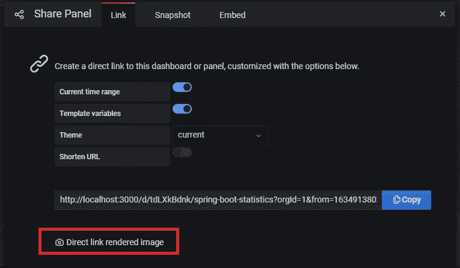

# 将 Graphana 板集成到前端应用中

> 原文：<https://medium.com/codex/integrate-graphana-board-into-front-end-application-120af6fcf684?source=collection_archive---------4----------------------->

我们的微服务集群由许多业务目的服务、前端应用、SQL 和 NoSQL 存储以及不同的编排服务组成，是该集群的核心。显然，为了使集群保持健康状态并对数据流问题做出反应，我们有一个连接到该解决方案的监控堆栈。

我们的监控堆栈是使用默认的产品集构建的:Grafana 和 Prometheus。

除了默认的 POD 指标(RAM、CPU、网络)、REST API 指标、Kafka 主题消耗指标之外，我们还有许多自定义指标，如系统中的实体数量、登录用户比率等。

其中一些业务指标对租户站点管理员(这些是有权限更改其租户配置的特权用户)非常有用。因此，为了避免重复实施和不构建类似的 Grafana 板，我们需要在用户/客户页面上呈现一些现有的 Grafana 指标(或针对客户需求预先配置的指标)。

想法是用额外的页面扩展客户端前端应用程序，为最终用户表示一些特定于业务的指标。同时我们也不想模仿 Grafana 引擎，而是用它作为这个数据的来源。

高级账户委员会就是一个例子。显然，这些数据可以从服务存储中收集，并表示为数字字段，但更复杂的板可能需要重新实现 Prometheus 聚合函数，采用特定的 UI 库等，因此获得已评估的数据作为预构建板对我们来说非常有趣。


这里的复杂性在于，通常基础架构级别由 DevOps 安全会计系统保护，因此只有公司内部用户可以访问基础架构组件，包括 Grafana。租户用户是另一个身份管理系统的一部分，该系统完全独立于 DevOps。

高级基础设施组件模型具有下一个设计:

*   所有供应的服务(包括客户端应用程序和监控堆栈)都存在于私有网络中，并由 Kubernetes 引擎进行编排
*   外部用户只能访问由使用此 API 的服务和客户端应用程序公开的 API，并受客户身份管理系统的保护

由于所有监控服务都位于私有网络中，外部用户无法访问它们以及这些服务公开的 API，因此我们需要一些解决方案来访问私有网络外部的内部监控数据。


作为 PNG 图像的度量

我们回顾了实现这一目标的几种选择:

*   *提供生产 Grafana 的“简化”副本，仅具有一组特定的板，并进行配置以支持* [*匿名访问*](https://grafana.com/docs/grafana/latest/auth/grafana/#anonymous-authentication) *并共享板作为 iframe 组件* —即使计数器也被视为内部数据，也应受到保护并被拒绝
*   *提供生产 Grafana 的“简化”副本，仅具有一组特定的板，并在配置中支持* [*OAuth 访问*](https://grafana.com/docs/grafana/latest/auth/grafana/#anonymous-authentication) *，从主机到 iframe 实施 SSO*—允许呈现具有所有相关控件和选择器的完整 Grafana 页面或板，因此用户可以在需要时进行额外配置(时间范围、过滤等)，但要求支持两个实例。此外，当最终用户需要真正高级的监控功能时，这种解决方案已经足够好了。
*   *在主机上将特定的电路板渲染为图像* —电路板将被表示为 PNG 图像，因此电路板内没有额外的功能

我们从最简单的一个开始——将面板呈现为图像，因为这种方法对于仪表图、条形图和饼图来说已经足够好了。

# 在主机上将特定的电路板渲染为图像

完整的演示解决方案可在[此处](https://github.com/donvadicastro/docker-monitoring-stack)获得。

**安装** [**渲染器插件**](https://grafana.com/grafana/plugins/grafana-image-renderer/)

首先，我们需要扩展默认的 Grafana 安装，支持共享板的渲染器功能。

这是一个外部插件，可以作为一个单独的 docker 容器运行，并链接到提供的 Grafana 实例，这里是“docker-compose”示例:

```
version: "3.7"
services:
  grafana:
    image: grafana/grafana:7.4.5-ubuntu
    ports:
      - 3000:3000
    environment:
      GF_RENDERING_SERVER_URL: [http://renderer:8081/render](http://renderer:8081/render)
      GF_RENDERING_CALLBACK_URL: [http://grafana:3000/](http://grafana:3000/)
      GF_LOG_FILTERS: rendering:debuglinks:
      - prometheusrenderer:
    image: grafana/grafana-image-renderer:latest
    ports:
      - 8081:8081
```

一旦激活，每个 Grafana 板共享功能将包括一个链接到自己的图像。



直接链接到渲染图像

点击此链接将在同一个浏览器中打开电路板，因此您将看到结果。

由于浏览器选项卡共享用户会话，这在其他浏览器或私人模式下不起作用。所以我们需要先认证才能看到结果。

**创建服务用户访问板卡**

很明显，我们不希望使用自己的用户凭证从外部应用程序访问 Grafana 板，我们希望有一种机制可以在应用程序遭到破坏时撤销凭证，所以让我们创建一个用于访问 Grafana 板的服务用户


导航到“配置”—“API 密钥”并创建一个仅具有查看权限的新 API 密钥。

我们将使用生成的密钥作为授权头，从外部应用程序访问 Grafana。我们也可以控制(作为管理员)所有创建的用户和撤销密钥，如果需要的话。

**代理用户请求不公开密钥**

已经可以使用创建的密钥来访问 Grafana 板，但是显然，在客户端应用程序中硬编码它是不安全的，所以我们将代理用户对 Grafana 的请求并返回已经生成的图像。

我们将使用 NGINX 作为代理服务器来处理这样的请求。让我们创建一条新路线:

```
location /metrics/users/premium {
   proxy_set_header Authorization "Bearer $token";
   proxy_pass [http://$grafanaUrl/render/d-solo/$heapBoard](http://$grafanaUrl/render/d-solo/$heapBoard);
}
```

**渲染板为原生 HTML 图像**

最后一步是只将 SRC 标记添加到 HTML 页面中，以呈现该板，例如

```

```

接下来是流量:

*   呈现主页时用户请求*"/metrics/users/premium "*URL
*   NGINX 处理这个 URL，并使用相应的认证头将它代理到内部 Grafana 实例，以通过认证边界
*   Grafana 插件使用默认的过滤器参数(可以在此板上预先配置或在 URL 中作为查询参数传递)从它所连接的板上生成图像，并以 PNG 图像作为响应
*   该板在用户页面上呈现为经典的 PNG 图像

对于现代应用程序来说，最好将加载图像包装到自己的定制组件中，同时控制整个图像加载生命周期。

在从服务器请求适当的数据之前呈现一些指示器，然后在下载后用图像替换它。此外，用适当的图像替换来控制错误。

这将产生更好的 UX，因为渲染需要一些时间，并且在权限冲突或一些网络问题的情况下可能会失败。