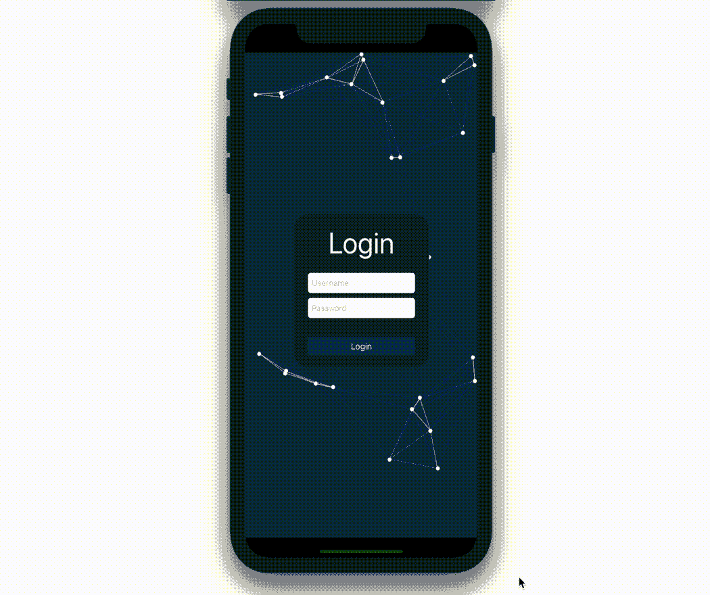

# 如何将 SpriteKit 添加到您的 iOS 应用程序中

> 原文：<https://medium.com/codex/integrate-spritekit-to-your-app-8d66b83f8091?source=collection_archive---------3----------------------->

## [法典](https://medium.com/codex)

## 连接 SpriteKit 和 UIKit，让你的应用程序有所动作

今天，我将向您展示如何将 SpriteKit 和 UIKit 结合在一起。

我将展示如何添加我的示例项目，[粒子主题](/swlh/plexus-effect-swift-a1b478b4d9fa)，作为登录屏幕的背景。您可以按照这些步骤将任何 SpriteKit 项目集成到您的任何…