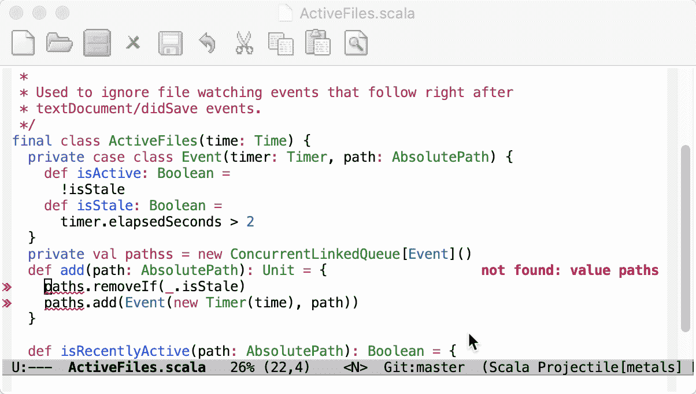

# 在 Ubuntu 上使用 LSP 集成 Scala Metals 和 Doom Emacs

> 原文：<https://medium.com/codex/integrating-scala-metals-with-doom-emacs-using-lsp-on-ubuntu-27acbbde77b8?source=collection_archive---------12----------------------->

# 为什么还要用另一个 HowTo 来集成 Metals 和 Doom Emacs？？？

快速的网络搜索会很快发现至少有两篇关于这个的博文*(我找到的是来自* [*2019*](https://www.matfournier.com/2019-10-05-scalaemacs/) *和*[*2020*](https://siawyoung.com/blog/code/2020-02-06-installing-metals-emacs-doom)*)*。那么…为什么我要创造另一个呢？信不信由你，尽管事实上这两篇博文都令人难以置信地…