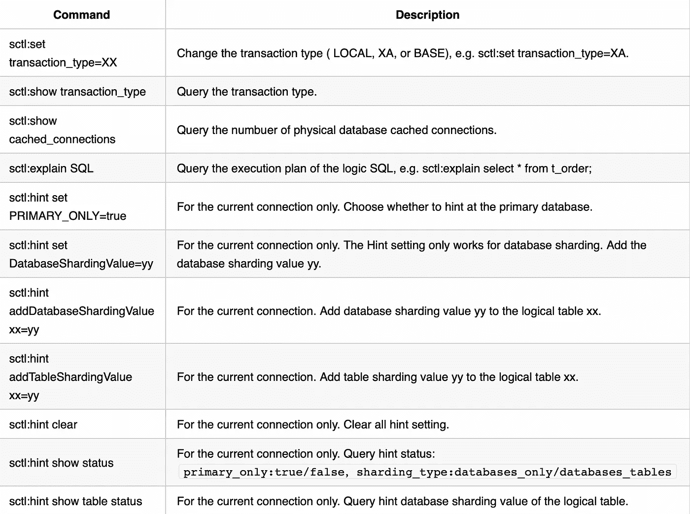
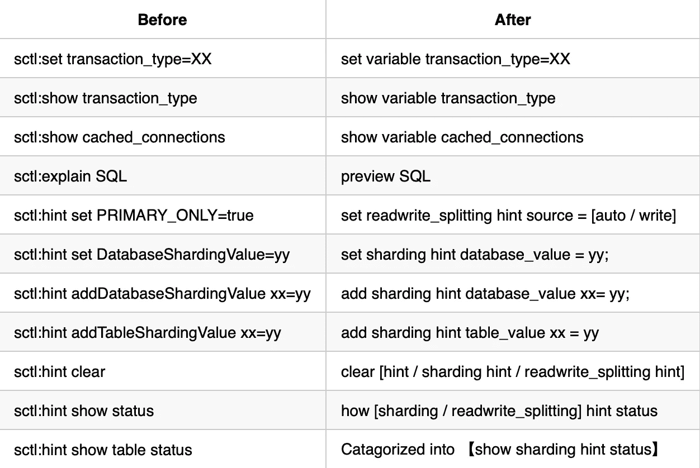

# 将 SCTL 集成到 RAL——使 Apache ShardingSphere 成为数据库管理的完美之选

> 原文：<https://medium.com/codex/integrating-sctl-into-ral-5c64ea45db02?source=collection_archive---------14----------------------->

在孟浩然撰写的上一篇文章[“DistSQL 简介”](https://shardingsphere.apache.org/blog/en/material/jul_26_an_introduction_to_distsql/)中，Apache ShardingSphere 提交者分享了 dist SQL 设计背后的动机，解释了它的语法系统，并令人印象深刻地展示了如何使用一条 SQL 创建一个分片表。

最近，ShardingSphere 社区重新设计了 SCTL 语法和执行引擎，将 SCTL 集成到 DistSQL 语法系统中。现在 RAL 包含了旧的 SCTL 函数，使得 ShardingSphere 的命令语言对于数据库管理来说更加方便。今天，我们的社区作者将介绍这些变化，并详细说明如何使用新的 RAL 命令行。我们总是追求更好的用户体验，我们这次开发的升级只是又一个典型的例子。

# 回顾:什么是 RAL？

RAL 是 DistSQL 的一个子类型。DistSQL 包含三种类型:RDL、RQL 和 RAL。

*   资源和规则定义语言(RDL):创建、修改或删除资源和规则。
*   资源和规则查询语言(RQL):查询和显示资源和规则。
*   资源和规则管理语言(RAL):控制资源和规则管理的高级功能。

# SCTL 是什么？

ShardingSphere 控制语言(SCTL)是 Apache ShardingSphere 对提示、交易类型切换、分片执行查询等增强功能执行一系列操作的命令语言。

SCTL 发出了下面的命令:



# 为什么现在整合 SCTL？

*   SCTL 特性在 ShardingSphere v3.1.0 中发布。当时，我们甚至没有创建 DistSQL 概念——现在 DistSQL 可以提供具有丰富特性和一致概念的新 API。为了避免过度陡峭的学习曲线，我们选择将 SCTL 整合到 RAL。
*   SCTL 语法实际上非常容易识别:它用特殊的前缀“sctl:”标记。解析 SCTL 命令依赖于字符串匹配，而不是使用我们的解析引擎。现在 DistSQL 已经足够成熟了，是时候删除这些特殊代码，让解析器引擎来处理它们了。
*   此外，SCTL 语法不是真正的 SQL。Apache ShardingSphere 5.0.0 刚刚发布，DistSQL 已经是管理资源和规则的最佳解决方案。这个由 ShardingSphere 创建的 SQL 在实践中是真正的 SQL——那么为什么不将 SCTL 集成到 DistSQL 中呢？

# 分析

我们的社区已经详细讨论了如何应对这一变化。最后，我们决定用新的 RAL 命令替换 SCTL 语法(见下表):



**现在，让我们逐一分析这些命令:**

*   `show variable transaction_type`

*查询当前交易类型。*

输入命令

```
mysql> show variable transaction_type;
```

输出

```
+------------------+
| TRANSACTION_TYPE |
+------------------+
| LOCAL            |
+------------------+
```

*   `set variable transaction_type`

> *修改当前交易类型(本地、XA 或基础；不区分大小写)。*

输入命令

```
mysql> set variable transaction_type=XA;
```

输出

a.如果成功，显示“查询正常，0 行受影响”；

b.再次执行`show variable transaction_type`，现在类型为 XA。

*   `show variable cached_connection`

> *查询有多少物理数据库缓存连接。*

输入命令

```
mysql> show variable cached_connections;
```

输出

```
+--------------------+
| CACHED_CONNECTIONS |
+--------------------+
| 0                  |
+--------------------+
```

*   `preview SQL`

> *预览实际的 SQL。这里，我们举一个读写拆分场景的例子。ShardingSphere 支持预览任何 SQL 命令。*

输入命令

```
mysql> preview select * from t_order;
```

输出

```
+-----------------+----------------------------------------------+
| datasource_name | sql                                          |
+-----------------+----------------------------------------------+
| read_ds_0       | select * from t_order ORDER BY order_id ASC  |
| read_ds_1       | select * from t_order ORDER BY order_id ASC  |
+-----------------+----------------------------------------------+
```

**注意:这是读写拆分场景下的提示示例。我们配置了两个规则:读写拆分和分片。配置如下:**

```
rules:
- !READWRITE_SPLITTING
dataSources:
ds_0:
  writeDataSourceName: write_ds_0
  readDataSourceNames: 
    - read_ds_0
ds_1:
  writeDataSourceName: write_ds_1
  readDataSourceNames: 
    - read_ds_1
- !SHARDING
tables:
t_order:
  actualDataNodes: ds_${0..1}.t_order
defaultDatabaseStrategy:
standard:
  shardingColumn: user_id
  shardingAlgorithmName: database_inline
defaultTableStrategy:
none:
shardingAlgorithms:
database_inline:
  type: INLINE
  props:
    algorithm-expression: ds_${user_id % 2}
```

*   `show readwrite_splitting hint status`

> *仅用于当前连接。readwrite_splitting 的查询提示状态。*

输入命令

```
mysql> show readwrite_splitting hint status;
```

输出

```
+--------+
| source |
+--------+
| auto   |
+--------+
```

*   `set readwrite_splitting hint source`

> *仅用于当前连接。设置读写拆分提示策略(自动或写入)。支持的源类型包括:AUTO 和 WRITE(不区分大小写)。—自动:自动读写分割提示—写入:主库的强制提示*

输入命令

```
mysql> set readwrite_splitting hint source=write;
```

输出

a.如果成功，显示“查询成功，0 行受影响”；

b.重新执行`show readwrite_splitting hint status`；显示源转换为写；

c.执行`preview select * from t_order`并查看查询的 SQL 将转到主数据库。

```
mysql> preview select * from t_order;
+-----------------+----------------------------------------------+
| datasource_name | sql                                          |
+-----------------+----------------------------------------------+
| write_ds_0      | select * from t_order ORDER BY order_id ASC  |
| write_ds_1      | select * from t_order ORDER BY order_id ASC  |
+-----------------+----------------------------------------------+
```

*   `clear readwrite_splitting hint`

> *仅用于当前连接。清除读写拆分提示设置。*

输入命令

```
mysql> clear readwrite_splitting hint;
```

输出

a.如果成功，显示“查询正常，0 行受影响”；

b.恢复 readwrite_splitting 提示的默认值；使用`show readwrite_splitting hint status`命令查看结果。

**注意:这里有另一个切分示例作为提示。提示算法用于数据库分片和表分片。分片配置规则如下所示:**

```
rules:
- !SHARDING
tables:
t_order_item:
  actualDataNodes: ds_${0..1}.t_order_item_${0..1}
  databaseStrategy:
    hint:
      shardingAlgorithmName: database_inline
  tableStrategy:
    hint:
      shardingAlgorithmName: table_inline
shardingAlgorithms:
database_inline:
  type: HINT_INLINE
  props:
    algorithm-expression: ds_${Integer.valueOf(value) % 2}
table_inline:
  type: HINT_INLINE
  props:
    algorithm-expression: t_order_item_${Integer.valueOf(value) % 2}
```

`show sharding hint status`

> *仅用于当前连接。查询分片提示状态。*

输入命令

```
mysql> show sharding hint status;
```

输出

初始状态输出为:

验证提示并输入命令:

```
preview select * from t_order_item;
```

现在不输出提示值。查询完全依赖于提示。

`-set sharding hint database_value;`

> *仅用于当前连接。将提示设置为仅用于数据库分片，并添加数据库值=1。*

输入命令

```
mysql> set sharding hint database_value = 1;
```

输出

a.如果成功，显示“查询正常，0 行受影响”；

b.执行`show sharding hint status`；将`t_order_item`的`database_sharding_values`显示为 1。将`sharding_type value`更新为`databases_only`。

c.执行`preview select * from t_order_item`；SQL all 提示给 ds_1:

* **注:根据 YAML 配置的分片规则，当数据库*值为奇数时，提示 ds*1；当数据库*值为偶数时，提示 ds* 0。**

`-add sharding hint database_value;`

> *仅用于当前连接。添加* `*t_order_item*` *的数据库分片值。*

输入命令

```
mysql> add sharding hint database_value t_order_item = 5;
```

输出

a.如果成功，显示“查询正常，0 行受影响”；

b.执行`show sharding hint status`；将`t_order_item`的`database_sharding_values`显示为 5；将`sharding_type value`更新为`databases_tables`；

c.执行`preview select * from t_order_item`；SQL 命令都被暗示给 ds_1:

再次输入 add 命令添加一个偶数值。

```
mysql> add sharding hint database_value t_order_item = 10;
```

输出:

a.如果成功，显示“查询正常，0 行受影响”；

b.执行`show sharding hint status`；显示`t_order_item`的`database_sharding_values`=‘5，10’:

c.执行`preview select * from t_order_item`；SQL 提示包含 ds *0 和 ds* 1:(因为提示值包含奇数和偶数，所以它包含所有目标数据源)

`-add sharding hint table_value;`

> *仅用于当前连接。为* `*t_order_item*` *添加数据库分片值。*

输入命令

```
mysql> add sharding hint table_value t_order_item = 0;
```

输出

a.如果成功，显示“查询正常，0 行受影响”；

b.执行`show sharding hint status`；显示`t_order_item`的`database_sharding_values`为‘5，10’，而`table_sharding_values`为‘0’；

c.执行`preview select * from t_order_item`；提示条件如下图所示；每个数据库只查询`t_order_item_0`:

**注:根据 YAML 配置的分片规则，当** `**table_value**` **为奇数时，提示**`**t_order_item_1**`**；当** `**database_value**` **是偶数时，提示** `**t_order_item_0**` **。跟** `**add sharding hint database_value**`挺像的**；您可以在** `**add sharding hint database_value**` **中设置多个提示值，以覆盖更多碎片。**

`clear sharding hint`

> *仅用于当前连接。清除分片提示设置。*

输入命令

```
mysql> clear sharding hint;
```

输出

a.如果成功，显示“查询正常，0 行受影响”；

b.清除分片提示并恢复默认；使用`show sharding hint status`；才能看到结果。初始状态是:

`clear hint`

> *是一个特殊的命令，因为它包含了* `*clear readwrite_splitting hint*` *和* `*clear sharding hint*` *的特性。它可以清除读写拆分和分片的所有提示值。使用命令，您将获得初始状态。*

设置提示值，然后执行命令；

```
mysql> clear hint;
```

输出

a.如果成功，显示“查询正常，0 行受影响”；

b.Get readwrite_splitting 提示默认值和分片提示默认值；使用`show readwrite_splitting hint status ;`或`show sharding hint status;`命令查看结果。

**注意:请记住:如果需要使用 DistSQL 提示，需要启用 ShardingSphere-Proxy 的配置** `**proxy-hint-enabled**` **。更多信息请阅读:**[https://sharding sphere . Apache . org/document/current/cn/user-manual/sharding sphere-proxy/props/](https://shardingsphere.apache.org/document/current/cn/user-manual/shardingsphere-proxy/props/)

# 还有更有用的 RAL 命令

RAL 不仅包含了所有的 SCTL 函数，还提供了其他有用的管理特性，包括弹性伸缩、实例断路器、禁用读写拆分的读数据库等。

关于 RAL 的更多详情，请查阅相关文档:[https://sharding sphere . Apache . org/document/current/cn/user-manual/sharding sphere-proxy/dist SQL/syntax/ral/](https://shardingsphere.apache.org/document/current/cn/user-manual/shardingsphere-proxy/distsql/syntax/ral/)

# 结论

这是所有的乡亲。如果您有任何问题或建议，请随时评论我们的 GitHub 问题或讨论部分。欢迎您提交您的 pull 请求，并开始为开源社区做贡献。我们还建立了一个 Slack 频道，您可以在这里与我们社区的其他成员联系，并与我们讨论技术。

# 开源项目链接:

***sharding sphere Github:***[https://github.com/apache/shardingsphere](https://github.com/apache/shardingsphere)

***sharding sphere Twitter:***[https://twitter.com/ShardingSphere](https://twitter.com/ShardingSphere)

***ShardingSphere Slack 频道:***[https://join . Slack . com/t/Apache sharding sphere/shared _ invite/ZT-sbd de 7 ie-sjdqo 9 ~ I 4 rycr 18 bq 0 sytg](https://join.slack.com/t/apacheshardingsphere/shared_invite/zt-sbdde7ie-SjDqo9~I4rYcR18bq0SYTg)

**GitHub 问题:**[https://github.com/apache/shardingsphere/issues](https://github.com/apache/shardingsphere/issues)

***投稿指南:***[https://shardingsphere.apache.org/community/cn/contribute/](https://shardingsphere.apache.org/community/cn/contribute/)

# 参考

[https://github.com/apache/shardingsphere/pull/1586](https://github.com/apache/shardingsphere/pull/1586)

[](https://github.com/apache/shardingsphere/issues/11677) [## 重构 SCTL 问题#11677 apache/shardingsphere

### 在社区中，目前，SCTL 语法是由前置关键字“sctl:”来标识的，并且在…

github.com](https://github.com/apache/shardingsphere/issues/11677) 

# 作者

江·

> *SphereEx 中间件开发工程师&Apache sharding sphere Committer。目前，他负责 DistSQL 和权限控制开发。*


兰程响

> *spherex 中间件开发工程师& Apache ShardingSphere 贡献者。他专注于 DisSQL 设计和开发。*

