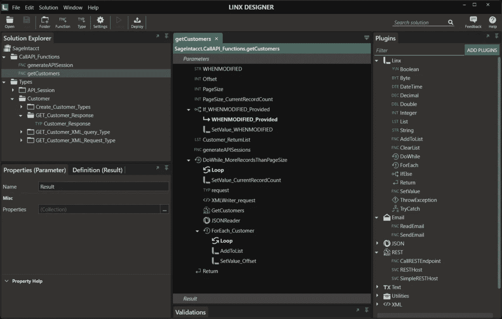
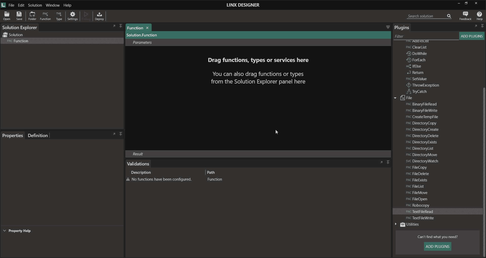

# 使用这些工具简化集成

> 原文：<https://medium.com/codex/integrating-stuff-a-look-at-why-system-integration-is-so-hard-and-what-can-be-done-to-make-it-d243f71dd7f8?source=collection_archive---------16----------------------->

生活在一个不断连接的世界中，让每个应用程序与另一个应用程序对话是我们的目标。我说这是目标，因为现实是必须有人来构建集成功能。假设您曾经参与过一个集成项目，甚至冒险开发了一个允许两个应用程序以任何方式共享数据、协同工作或共享功能的领域。在这种情况下，你知道这可能是相当具有挑战性的。

幸运的是，这样的集成项目正变得更加易于管理，尤其是对于现代应用程序和平台。任何事情都有一个可用的 API。在 REST APIs 时代之前，有 SOAP，或者天理不容， ***直接数据访问*** 。

如果您希望进行集成，有几件事情需要考虑:

*   我为什么要整合？
*   这两个(或更多)系统将如何相互作用？
*   我将使用什么来促进这种集成？

当然，我们可以问更多的问题，但是在这篇文章中，让我们关注这些问题。在我们深入研究这些问题之前，最好从基础开始:

# 什么是系统集成？

系统集成是将不同的系统和软件结合起来，使它们能够协同工作的过程。它也是系统或应用程序与其他系统、应用程序或设备进行交互的过程。

有些人会争辩说，集成就是数据交换，尽管这在一定程度上是正确的，但我们必须认识到系统功能的共享。例如，如果一个应用程序保存数据，而另一个应用程序用于向客户发送电子邮件，我们需要创建一个集成，允许我们访问这些数据，以便通过电子邮件向我们的用户发送报告。要做到这一点，我们需要两种系统都有一点。这是一个非常简单的例子，但是你已经掌握了它的要点。

集成系统是一个专门处理这种交互的应用程序。当两个应用程序没有自然或内置的交互方式时，这可能是必要的。想想您公司中那些没有 API 或集成特性的遗留系统。

由于我们也在朝着 API 成为规范的方向发展，集成变得越来越容易。API 使得访问应用程序的数据和特性变得更加容易，而不必直接钻研它们的数据源。在 API 成为一件大事之前，许多集成必须通过直接访问一个应用程序的数据库来完成，读取该应用程序生成的文件，或者必须编写一段自定义代码来直接访问该应用程序。

这听起来似乎很简单，从某种程度上来说，确实如此。如果你只是需要调用一个 API，那么这并不困难(当然这取决于所讨论的 API 的独特复杂性)。棘手的部分来自编排和基础设施。何时发生什么，如何使用数据/功能？在开始集成之前，一定要理解您的需求以及这些系统是如何交互的。

除了理解所需的交互之外，您还必须选择工具来促进集成。在这里，您可以选择代码，但也可以选择低代码选项。选择低代码选项可以允许您使用预定义的组件和功能，这些组件和功能专门用于促进与特定系统和应用程序的集成和交互。

# 为什么集成具有挑战性？

每次整合都不一样。有些会很难，有些会很容易。根据您正在集成的系统，您与该系统的交互方式会因其架构、技术甚至用于构建该系统的方法而有所不同。如前所述，许多系统都有使集成和交互更加容易的 API。然而，一些旧的和更定制的系统可能没有这样的奢侈。

任何集成项目的很大一部分都是对我们如何检索数据和访问系统功能的适当分析。正确理解我们如何与之交互是成功集成的关键，尤其是如果您需要构建一个需要与许多不同系统/应用程序交互的集成系统。

# 了解需求

我要问的第一个问题是**为什么**我们需要开发这种集成。最终目标是什么？这听起来可能很奇怪，但是我发现人们经常不理解这个需求。从个人经验来看，这是一个灾难的处方。

理解需求将引导你完成整个集成。它将确保您选择正确的集成方法，选择正确的工具来促进您的集成等等。您是否需要通过 API 进行交互，或者是否需要从文件、数据库表或任何组合中读取数据的直接数据访问场景。在这种情况下，您可能会受益于一个允许您快速创建小 ETL 的工具。

您不必完全理解所有最小的细节，但是对我们为什么构建集成的基本理解是至关重要的。我们这样做是为了访问数据吗？我们需要从一个系统中开始一些功能吗？这种整合的结果是什么？

# 理解互动

一个系统如何与另一个系统交互？你对前一个问题的回答会影响到对这个问题的回答。每个集成都是不同的。没有两个系统是相同的，这取决于它们是什么时候开发的，使用什么工具开发它们，以及在开发时流行什么方法和技术。

例如，假设我们有一个系统或流程需要访问另一个系统或流程中的数据。如果有可用的 API，我们可以简单地使用它来检索所需的数据。如果没有可用的 API，交互就会变得更加复杂，因为我们必须找到一种方法从其他系统中检索数据。这可以通过直接数据库读取、直接文件读取或任何其他方式来完成，这取决于这两个系统允许什么。

通常，您无法在两个系统之间进行直接的交互，在这种情况下，您要么需要使用一个工具来创建一个集成系统或工具，要么您需要创建一个。这就是为工作选择正确的工具变得重要的地方。

# 选择工具

现在是有趣的部分:为工作选择工具。有很多选择；您可以编写一些代码来促进 API 调用，使用专门的集成工具来促进特定的交互，甚至使用低代码工具来构建您的集成系统。前面问题的答案将指导这一过程。系统之间交互的需求和类型将决定您需要选择的工具是否有任何技术特性。

我最近参与了一个集成项目，其中一个系统必须从 Sage Intacct 中检索数据。我用 [Linx](https://linx.software/) 制作了我的解决方案，因为它是我开发这些集成的首选工具。

我发现最难的部分是**开始**。我将用我最近的经验 Sage 集成作为例子。需要从 Sage 中提取数据，以便在另一个应用程序的报告中使用该数据。

我使用 Linx 连接到 [Sage web 服务并提取数据](https://linx.software/blog/sage-intacct-integration/)。这带来了一些挑战，比如弄清楚 Sage web 服务是如何工作的。首先，我必须检索一个会话 ID(他们的身份验证版本)。检索到会话 ID 后，我可以调用相关的 web 服务函数来检索数据，并将其写入数据库，我的其他进程可以使用它。在这里阅读更多关于我如何调用 Sage Web 服务的内容。

对于这种简单的集成，我基本上需要创建一个中间人流程，或者中间人应用程序，通常称为中间件:

iddleware 是连接其他两个软件应用程序的软件。它通常用于计算机网络环境中，管理两个或多个程序之间的数据流。

使用 Linx，我创建了一个非常简单的集成应用程序或中间件应用程序，以促进我的两个进程之间的数据流或功能。我无数次使用 Linx 来做类似的事情，将遗留应用程序与较新的平台集成，以确保功能的可访问性，甚至只是为了促进应用程序或进程之间的数据交换和流动。

# 作为集成构建器的低代码工具

有理由使用低代码工具来促进集成。低代码工具通常受益于拥有预定义的功能或组件来与各种系统、技术或对象进行交互。

例如，让我们看看如何使用 Linx 来集成不同的系统。Linx 拥有与 QuickBooks、Xero 和其他特定平台交互的组件，但我们总是可以使用简单的 [REST API 调用组件来使用 REST AP](https://linx.software/blog/no-connectors-no-problem/)I。Linx 还允许直接数据库访问和[轻松文件读取](/@shantoiev/a-better-way-to-import-files-470d835769c1)。

Linx 的屏幕截图——使用 Linx designer 创建集成是什么感觉

假设我们有三个应用程序或系统:

*   一个为客户捕获财务数据的系统，通过 API 提供这些数据
*   将特定客户端交互转储到 CSV 文件中的系统
*   一种系统，通过前端捕获客户端数据，并将电子邮件地址等数据记录在数据库中

我们需要通过电子邮件向每个客户发送一份报告。

使用 Linx 之类的低代码工具，我可以:从数据库中检索带有电子邮件地址的客户列表，从 CSV 中读取客户的特定客户交互，然后将该数据与金融系统中的数据相结合，以构建特定的报告。然后，我可以使用低代码平台将该电子邮件发送给客户端，并将其记录在单独的日志数据库中。所有这些都将使用预定义的组件和拖放界面来完成，这使得这种开发比编码等传统开发技术要快得多。

在 Linx 中，我会使用一个[文件阅读器](https://linx.software/blog/building-a-file-reader/)，一个数据库阅读器和一个 Call REST API 组件来完成这项工作，最后，使用 Linx 组件来编译报告和发送电子邮件[访问邮箱](https://linx.software/blog/using-oauth2-to-access-emails/)。

用 Linx 读取文件

同样，所有这些都可以通过代码实现，但这将花费我更多的时间。低代码工具带来了更快开发的好处，根据经验，我也可以说它使系统开发更简单。当使用低代码工具，尤其是面向开发人员的工具时，您正在使用更大的、预先测试和预定义的块进行开发。

# 最后的想法

每个集成都是不同的，在您开始之前需要适当的考虑和分析。选择正确的工具会有很大的不同。选择一个能够简化开发并允许与集成的不同组件进行更容易的交互的工具。你将有更多的时间专注于弄清楚这些交互的细微差别和业务规则。

确保您:

*   理解你的要求。
*   理解这两个系统需要如何相互作用。
*   选择正确的工具。