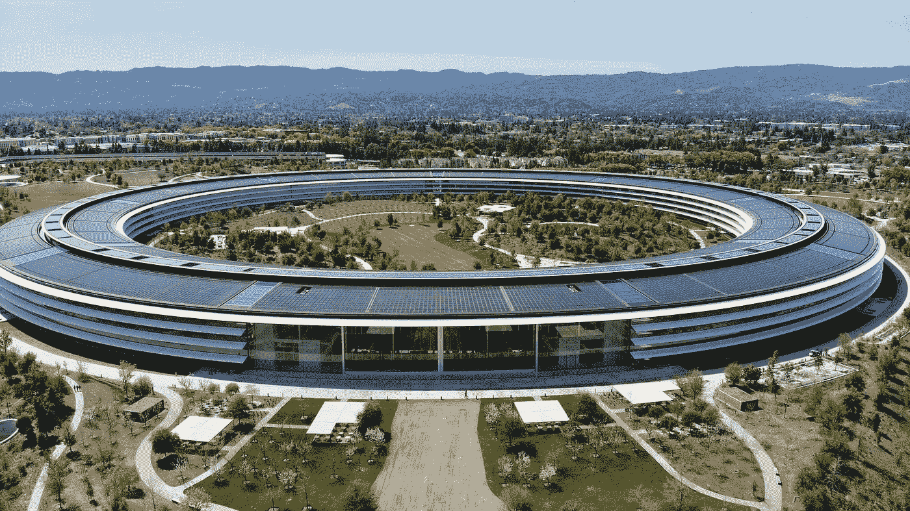

# 英特尔 4004 和 Altair 8800:硅谷的建筑师

> 原文：<https://medium.com/codex/intel-4004-and-altair-8800-architects-of-silicon-valley-23281aa67676?source=collection_archive---------10----------------------->

在数学(确切的说是微分学)中，用“拐点”这个词来描述一个函数改变凹度的点，或者通俗地说，经历曲率的变化。尽管还是一个技术术语，拐点的概念可以应用于数学之外的许多领域。例如，在历史上，拐点可以被认为是某个事件或范式转变改变了历史进程的地方。第一个日历的诞生、印度-阿拉伯数字系统的发明、克里斯托弗·哥伦布登上西印度群岛以及约翰内斯·古腾堡发明印刷机都是历史拐点的突出例子。

然而，并不是所有的历史拐点都在遥远的过去。如果你希望找到最近的伟大历史转折点，那么看看 20 世纪 70 年代的硅谷就知道了。说微处理器改变了世界是一种保守的说法。在这一技术发展之前，计算机运行在需要与穿孔卡交互、维护笨重的真空管和分时操作的大型机上。此外，它们每台价值约 100 万美元，因此只有军队、大学和富有的公司才能拥有它们。

将这与当前的计算技术状态进行对比。即使是中等收入的普通公民，也可以走进百思买，然后带着阿波罗 11 号美国宇航局成员可用的更多处理能力离开。然而，这一巨大的转变并非偶然，而是英特尔 4004 处理器和 Altair 8800 个人电脑发展的直接结果。从这两项发明开始，20 世纪 70 年代的一系列其他发展，如 MS-DOS 和 Apple 1，随之而来，永远改变了技术和硅谷。本文的目的是概述 20 世纪 70 年代微处理器革命的历史和原因，以及这场革命如何反过来改变了硅谷的技术和风险投资行业。回答这些问题对于理解这个世界上最大的技术中心的现状和未来是不可或缺的。

为了理解英特尔 4004 微处理器和 Altair 8800 的发展和原因，需要了解一些基本的计算历史。虽然帮助人类计算的机器已经存在了几千年，从希腊的 Antikythera 机制到印度的算盘，但第一台被称为“差分机”的可编程计算机是由英国数学家和发明家查尔斯·巴贝奇在 1833 年制造的。巴贝奇的工作激励了天才和博学的阿达·洛芙莱斯继续巴贝奇的工作，在 19 世纪中叶为巴贝奇设想的计算机开发了一个名为“提花织机”的程序。随着 20 世纪电子学的兴起，巴贝奇和洛夫莱斯关于可编程计算机的想法利用电子管等电子元件得到了改进。其中第一个是“微分分析器”，这是一种严格为解决复杂微分方程而构建的科学计算机，由麻省理工学院的 Vannevar Bush 在 1927 年发明(IEEE Spectrum)。作为富兰克林·罗斯福总统的国防研究委员会主席，布什也帮助创建了著名的电子数字积分器和计算器，或 ENIAC 计算机，具有讽刺意味的是，直到 1946 年战后才完成。然而，ENIAC 的英国对手“巨像”在赢得第二次世界大战中发挥了重要作用，它做了从计算炸弹轨迹到破解德国密码的一切事情。

然而，战争结束后，人们并不立即需要计算，因此计算技术一度停滞不前。然而，当英国数学家艾伦·图灵在 1946 年写信给他的同事约翰·冯·诺依曼，谈到存储程序计算机的可能性时，这个时期就结束了。这个消息一传到美国，研究马上就开始了。仅仅一年后，贝尔实验室的物理学家威廉姆·肖克利和他的同事发明了金属氧化物半导体场效应晶体管(MOSFET)，这是一种重定向和放大电流的设备。晶体管是计算机的组成部分。没有它们，存储程序、逻辑门以及构成现代计算机的其他一切都无法有效运行。甚至在 1956 年，在晶体管成为计算机不可或缺的一部分之前，当肖克利因 MOSFET 晶体管获得诺贝尔奖时，他就知道他的发明有着比科学实验更大的价值。1956 年，就在获得诺贝尔奖几个月后，威廉姆·肖克利成立了肖克利半导体实验室，总部设在加州的帕洛阿尔托。然而，这家公司并不十分成功，因为肖克利盛气凌人的个性和日益增长的偏执激怒了他的员工，其中八人离开，开始了一个新的和改进的半导体制造商:1957 年飞兆半导体。硅谷诞生了。

英特尔 4004 处理器是 20 世纪 70 年代微型计算机革命背后的计算机处理器，它有一个前身:飞兆 8 位集成电路(CPU world)。1960 年，物理学家兼飞兆员工罗伯特·诺伊斯发明了集成电路。就上下文而言，集成电路是为了在计算机系统内处理布尔和二进制代数或逻辑运算而排列的大量晶体管。没有集成电路，现代计算机就不可能存在。戈登·摩尔是飞兆半导体公司的工程师，也是诺伊斯的同事，他在 1965 年指出，“芯片上晶体管和电阻的数量每 18 个月翻一番”，这句话今天被称为摩尔定律。从 1960 年到 1968 年，诺伊斯和摩尔完善了他们的集成电路设计，最后，在意识到其商业潜力后，决定成立自己的公司来制造微处理器。1968 年 7 月 18 日，英特尔公司成立。

成立仅 4 年后，英特尔就挖到了金子。它的 4004 微处理器拥有引领个人计算的一切必要条件。它不仅利用了新的硅栅极技术(减少了热过载并提高了效率)，而且它还是一个模块化芯片，可以模块化地集成到具有独立 I/O、RAM 和 ROM 功能的不同计算系统中。这种新的设计模式引发了其他公司以及英特尔(CPU world)推出 4004 衍生处理器的浪潮。1974 年，英特尔发布了 8080 CPU，这是一款按比例放大的 4004 微处理器，晶体管数量约为 4004 的 3 倍(如果你计算一下，这与摩尔定律惊人地接近)，模块性甚至更好。毫不奇怪，这将是英特尔 8080 驱动的第一个真正的个人电脑。

如果没有 Altair 8800，我们今天所知的硅谷就不会存在。苹果、微软和许多其他专注于个人计算软件和硬件的技术公司都是从硅谷对这种微型计算机的痴迷中诞生的。Altair 8800 令专业工程师和电子爱好者惊叹不已，因为它是第一批可以以相对较低的成本组装和使用的计算机之一。此外，由于英特尔 8080 处理器，用户只需去一趟当地的电子商店，就可以定制计算机的许多端口和外围设备。Altair 8800 在业余爱好者中非常受欢迎，以至于 1975 年《大众电子》杂志将这款电脑作为封面。更重要的是，Altair 8800 不仅引发了一场硬件革命，也开始了硅谷向软件的转型。1975 年 3 月，Altair 8800 背后的小型电子公司 Micro Instrumentation and Telemetry Systems(MITS)的创始人埃德·罗伯茨(Ed Roberts)收到了两个大学生的来信，想知道他们是否可以为 Altair 编写一些基本代码，并与罗伯茨建立合作伙伴关系。罗伯茨让他们为牛郎星编写代码，但对组建任何商业企业不太感兴趣。因此，这两个大学生在新墨西哥州的阿尔伯克基成立了一家小型软件公司，出售他们为 Altair 编写的基本代码(现在官方称之为 Altair-Dos ),并授权给其他机器使用。这些大学生的名字是比尔·盖茨和保罗·艾伦，他们的小公司名叫微软。

因为牵牛星 8800，不仅微软成立了，许多其他硅谷巨头也成立了。事实上，史蒂夫·沃兹尼亚克和史蒂夫·乔布斯早在 1976 年就在门洛帕克的家酿电脑俱乐部积累了大量摆弄 Altair 8800 电脑的经验，并由此萌生了苹果公司的想法。几年后，在 20 世纪 80 年代初，当微软和苹果上市，将他们的员工和创始人变成千万富翁时，整个技术行业都注意到了，硅谷再也不是原来的样子了。

如果一个人今天想在硅谷开一家公司，风险资本是未来业务增长的一个必不可少的因素。现代风险资本本质上是一家由外部投资者组成的公司，这些投资者同意为一个高风险、高回报的项目提供资金，以获得公司的部分股份。由于其固有的风险承受能力，美国几乎一半的现代风险投资行业都集中在硅谷，每年超过 60%的风险投资美元流向硅谷公司。20 世纪 70 年代的微处理器和微型计算机革命创造了微软和苹果，使得以前规避风险的私募股权公司愿意投资于资本少但潜力大的计算机或软件公司。对硅谷的风险投资者来说，追随这一趋势已经获得了回报，因为许多人继续通过投资亚马逊、脸书和谷歌等最新的技术公司来赚取财富。不幸的是，20 世纪 70 年代的微机革命也无意中永远伤害了硅谷的创新。通过向投资者展示计算机技术可以遵循摩尔定律并变得如此可扩展，硅谷的整个风险投资行业继续过度投资于软件风险投资，而忽略了不相关行业中其他有价值的技术。尤其是在清洁能源、医疗保健、交通运输等领域需要创新的时候，硅谷 85%以上的风险投资资金仍然流向了软件公司(风险投资危机)。这种投资模式不仅阻止了硅谷的硬件创新(除了像特斯拉这样的例外)，还让风险投资行业越来越不注重技术。在一个曾经以投资未来为荣的行业，风险投资公司的现任高管现在只寻求盈利。

探究了微型计算机革命的历史及其对硅谷风险投资业和科技业的影响之后，现在预测这片科技之地的未来就容易多了。除非出现另一个重大的历史拐点，即除非有人发明出另一种具有高度商业潜力的可扩展的非数字技术，否则硅谷的风险投资公司将继续压倒性地资助软件公司，而忽略其他类型的技术。如果这一趋势持续下去，美国最具创新性的地区将失去其技术优势和发明意识。如果这种情况发生，也许下一个技术拐点不会出现在斯坦福或英特尔的实验室，而是出现在全球尚未被发现的创新中心。

参考资料:

小卡斯蒂芬。"芯片名人堂:英特尔 4004 微处理器第一个单芯片 CPU 是一个小本经营的项目." *IEEE Spectrum* ，Spectrum . IEEE . org/chip-hall-of-fame-Intel-4004-微处理器。于 2021 年 9 月 27 日访问。

放克杰弗里。"风险资本的危机:修复美国破碎的创业体系."*《美国事务》*，第五卷第一期，2021 年春，American Affairs journal . org/2021/02/the-crisis-of-venture-capital-fixing-Americas-broken-start-system/。于 2021 年 9 月 27 日访问。

“英特尔 4004 处理器家族。” *CPU 世界*，[www.cpu-world.com/CPUs/4004/index.html.](http://www.cpu-world.com/CPUs/4004/index.html.)2021 年 9 月 27 日访问。

凯耶，格林尼斯汤普森，编辑。"一场正在进行的革命——英特尔公司的历史."*英特尔*，1984 年，[www.intel.com/Assets/PDF/General/15yrs.pdf.](http://www.intel.com/Assets/PDF/General/15yrs.pdf.)2021 年 9 月 27 日访问。

马佐尔，斯坦利和安妮·菲茨帕特里克。"仙童符号计算机。"IEEE 计算历史年鉴，第 1 卷第 1 期，2008 年，第 92–95 页。muse.jhu.edu/article/235250.缪斯项目

戈登·摩尔《微处理器:技术革命的引擎》《美国计算机协会通讯》,第 40 卷，第 2 期，1997 年 2 月，第 112+页。盖尔学术档案，link.gale.com/apps/doc/A19238429/AONE?u = nm _ p _ oweb & sid = bookmark-AONE & xid = e 00 cdd 43。于 2021 年 9 月 21 日访问。

摩尔弗雷德。"家酿计算机俱乐部通讯第 5 号(1975 年 7 月 5 日)." *DigiBarn 电脑博物馆*，[www . digi barn . com/collections/时事通讯/home brew/V1 _ 05/index . html .](http://www.digibarn.com/collections/newsletters/homebrew/V1_05/index.html.)2021 年 9 月 27 日访问。

《大众电子》1975 年 1 月号《牛郎星 8800》"*世界无线电史*，World Radio History . com/Archive-Poptronics/70s/1975/Poptronics-1975–01 . pdf，2021 年 9 月 27 日查阅。