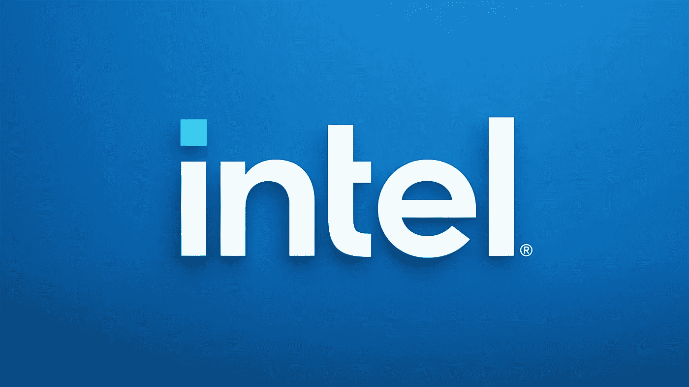
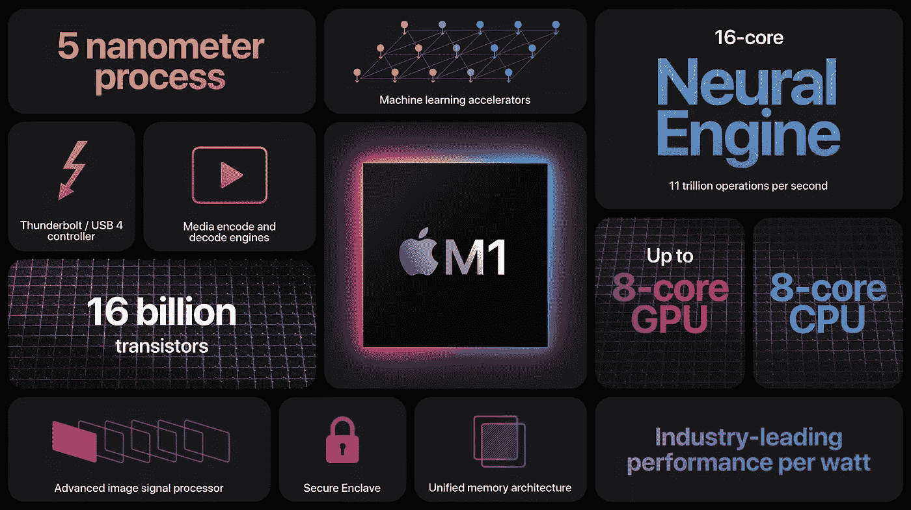
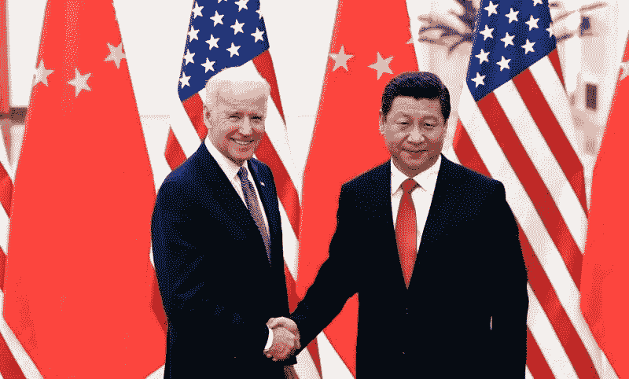

# 英特尔可能会没事的

> 原文：<https://medium.com/codex/intel-is-probably-going-to-be-fine-6e0d8d894cc1?source=collection_archive---------21----------------------->

## ….但不是为了正确的理由！

如果你曾经在办公室工作过，你可能有一个同事一直在那里。他或她每天都来上班，做的绝对最少，对变化没有特别的兴趣，没有适应新技术的欲望，就像一个挂钟一样走过场，直到他们最终退休的那一天。

在经历了数年的无话可说之后，芯片行业目前正在经历其历史上最激动人心的变化。这让英特尔处于非常尴尬的境地，因为这可能是他们历史上第一次，他们的产品似乎跟不上竞争。尽管严重缺乏创新，但该公司正准备蓬勃发展，因为他们完全有能力利用西方世界面临的最大问题之一。

## 看起来不太好。

如果一年前你问我未来十年英特尔会在哪里，我会想都没想就说:破产了！为什么？因为这家公司已经很久没有做任何有价值的事情了。年复一年，他们错过了新方向的每一艘船，似乎只能用不到增量迭代来推动相同的处理器。即使是该公司最狂热的粉丝(我不知道这样的事情是否存在)也会承认该公司在过去十年的表现并不理想。坦率地说，该公司一直满足于享受他们在行业中相当大的领先优势，认为竞争无处可寻。

问题是，这根本不是真的。竞争的势头越来越大，每年都在缩小差距，直到 AMD 和苹果突然领先，出于某种原因，这似乎让英特尔感到惊讶。

英特尔衰落的一个巨大标志是苹果对他们的处理器非常不满，以至于他们开始设计和制造自己的苹果芯片，并取得了惊人的成果。基本 Macbooks 中的新 M1 芯片不仅仅是越来越好，它们几乎在每一个指标上都以相同的价格摧毁了 windows 笔记本电脑。让事情变得更糟的是，亚马逊和微软正在旁观，他们已经在复制苹果的剧本。[谷歌将在今年 10 月推出自己的芯片，](https://techstory.in/googles-whitechapel-chip-gs101-project/)在新的谷歌 Pixel 6 中，它可能会出现在目前运行英特尔芯片的下一代 Chromebooks 中。亚马逊已经在将他们的服务器芯片转换为 Graviton 芯片的第二代产品，看起来他们不会再回过头来使用 x86。即使是自个性化计算诞生以来英特尔最亲密的合作伙伴之一微软，也在从 x86 过渡的过程中迈出了小步。他们[已经提供了 ARM 版本的 Windows 10 和 11，更不用说设计他们自己的电脑了，运行在 snapdragon ARM 处理器上的 Surface pro X。](/swlh/microsoft-designing-their-own-chips-will-bring-the-chip-industrys-biggest-shake-up-ever-66fa0d48aec5)

投资者很大程度上已经意识到了英特尔的问题，其股票已经持续下跌了两年多。这种情况一直持续到去年 10 月，当时该公司宣布他们将更换首席执行官，这使得股价飙升，人们希望他能够带来一些急需的变化。在接下来的几个月里，帕特·基尔辛格宣布了他带领英特尔走向未来的计划，在英特尔的制造能力和研发方面加倍努力

但是，无论这种新的领导带来了什么，有一样东西是英特尔无法与之竞争的。深度融合。苹果的芯片可以提供惊人的性能，不仅仅是因为它们的晶体管数量，还因为它们可以与 Mac 硬件和软件一起设计。这是英特尔和任何其他芯片设计者无法做到的，因为他们为其他笔记本电脑制造商和软件设计者提供芯片。除非他们开始制造他们自己的带有深度集成操作系统的笔记本电脑，这是极不可能的，我真的看不出他们将如何能够竞争。

## 有前途！

但是尽管竞争激烈，尽管缺乏远见，英特尔将会很好。不是因为他们正在研发的突破性产品，不是因为他们极具天赋的工程师，也不是因为他们惊人的制造能力。在所有这些方面，他们基本上都落在了后面。因为政治，英特尔会没事的。

中国的崛起目前是拜登总统和欧盟委员会议程上的最大议题之一。在这种背景下，芯片制造供应链过于依赖中国也成为去年芯片短缺的焦点。在一个连汽车都离不开硅的世界里，这是一个重大问题。正因为如此，美国和欧洲已经把不惜一切代价将制造业带回西方世界作为优先事项。[英特尔的新任首席执行官深知这一点](https://www.cnbc.com/2021/04/12/intel-ceo-hopes-us-can-reclaim-one-third-of-chip-manufacturing.html)。他在公司未来的战略中表示，他的目标是将全球 1/3 的芯片制造业务带回美国，他还宣布英特尔将在亚利桑那州建造一座价值 200 亿美元的制造工厂。该公司也已经在与欧盟官员就在欧盟境内建立一家工厂进行谈判，要求欧洲纳税人提供 100 亿美元的资金。

不管是好是坏，尽管竞争激烈，英特尔不仅会生存下来，而且会蓬勃发展。就处理器而言，它们可能无法提供最好的，但地理和政治在当今世界同样重要。