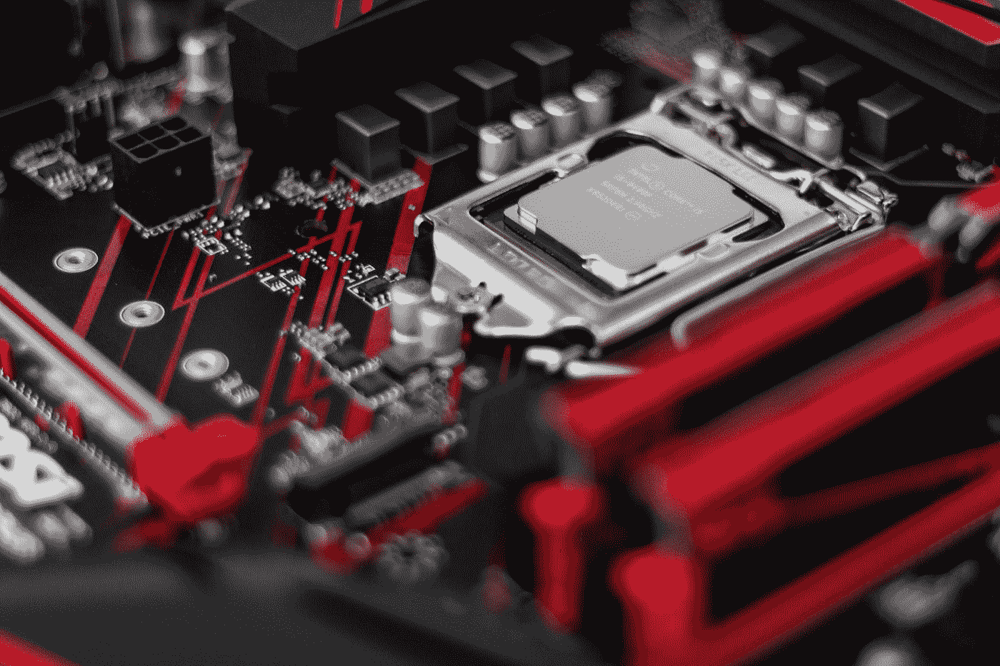

# 英特尔又赢了。一流的。

> 原文：<https://medium.com/codex/intel-wins-again-big-time-4f0e64914792?source=collection_archive---------1----------------------->

## i9–12900 hk Alder Lake——有史以来最快、最耗电和最热的笔记本电脑 CPU，但它到底是为谁准备的？！？

克里斯蒂安·威迪格在 [Unsplash](https://unsplash.com?utm_source=medium&utm_medium=referral) 上拍摄的照片

有史以来最疯狂的笔记本电脑 CPU 大奖被授予……哦，不，不是苹果。它属于英特尔。看啊。这是一个最近似乎只有英特尔喜欢玩的游戏，所以我们给他们颁奖…