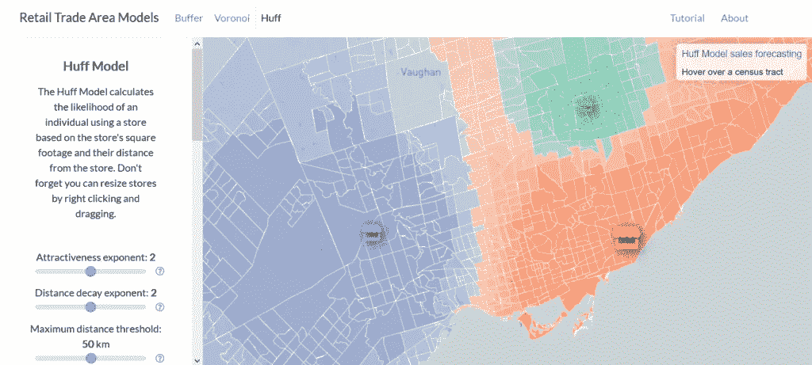
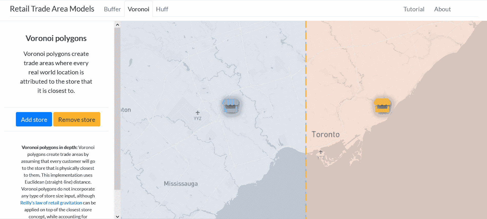

# 零售地理互动介绍

> 原文：<https://medium.com/codex/interactive-introduction-to-retail-geography-cd63678a6510?source=collection_archive---------4----------------------->

## [法典](http://medium.com/codex)

## 谁在哪个商店购物？| [**商贸区模特网 app**](https://gis.jackforsyth.com/)

业务分析师和零售地理学家使用各种各样的模型和数据来了解消费者的决策，以帮助确定新店的位置、定向广告和预测销售。在这种零售分析中，了解商店的交易区域，或者商店的顾客来自哪里，起着重要的作用。我开发了 [**贸易区模型 web 应用**](https://gis.jackforsyth.com/) ，让用户以动态、互动的方式涉足零售地理世界，了解缓冲区、Voronoi 多边形和 Huff 模型，这些是贸易区建模的一些常见模型。

在贸易区模型网络应用程序中展示的哈夫模型

该 web 应用程序提供了一个教程，引导新用户了解贸易区建模和应用程序本身的基础知识。完成教程后(或者对于重复用户跳过它！)，就可以掌控大多伦多地区的零售格局。商店可以添加、删除和重新定位，许多模型参数可以调整。web 应用程序关注三种模式:

[**缓冲区**](https://docs.qgis.org/3.10/en/docs/gentle_gis_introduction/vector_spatial_analysis_buffers.html?highlight=buffer%20spatial%20analysis) **:** 商店周围的缓冲区在离商店指定距离处创建一个区域。可以使用不同的方法来计算距离，例如欧几里德(直线)距离，或者用行驶时间测量的距离。它们交流起来相对简单，但当有重叠的贸易区时可能难以理解，因为它们是一种确定性模型，这意味着假设客户只在一家商店购物。通过纳入收入、教育水平和年龄等客户人口统计变量，缓冲区分析可以变得更加强大，这样商店就可以确定位于目标客户附近。缓冲区的大小可以基于零售分析师的直觉、客户调查或其他定量方法。

[**Voronoi 多边形**](https://www.gislounge.com/voronoi-diagrams-and-gis/) **:** Voronoi 多边形通过假设每个顾客都会去离他们最近的商店来创建交易区。这种实现使用欧几里德(直线)距离。Voronoi 多边形不包含任何类型的商店规模输入，尽管 [Reilly 零售引力定律](https://transportgeography.org/?page_id=9345)可以应用于最近商店概念之上，这说明了商店的相对吸引力。

[**哈夫模型:**](https://gisgeography.com/huff-gravity-model/) 哈夫模型是一种空间交互模型，它根据商店的吸引力(通常是平方英尺或产品种类)、与商店的距离以及其他竞争商店的综合吸引力来计算任何给定顾客选择在商店购物的概率。通常，距离衰减指数用于更好地模拟距离衰减对客户决策的影响，该模型参数的理想值因行业而异。同样，吸引力值根据商店的相对规模放大了商店的顾客“吸引力”。这些模型参数通常会使用来自商店调查的经验数据进行验证，比如在结账时询问顾客的邮政编码。Huff 模型的一些版本包括最大距离阈值，表示客户不会考虑超出的距离。

打开[应用](https://gis.jackforsyth.com/)对模型进行实验！

**Web app 设计**

web 应用程序的设计是让地图在屏幕上占据主导地位。在浏览器窗口的左侧，用户有一个控制面板，他们可以在这里了解地图上显示的模型，添加和删除商店，并在适当的时候调整模型参数。参数更改时，用户会在地图上收到即时反馈，显示其参数更改的结果。这种快速反馈循环旨在**鼓励桌面 GIS 软件所不具备的有趣和探索性的互动。**在屏幕顶部，用户可以在选项卡之间导航，以查看不同的贸易区模型，他们还可以选择返回教程，或在“关于”选项卡中阅读有关 web 应用程序的更多信息。

缓冲区选项卡允许欧氏距离和行驶时间缓冲区

## 履行

使用 HTML/CSS/JavaScript 和第三方库(包括 [Bootstrap](https://getbootstrap.com/) 、 [JQuery](https://jquery.com/) 、[传单](https://leafletjs.com/)、[地图框](https://docs.mapbox.com/api/)和 [Turf.js](https://turfjs.org/) )实现贸易区模型网络应用。Bootstrap 和 JQuery 提供了 web 开发中常见的格式和功能框架。传单为 web 制图组件提供了基础，包括地图本身、大多数基于地图的用户交互和多边形图层。Mapbox 用于基础地图图层，其等时线 API 用于可视化行驶时间缓冲区。Turf.js 是一个基于 JavaScript 的地理空间分析库，它使得在 web 浏览器中执行许多与 GIS 相关的功能和分析变得简单，它用于距离计算、缓冲和创建 Voronoi 多边形。2016 年多伦多(人口普查大都会区)人口普查区域数据是从[人口普查映射](https://censusmapper.ca/) API 收集的，该 API 提供了一个易于使用的接口来从加拿大统计局提取人口普查数据。从 API 检索的数据包括地理空间边界、家庭数量和家庭收入中位数。Huff 模型是用 JavaScript 从头开始编写的，但是使用 Turf.js 的距离计算功能来了解从每个商店到每个人口普查区域质心的距离。

## 限制

web 应用程序提供了零售地理概念的有用介绍，但也有一些重要的限制。其中一个限制是模型缺乏特异性。为了简单起见，缓冲区大小和商店面积从应用程序中抽象出来，但这导致缺乏量化的反馈。哈夫模型还使用欧几里得距离，而不是驾驶时间，这忽略了道路网络和替代交通方式，如地铁或步行交通。此外，Huff 模型还使用普查区域质心，这可能会在大型普查区域中导致违反直觉的结果。Huff Model 选项卡的销售预测方面对每个家庭在商品上花费的金额进行了大量假设，并受到可能超出多伦多 CMA 的商店和客户的边缘效应的影响。

## 未来的工作

该应用程序有助于激发对贸易区建模的兴趣和讨论，但应该更具分析性，以便用于真正的分析。未来的迭代将移除缓冲区大小和平方英尺估计的抽象，以允许有经验的用户在模型中输入准确的值。此外，支持 Huff 模型的更多人口统计数据以及特定行业的参数默认值将帮助用户更快地创建有意义的模型。例如，将人口统计过滤器应用于销售预测将允许销售婴儿服装的商店更恰当地识别有更多新家庭的区域。该应用程序的另一个有用功能是整合房地产数据，以显示城市中实际可供租赁的零售空间，这样用户就可以以更有意义的方式选择他们的候选商店位置。

Voronoi 多边形的交互式演示，包括添加和移动商店

## 摘要

贸易区模型网络应用为有经验和无经验的分析师提供了学习更多零售地理知识的机会。虽然更多的分析组件已经从应用程序中抽象出来以利于简化，但用户不仅可以了解缓冲区、Voronoi 多边形和 Huff 模型，还可以直接与它们进行交互，并了解商店位置和模型参数的变化如何影响多伦多的零售景观。除了零售领域，您还能想到这些模型的其他用例吗？如果您对这方面的工作有任何问题或反馈，请联系我！