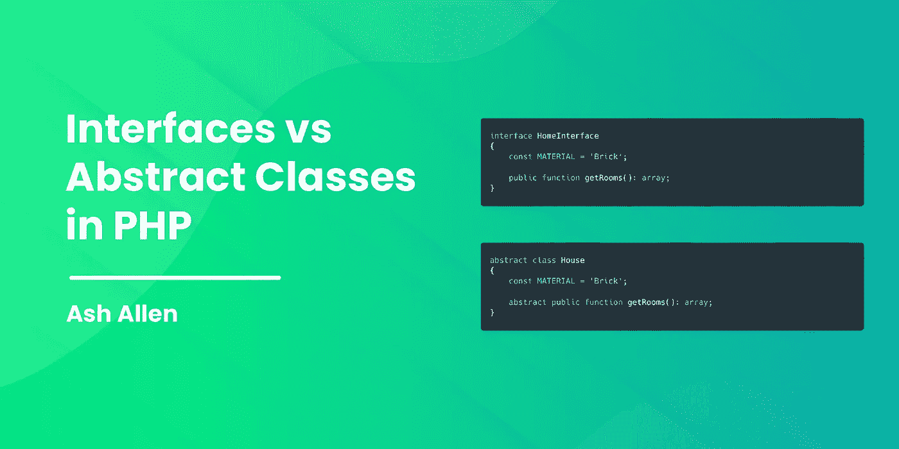

# PHP 中的接口与抽象类

> 原文：<https://medium.com/codex/interfaces-vs-abstract-classes-in-php-d2c9d34b599?source=collection_archive---------11----------------------->



# 介绍

我最近发表了一篇博文，谈到了[如何使用接口](https://ashallendesign.co.uk/blog/using-interfaces-to-write-better-php-code)编写更好的 PHP 代码。它涵盖了什么是接口、它们能做什么以及如何使用它们使 PHP 代码更具可扩展性和可维护性的基础知识。

我在帖子上得到的一个主要评论来自开发者，他们想知道“什么时候我会使用接口而不是抽象类？”。所以我想我应该写这篇文章来解释 PHP 中抽象类和接口之间的区别，并简要概述何时应该使用它们中的任何一个。

# 什么是接口？

用基本术语来说，接口应该描述实现它们的类将如何构建，它们就像描述它们应该包含的公共方法和常量的蓝图。

接口**可以是:**

*   用于定义类的公共方法签名。
*   用于定义类的常数。

接口**不能**是:

*   自行实例化。
*   用于为类定义私有或受保护的方法。
*   用于定义类的属性。

接口用于定义一个类应该包含的公共方法。重要的是要记住，一个接口总是要由一个类来实现的，所以在这里你只需要定义一个方法的签名，例如:

```
interface HomeInterface
{
    const MATERIAL = 'Brick';

    public function openDoor(): void;

    public function getRooms(): array;

    public function hasGarden(): bool;
}
```

而不是像这样:

```
interface HomeInterface
{
    public string $material = 'Brick';

    public function openDoor(): void
    {
        // Open the door here...
    }

    public function getRooms(): array
    {
        // Get the room data here...
    }

    public function hasGarden(): bool
    {
        // Determine if the home has a garden...
    }
}
```

根据 php.net 的说法，接口有两个主要用途:

1.  允许开发人员创建可互换使用的不同类的对象，因为它们实现相同的一个或多个接口。一个常见的例子是多个数据库访问服务、多个支付网关或不同的缓存策略。不同的实现可以交换，而不需要对使用它们的代码进行任何更改。
2.  允许函数或方法接受符合接口的参数并对其进行操作，而不关心对象还可以做什么或如何实现。这些接口通常被命名为 Iterable、Cacheable、Renderable 等等，以描述行为的重要性。

使用我们上面的接口并坚持房子的类比，我们可以创建实现`HomeInterface`的不同类，比如`House`、`Flat`或`Caravan`。通过使用接口，我们可以确保我们的类包含了 3 个必要的方法，并且都使用了正确的方法签名。例如，我们可以有一个看起来像这样的`House`类:

```
class House implements HomeInterface
{
    public function openDoor(): void
    {
        // Open the door here...
    }

    public function getRooms(): array
    {
        // Get the room data here...
    }

    public function hasGarden(): bool
    {
        // Determine if the home has a garden...
    }
}
```

# 什么是抽象类？

抽象类非常类似于接口；它们并不是被设计成独立实例化的，而是为您提供一个基本的实现来进行扩展。

以我们上面的家为例，如果一个界面是你的蓝图，那么一个抽象类就是你的展示室模型。它很好用，是一个很好的家居范例，但你仍然需要布置和装饰它，让它成为你自己的家。

抽象类**可以是:**

*   用于使用“抽象”方法(类似于接口)为类定义方法签名。
*   用于定义方法。
*   用于定义类的常数。
*   用于定义类的属性。
*   由子类扩展。

抽象类**不能**是:

*   自行实例化。

为了理解这意味着什么，让我们看一个抽象类的例子:

```
abstract class House
{
    const MATERIAL = 'Brick';

    abstract public function openDoor(): void;

    public function getRooms(): array
    {
        return [
            'Bedroom',
            'Bathroom',
            'Living Room',
            'Kitchen',
        ];  
    }

    public function hasGarden(): bool
    {
        return true;
    }
}
```

我们的`House`类是抽象的，这意味着我们不能直接实例化其中的一个。为了能够使用它，我们需要继承它。例如，让我们创建一个扩展我们的`House`抽象类的`MyHouse`类:

```
class MyHouse extends House
{  
    public function openDoor(): void
    {
        // Open the door...
    }

    public function getRooms(): array
    {
        return [
            'Bedroom One',
            'Bedroom Two',
            'Bathroom',
            'Living Room',
            'Kitchen',
        ];  
    }
}// This will not work:
$house = new House();

// This will work:
$house = new MyHouse();
```

你可能已经注意到，在`House`类中，我们声明了一个名为`openDoor()`的抽象公共方法。这基本上允许我们定义一个子类应该包含的方法的签名，就像我们定义一个接口一样。如果您想与您的子类共享一些功能，但又想强制它们包含自己的一些方法的实现，这确实很方便。

在这个特殊的例子中，子类可以像往常一样覆盖`getRooms()`和`hasGarden()`方法，但是不需要包含它们。为了展示这一点，我们重写了`getRooms()`方法，以展示如何在子类中改变它的行为。

# 如何决定使用哪一个

这真的取决于你的目标是什么。为了保持我们的房子类比，如果你正在创建蓝图，可以用于以后设计不同类型的房子，那么你需要一个界面。

如果你建造了一所房子，现在你需要定制副本，那么你需要一个抽象类。

让我给你举几个例子:

# 何时使用界面

为了帮助我们理解什么时候使用接口，让我们看一个例子。假设我们有一个包含`buildHome()`方法的`ConstructionCompany`类，如下所示:

```
class ConstructionCompany
{
    public function buildHome($home)
    { 
        // Build the home here...

        return $home;
    }
}
```

现在，假设我们有 3 个不同的类，我们希望能够构建并传递给`buildHome()`方法:

1.  `class MyHouse implements HomeInterface extends House`
2.  `class MyCaravan implements HomeInterface`
3.  `class MyFlat implements HomeInterface`

我们可以看到，`MyHouse`类扩展了`House`抽象类；从概念的角度来看，这是完全合理的，因为房子就是房子。然而，从抽象类扩展出`MyCaravan`或`MyFlat`类是没有意义的，因为它们都不是房子。

因此，因为我们的建筑公司能够建造房屋、大篷车和公寓，这就排除了 us type 暗示`buildHome()`方法中的`$home`参数是`House`的实例。

然而，这将是一个完美的地方，我们可以键入 hint 我们的方法，只允许实现了`HomeInterface`的类被传递。例如，我们可以将该方法更新为:

```
class ConstructionCompany
{
    public function buildHome(HomeInterface $home)
    { 
        // Build the home here...

        return $home;
    }
}
```

这样做的结果是，我们可以确信，无论我们经过一所房子、一辆大篷车还是一套公寓，我们的`ConstructionCompany`类都将拥有它所需要的信息，因为传入的 home 对象将总是包含我们所需要的必要方法。

你可能也在想“为什么我们不创建一个抽象类而不是一个接口呢？”。然而，重要的是要记住 PHP 只支持单一继承，一个类不能扩展一个以上的父类。所以，如果你想在将来扩展你的一个类，这会变得非常困难。

# 何时使用抽象类

让我们看一个类似于上面例子的场景。让我们想象一下，我们有一个与我们的`ConstructionCompany`相似的`HouseConstructionCompany`。但是，在这个例子中，我们将假设`HouseConstructionCompany`只建造房屋，其他什么都不建造。

因为我们知道我们只需要能够建造房屋，我们可以键入 hint 我们的方法只接受扩展了`House`抽象类的类。这真的很有用，因为我们可以始终确保我们不会将任何其他类型的房屋传递给建筑公司没有建造的方法。例如:

```
class HouseConstructionCompany
{
    public function buildHouse(House $house)
    { 
        // Build the house here...

        return $house;
    }
}
```

# 结论

希望这篇文章能让你深入了解 PHP 中接口和抽象类的区别。它还应该给你一个不同场景的简要概述，当你应该使用其中任何一个。

如果这篇文章对你有所帮助，我很乐意听听。同样，如果你对这篇文章有任何改进的反馈，我也很乐意听到。

对于我的 Laravel 开发者读者来说，如果他们想进一步了解关于接口的内容，可以在这里阅读 Laravel 中关于如何使用接口来[使用策略模式的内容。](https://ashallendesign.co.uk/blog/using-the-bridge-pattern-in-laravel)

如果你有兴趣在我每次发布新帖子时得到更新，请随意[在这里注册我的时事通讯](https://ashallendesign.co.uk/blog)。

非常感谢 [James Mahy](https://www.linkedin.com/in/james-mahy-84524615/) 、 [Aditya Kadam](https://www.linkedin.com/in/aditya-kadam-77a594134/) 和 [Andrew Palfrey](https://www.linkedin.com/in/andrew-palfrey/) 校对这篇文章并给我反馈！我推荐看看詹姆斯正在建立的一个很酷的社交网络: [SoSa](https://sosa.net/) ，一个有趣、友好、隐私至上的社区，让在线社交变得简单而有趣！

也非常感谢 [Jess Pickup](https://www.linkedin.com/in/jessica-pickup-481030186/) 一如既往地创造了另一个很酷的博文图片！

继续建造令人敬畏的东西！🚀

*原载于*[*https://ashallendesign.co.uk*](https://ashallendesign.co.uk/blog/interfaces-vs-abstract-classes-in-php)*。*