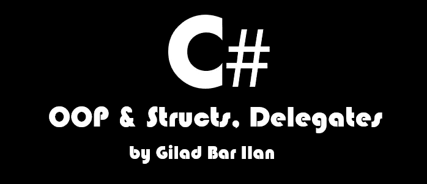
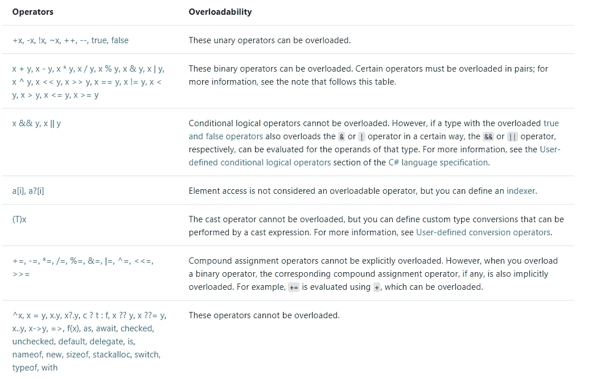

# 中级 c#[面向对象和结构、委托]

> 原文：<https://medium.com/codex/intermediate-c-oop-structs-delegates-4ffd0cd70cf?source=collection_archive---------2----------------------->

## [法典](http://medium.com/codex)

## 在 C#中，我们可以找到一些有用的 OOP 工具来使我们的代码变得更好。

在本文中，您将找到一些可以在您的程序中使用的中间工具。

> **注意——操作(操作符重载，索引器)同样适用于结构。然而，这些例子将使用类。**



# 索引器

如果你曾经使用过 List <t>或者 Dictionary <t>并且你对一个类的实例如何像数组一样拥有索引感到好奇，那么答案就是索引器。</t></t>

在下面的例子中，我们可以看到如何创建一个索引器。

T —代表我们从索引返回的值。

[int index] —用户作为参数给出的索引。

```
public class SampleClass<T>
{
   protected T[] arr; public SampleClass(params T[] arr2)
   {
     this.arr = arr2;
   } public T this[int index]
   {
     get { return arr[index]; }
     set { this.arr[index] = value; }
   }
}
```

**注意**我们可以让索引器获取&返回我们想要的任何类型，如果我们实现了字典<字符串，例如字符串>，我们可以用**字符串键替换 **int index** 。**

主要功能:

```
public static void Main(string[] args)
{
  SampleClass<int> sample = new SampleClass<int>(5,4,3);
  sample[0] = 10; //now the array value is [10,4,3]
  Console.WriteLine(sample[0]); //prints 10 to the console
}
```

**在 Visual Studio 中，可以编写索引器，然后按两次 tab 来自动完成索引器结构。**

# 运算符重载

如果你曾经考虑过如何创建一个能够使用像++和==这样的操作符的实例，那么答案就在这里。

```
public class Circle
{
   public double radius { get; set; }
   public const double PI = Math.PI; public Circle(double Radius)
   {
     this.radius = Radius;
   }

   public static Circle operator ++(Circle myCircle)
   {
     myCircle.radius++;
     return myCircle;
   }
}public static void Main(string[] args)
{  
   Circle instance = new Circle(45.45);
   instance++;
   Console.WriteLine(instance.radius);
}
```

运算符重载的语法是“public static (Type) operator(我们要重载的运算符)(Arguments)”。

> **当我们谈到操作符重载时，第一个论据就是实例。**

在 operator ++中，实例的唯一交互是与实例本身的交互，所以这就是++重载中的参数只能是调用方的原因。

因为++是一个赋值操作符，操作符返回的类型应该和调用这个操作符的类相同，在我们的例子中是 Circle。

如果你的编译器返回的值不是你的实例在++上的类，那么它将会产生一个编译时错误。

```
instance = instance + 1; //raise error if it's not a Circle type
```

但是，比如说，因为这个操作应该返回一个布尔值，那么在这种情况下，这个值是**而不是作为实例值存储的**。

这就是为什么我们可以让操作符重载来返回一个 bool(因为值不存储在名为 operator 的类中，我们可以让==返回我们想要的任何类型，但是，最好的做法是返回一个 boolean)。

```
public static bool operator ==(Circle myCircle, Circle myCircle2)
{
  if (myCircle.radius == myCircle2.radius)
    return true;
  return false;
}public static bool operator !=(Circle myCircle, Circle myCircle2)
{
   if (myCircle.radius != myCircle2.radius)
     return true;
   return false;
}
```

在上面的例子中，我们比较了实例半径，如果满足条件，则返回 true 或 false。

请注意，如果重载==运算符，则必须实现！=运算符。

==和！=需要根据它们返回的内容进行匹配，例如我们不能说= = return bool wherever！=返回 double。

```
public static void Main(string[] args)
{
  Circle first = new Circle(50);
  Circle second = new Circle(60); Console.WriteLine(first == second); //prints false
}
```

运算符重载有一些限制，例如，我们不能重载所有类型的运算符。



该列表摘自[https://docs . Microsoft . com/en-us/dot net/cs harp/language-reference/operators/operator-overloading](https://docs.microsoft.com/en-us/dotnet/csharp/language-reference/operators/operator-overloading)

# 扩展ˌ扩张

扩展是我们为已有类添加方法的方式。

如果您曾经想给字符串类型添加一个名为 PrintMe 的函数，将字符串值打印到屏幕上，这是最佳的方法。

## 为什么不继承到其他类？

可以问的一个问题是，为什么不以类 Random 为例，并使 CustomRandom 类继承 Random。

答案是我们不能，不是所有的类都可以继承到其他类，因为它们被标记为**密封类，**这意味着其他类不能在继承中实现它们，这意味着我们为这个类定制函数的唯一方法是使用扩展。

## 我们如何进行扩展？

为了进行扩展，我们需要遵循一些规则，首先，一个扩展函数应该嵌套在一个**静态类中。**

该方法应遵循以下规则。

```
public static class SampleExtentions
{
  public static (Return Type) SampleFunction(this (Type Name) name)
  {
    //implementation
  }
}
```

在上面的例子中，**“this(Type Name)”**指的是我们要为其添加函数的类型。

```
public static class StringExtention
{
   public static void PrintMe(this string value)
   {
      Console.WriteLine(value);
   }
}
```

在上面的例子中，我们对 string 类型做了一个名为 PrintMe 的扩展。

在下面的例子中，我们在 main 函数上使用了那个方法。

```
public static void Main(string[] args)
{
   string myName = "Hello World!";
   myName.PrintMe();
}
```

**注意** —扩展方法中的类型也可以是值类型。

# 代表

## 什么是委托？

总而言之，委托是一个函数指针。这意味着委托将函数的地址存储为值。

委托也可以将其他地址链接到他的值，但是，所有的函数都应该使用相同的参数并返回相同的值。

我们可以通过说“delegate_name(arguments)”来执行所有的函数(因为它们采用相同的参数)，并返回最后一个函数添加的返回值。

要创建委托，我们需要编写:

```
public delegate int SampleName(int value); //declare the delegatepublic static void Main(string[] args)
{
  SampleName delegate1 = Function1; //get the address of the function
  delegate1 += (int value2) => return (value2 + 3); //chained them

  int val = delegate1(5); //stores 8 because of the last function chained delegate1 += Function1; //by that we execute the same function twice
}public static int Function1(int value)
{
  Console.Write("Hi!");
  return value + 1;
}
```

## 函数 <t>&动作 <t>&谓词</t></t>

**普通委托的问题**

普通代表有各种各样的问题。例如，如果我们有两个委托，它们接受相同的参数并具有相同的返回类型，但委托本身有不同的名称，我们就不能将它们链接起来或使它们相等。

```
public delegate void FirstDelegate();
public delegate void SecondDelegate();public static void Main(string[] args)
{
  FirstDelegate fi = Console.WriteLine;
  SecondDelegate se = Console.WriteLine;
  Func1(fi); //OK
  Func2(se); //raise error because delegates not from same type
}public static void CallDelegate(FirstDelegate fi)
{
  fi(); //execute the delegate
}
```

由于这个问题，用户可以毫无理由地用相同的参数和相同的返回类型反复定义相同的委托。

## **解决方案**

不是任何问题都有解决方案，但是代表们有。

C#提供了另外两个名为 Func 和 Action 的预定义类，它们是一种委托。

**动作** —在动作中，我们简单地编写动作<参数类型>，动作将获得参数类型的参数，但返回值将是空的。

*   **动作**示例

```
Action<int> act = (int value) => Console.WriteLine(value);//pass a bigger function
act += (int value) => 
{
   Console.WriteLine(value);
   Console.WriteLine(value);
};
```

在上面的例子中，我们将一个获取整数并返回 void 的函数链接到委托。

*   什么是 **Func**

在 Func 中，事情就像在运行中一样，唯一的区别是最后一个泛型类型是返回类型。

```
Func<int, string> fun_ = (int value) =>
{
  return value + " Hello";
};string b = fun_(5); //now b stores "5 Hello"
fun_ += (int value) =>
{
   return value + " World";
};
b = fun_(5); //now b stores "5 World"
```

*   什么是**谓词**

谓词很像操作，它们之间的主要区别是谓词总是返回 bool 而不是 void。

```
public static void Main(string[] args)
{
  Predicate<int> pre = (int value) => value == 5;
  Print(pre, 1,2,3,4,5,6); //prints 5 as the number of times it shown in the params
}public static void Print(Predicate<int> pre, params int[] arr)
{
   foreach(int item in arr)
   {
     if(pre(item)) //check the condition in the predicate
     {
        Console.WriteLine(item);
     }
   }
}
```

## **他们如何提供帮助？**

Func & Action & Predicate 在全局范围内使用，所以使用它们是一个好习惯，因为每个人都使用它们，我们避免了相同的委托使用不同名称的问题。

然而，考虑这样一个事实，有时创建我们自己的委托是好的，因为 Func & Action & Predicate 很难理解它们的目的是什么，并且我们不能给它们一个好的解释，因为它们已经定义了 name 类。

恭喜你！你已经写完文章了！希望你喜欢。