# 间歇时间序列预测

> 原文：<https://medium.com/codex/intermittent-time-series-forecasting-be530f819880?source=collection_archive---------8----------------------->


我们综述了可用于预测间歇时间序列的各种方法。我们的工作在 2021 年国际神经网络联合会议上发表并被接受。这篇文章是我们调查报告的简短摘要。

这是我们论文的链接:[https://ieeexplore.ieee.org/document/9533963](https://ieeexplore.ieee.org/document/9533963)

在给定的时间序列中，如果非零值只是以间歇的方式出现，那么它可以被认为是一个间歇的时间序列。

我们可以看到这样的系列发生在制造业。例如，一家制造公司可能不会每周都收到所有产品的订单。事实上，对于某一种产品的需求出现的每一周，在下一次需求出现之前，通常会有几周没有需求。这些需求间隔标有 0。这可以在零件数据集中观察到，我们将在本文中使用其中的几个系列。

有多种模型被设计成适合间歇时间序列。克罗斯顿、迪帕尔等。都是这种模式的例子。此外，还可以使用回归和分类模型进行预测。

## 指数平滑法

虽然可以使用指数平滑等方法来拟合间歇时间序列，但它假设给定的时间序列是连续的。

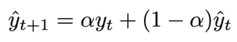

指数平滑方程

当试图拟合一个间歇的时间序列时，这可能会有问题。在此代码中，我们尝试使用前 42 个步骤来预测最后 8 个时间步骤:

```
library(tsintermittent)
exp_model <- sexsm(data, h=8, outplot=TRUE)
```

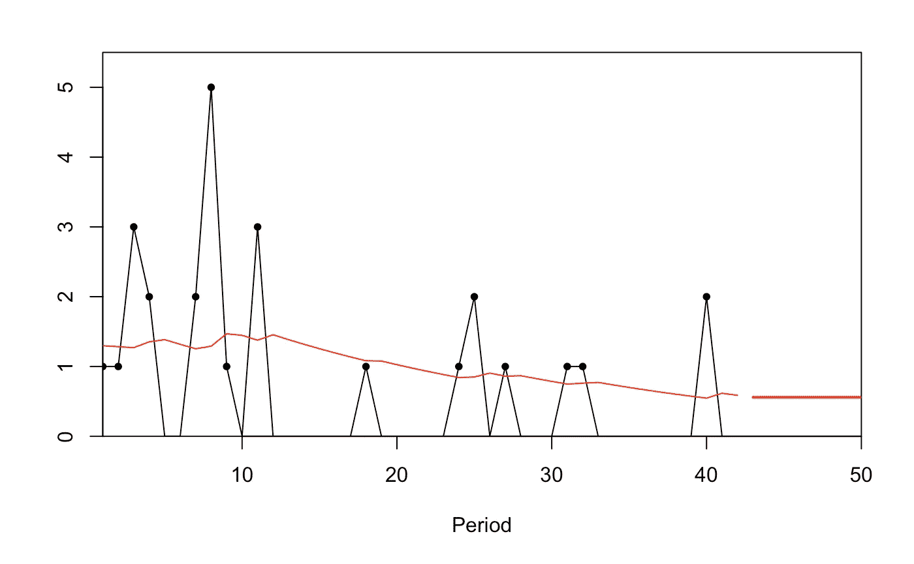

用于间歇时间序列的指数平滑。较粗的红线表示指数平滑的平均预测值。

使用指数平滑，我们得到 0.52 的绝对和误差。

## 克罗斯顿模型

克罗斯顿模型通过在给定的时间序列上拟合两个指数平滑模型克服了这个问题。给定的时间序列被分离为需求(非零值)和它们之间的间隔。每个序列都符合指数平滑模型。

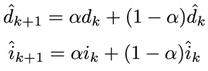

d 表示需求，I 表示需求发生的时间间隔

预测需求和间隔之间的比率作为每个时间步长的预期需求返回。

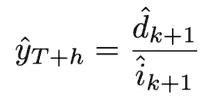

每个时间步长的预期需求

正如我们所观察到的，该解决方案的绝对和误差为 0.16。与指数平滑相比，这要小得多。

```
croston_model <- croston(data, h=8,outplot=TRUE)
```

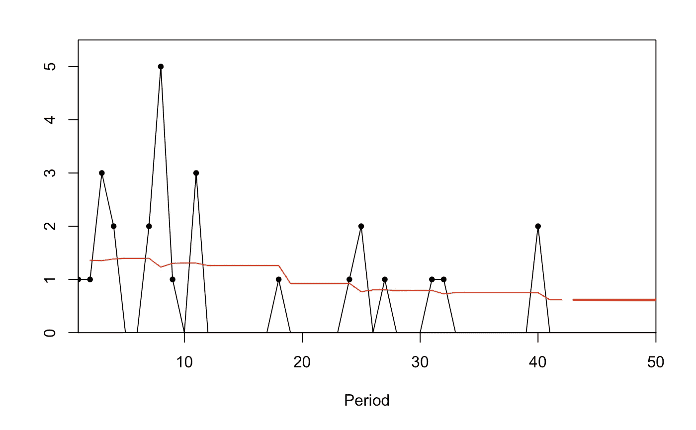

克罗斯顿模型的解。较粗的红线代表该方法的平均预测值。

## 特恩特、辛特托斯和巴拜(TSB)模型

尽管结果有所改善，但克罗斯顿模型可以进一步修改，以获得更好的结果。克罗斯顿模型仅在需求发生时更新。当模型必须遇到长时间间隔时，这可能是一个问题。

TSB 模型使用需求发生的概率序列，而不是区间序列。需求发生期间该模型的更新公式如下所示:

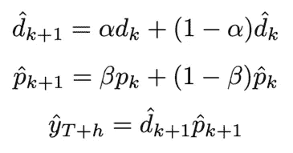

需求发生时的 TSB 更新方程

即使没有需求发生，等式也会更新。这与克罗斯顿模型不同。

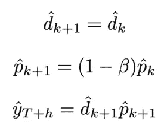

需求区间的 TSB 模型更新方程

我们可以注意到，在下图中，TSB 模型甚至在需求区间更新参数。

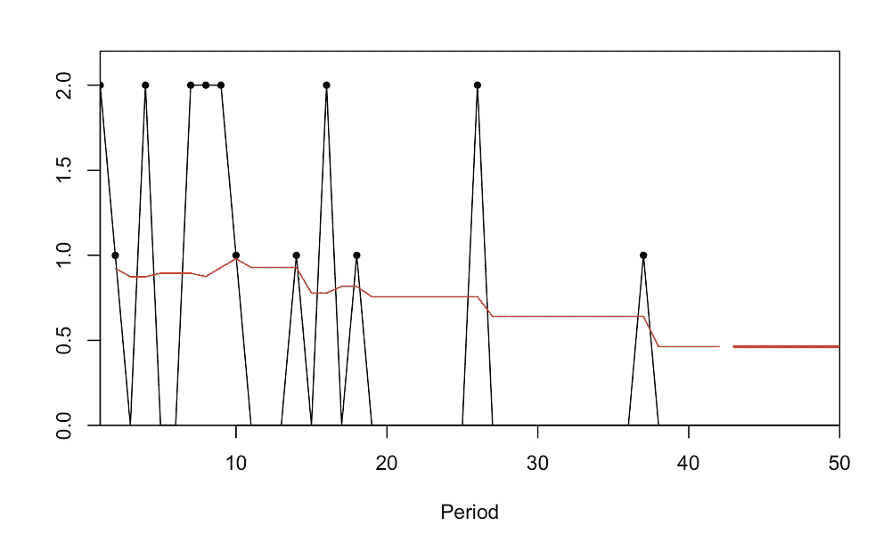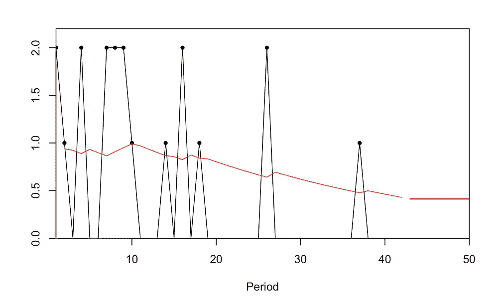

这两张图表从左到右分别来自克罗斯顿和 TSB 模型。

## 迪帕尔

最近，深度学习也被用于预测间歇性时间序列。例如，像 DeepAR 这样的模型已经成功地纳入了深度学习，以提供良好的结果。

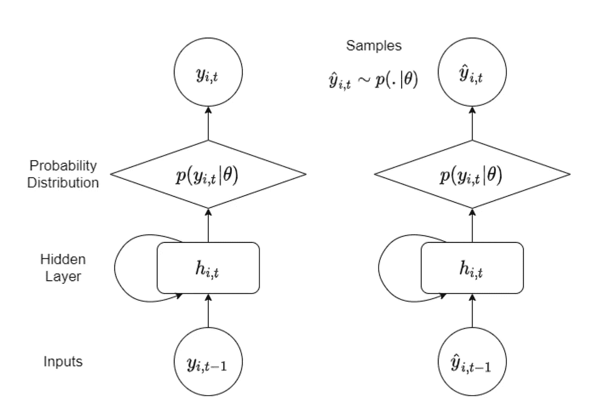

DeepAR 的架构

DeepAR 的架构试图将时间序列建模为负二项式分布。在包括零件数据集在内的大多数时间序列数据集中，需求仅为正，因此负二项式分布是一个合适的选项。此外，这种架构可以一起处理任意 N 个相同长度的时间序列。该架构的目标是最大化分布的对数似然性。

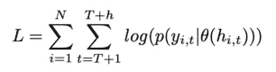

N 系列 DeepAR 的对数似然函数通过调整使用隐藏层值 h 的参数θ来优化。

总之，没有一种模式能胜过所有其他模式。这将取决于我们手头的数据集的类型。例如，像 Croston 这样的经典方法可以很好地处理较短的数据集。使用多种方法在给定数据集上进行试验对于获得最佳解决方案至关重要。

这篇文章只包含了目前用于间歇时间序列预测的现有方法的概述。还有其他方法可以解决这个问题。

本文([链接](https://ieeexplore.ieee.org/document/9533963))由万事达卡的 AI 车库团队发布。它包含了对其他方法的广泛解释，还包括对这些方法的实验观察。

**感谢您的阅读！在您离开之前，请随时与我联系，并在 LinkedIn 上关注我们的团队:**

[](https://www.linkedin.com/in/karthikeswaren/) [## Karthikeswaren R -数据科学专家-万事达卡人工智能车库| LinkedIn

### 查看 Karthikeswaren R 在全球最大的职业社区 LinkedIn 上的个人资料。Karthikeswaren 有 4 份工作…

www.linkedin.com](https://www.linkedin.com/in/karthikeswaren/) [](https://in.linkedin.com/company/mastercard-ai-garage) [## 万事达卡人工智能车库| LinkedIn

### 万事达卡人工智能车库| LinkedIn 上有 483 名粉丝。加速人工智能的采用，获得…

in.linkedin.com](https://in.linkedin.com/company/mastercard-ai-garage)