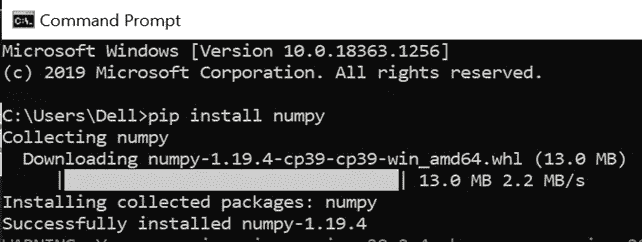
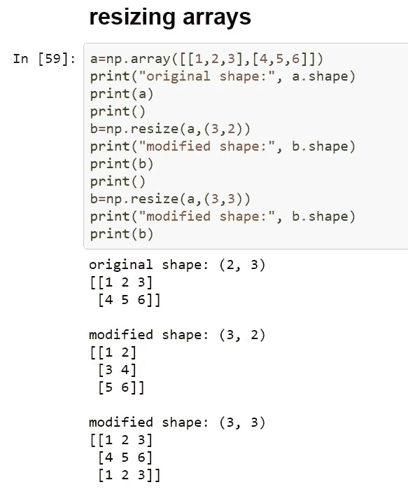

# 实习生日记:数字基础

> 原文：<https://medium.com/codex/intern-diaries-numpy-basics-caf6e30460d5?source=collection_archive---------4----------------------->

塞尔吉·卡夫雷拉在 [Unsplash](https://unsplash.com?utm_source=medium&utm_medium=referral) 上的照片

作为一名机器学习实习生，我们需要了解 NumPy 库的基础知识。这是蟒蛇神赐予的非常美丽的造物，它让我们的生活变得更加轻松。

在这个博客中，我将分享 NumPy 库的基本知识，并让你欣赏它们的美丽。

# **NumPy 到底是什么？**

*   NumPy 是一个 python 包，用于 Python 中的科学和数值计算。它提供了高性能多维数组和处理数组的工具。Python 中的很多模块都是建立在 NumPy 之上的。这一事实使我们有必要研究它的基本原理。
*   如上所述，它的主要对象是一个多维数组。它是同质元素(相同类型)的表，用正整数索引。这种阵列的维度被定义为轴。
*   NumPy 的 array 类也称为数组，其中 ND 代表" **N** umpy **D** ata "。
*   它也经常与 **SciPy** (科学 Python)和 **Matplotlib** (绘图库)库一起使用。这种“神圣的三位一体”通常被视为对 **Matlab** (一种用于技术计算的高性能语言)的替代。

我很确定你一定想知道，**“嗯，NumPy 数组看起来不错，但是我们不能只使用 Python 列表吗…”。**

对于正常的计算，我们可以使用列表，但是， **NumPy 数组更好，原因有三:**

*   它们使用的内存比我们的 python 列表少得多。

导入 Sys 包是为了找出我们的对象所占用的内存

*   它们更加优化，因此执行时间更短。

*   它有更多的功能，这使得它使用方便。

既然我们对 NumPy 有了更多的了解，我们现在将继续讨论如何安装 NumPy 包。

# **安装 NumPy**

*   进入你的命令提示符，输入“pip install numpy”。

*   安装完成后，我们可以在 IDE 中输入“import numpy as np”来导入 numpy。

做完这些之后，我们现在进入实质问题，即 NumPy 数组上的操作和函数。

# **NumPy 函数列表:**

ndim、itemsize 和 shape 的输出

*   **ndim:** 我们检查 NumPy 数组的维数，如上图所示。
*   **itemsize:** 使我们能够用字节来检查单个项目的大小。在上面的例子中，我们的数组由大小为 4 字节的整数元素组成。
*   **shape:** 它帮助我们找到“形状”或者更确切地说是数组的顺序。例如，在上面的例子中，我们看到 numpy 数组 a 有两行和三列。这给了我们(2，3)的形状。
*   **dtype:** 指的是数据类型。它用于改变 NumPy 数组中每一项的数据类型。

*   **np.zeros()和 np.ones( ):** 这个函数以所需数组的形状作为自变量，分别为我们提供全 0 和全 1 的 Numpy 数组。

*   **np.arange( limit ):** 以一个数为自变量(此处为极限)，提供从 0 到(limit-1)数的 NumPy 数组。我们的“正常”范围函数和 np.arange()给出的输出如下:

# **与字符串相关的操作:**

*   **np.char.add( ):** 它用于字符串的元素级连接，如下例所示。这里，我们可以看到第一个列表的第一个元素与第二个列表的第一个元素连接在一起。类似的事情也会发生在其他元素上。

*   **np.char.multiply( ):** 参数是要按元素连接的数组，以及每个元素与其自身连接的次数。在下面的示例中，该函数重复“good”五次。

*   **NP . char . capital():**将字符串数组作为参数，返回数组中每个元素的首字母大写的元素。
*   **np.char.title(array ):** 将一个数组作为参数，返回按元素排序的字符串的大小写版本。

*   **np.char.center(string，length，fill char = '<char>'):**它返回一个长度在参数中指定的字符串，并使参数中给定的字符串居中对齐。

*   **np.char.split(array):** 对于参数中传递的数组中的每个元素，它返回该字符串元素中的单词列表。如果分隔符不是作为参数提供的，那么它使用空格进行分隔。
*   **np.char.strip( array，'< char > '):** 参数是 array 和一个要从数组中的每个元素剥离的 char。请注意，只有前导和尾随字符被删除。
*   **NP . char . split lines(array):**对于数组中的每个元素，我们看到它在出现' \n '字符的地方分割我们的字符串。
*   **np.char.join(array，separator):** 对于每个元素，返回其中每个字符由指定分隔符分隔的每个元素。例如，在下面的示例中，第二个序列中的第一个元素的单个字符与参数中第一个序列中提到的第一个分隔符分开。
*   **np.char.replace( array，new_str，old_str):** 对于数组中的每个元素，用新字符串替换旧字符串。

# 数组操作操作:

*   要更改形状，请注意，在使用 reshape()时，您必须使用相乘后与原始尺寸乘积相同的尺寸。你不能在下面的例子中使用 3X5，因为 3X5 给出了 15，而它应该是 9。

*   展平我们的‘vector’或者 numpy 数组:(在这里 C 指的是 C 风格的面向，F 指的是 Fortran 风格的面向)。

*   转置多维数组

# 算术运算:

下面给出了我们的两个初始数组:

数组 a 和 b 的加法、减法、乘法和除法:

# **切片:**

**(语法)**

**array[start:stop:step _ size]**其中，start=起始索引，stop=结束索引，step_size=(默认为 1)确定我们在每一步增加的量。所以，如果初始索引是 0，步长是 2，那么我们会得到 0，2，4…

**array[start:]** 建议我们从数组的起始索引开始切片，直到数组的末尾。

**array[: end]** 建议我们从索引 0 开始切片，直到结束索引。

在**切片**函数中，我们再次拥有起始索引、结束索引、步长)。

# **调整大小与整形:**

如果我们最初给定一个形状数组(1，12)，那么在整形时，我们可以将它整形为(r，c)的形式，其中 r 和 c 的乘积等于 12X1，如(3，4)，(4，3)，(2，6)或(6，2)。我们不能把它改造成(3，5)的形状。

但是，在调整大小时，我们可以这样做，如下例所示:

# 其他有用的功能:

*   **linspace 函数:**返回指定间隔之间的等间距数字。在下图中，我们看到它返回 1 到 3 之间的 10 个数字。
*   **ravel:** 将多维数组更改为连续的扁平数组。

# 绘制直方图:(这才是有趣的事情)

我们可以结合 numpy 使用 matplotlib 库来绘制图形和直方图。

这里，hist()函数中的“bin”指的是我们的轴所划分的区间。上面的直方图显示了数字在每个区间的频率(例如，在 0 到 20 之间，我们的数组中只有 2 个数字)。

NumPy 中有更多的函数和操作。您可以在[***N***](https://numpy.org/doc/stable/reference/index.html)[***umPy 文档***](https://numpy.org/doc/stable/reference/index.html) ***中获得关于此类函数的更多信息。***

谢谢你一直读到最后，祝你有美好的一天！！！