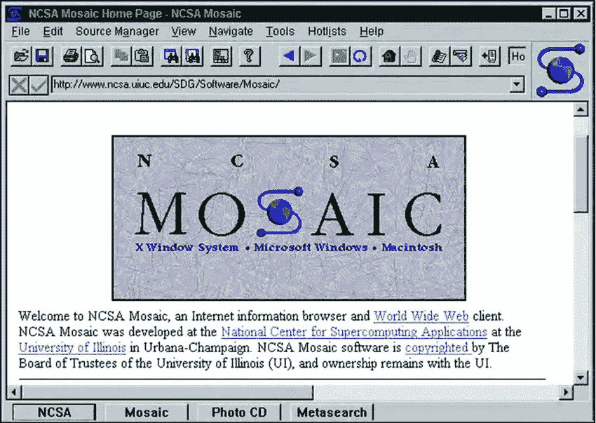
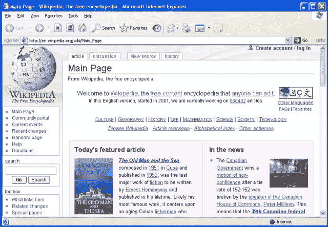
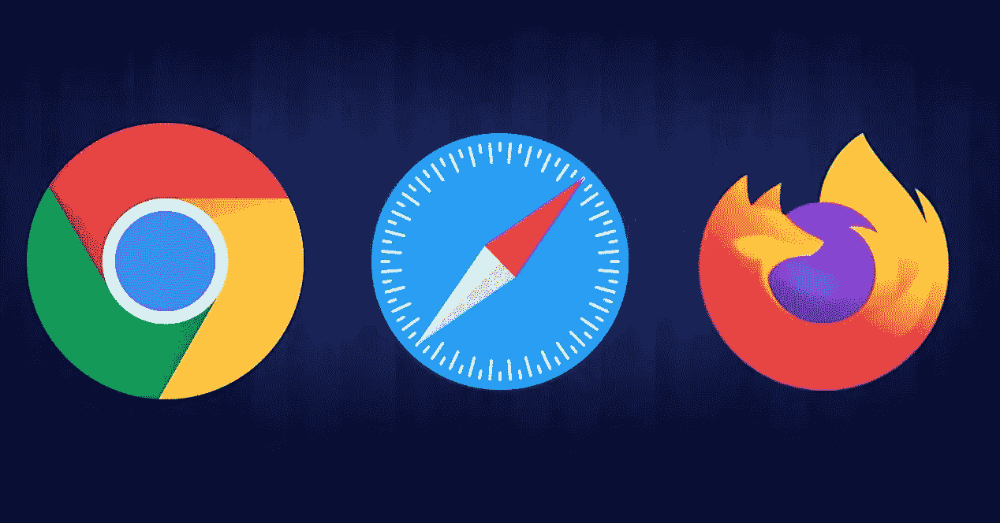

# Internet Explorer:前 Windows 明星的自由落体

> 原文：<https://medium.com/codex/internet-explorer-the-free-fall-of-the-former-windows-star-adf15622c588?source=collection_archive---------11----------------------->

## 调查导致被称为“Windows 之星”的浏览器 Internet Explorer 自由落体的一波三折。

internet Explorer——曾经的 Windows 之星

几周前，在 2022 年 6 月 T1 日，微软宣布 T2 将不再支持 ie 浏览器 T3。该浏览器在 9801 天后被正式关闭，并将随着时间的推移将其用户重定向到 Microsoft Edge。当然， **IE 模式将在 2029 年**之前在微软 Edge 中可用，对于那些需要使用 Internet Explorer 的用户来说可能很有用(例如，打开与新浏览器不兼容的旧网站可能很有用)。

这不是故事的全部，应该说，对于非常特定的环境**如 Windows server 版本或中国政府版本的 Windows，Internet Explorer**仍然受到支持**；所以，可以说，这款浏览器在相当一段时间内仍将在技术上发挥作用，但无论如何，微软向普通公众传递的信息是明确的。**

这是 Internet Explorer 的终结，这个浏览器可能是我们许多人第一次用它连接到互联网，这个浏览器在第一次浏览器大战中击败了所有竞争对手和**登顶**，但在第二次浏览器大战中却无能为力**并消失了**。

# 在 Internet Explorer 之前

在一个页面上显示图像和文本— NCSA Mosaic web 浏览器

*NCSA Mosaic* 是最受欢迎的浏览器之一，它第一次将**图像和文本一起显示在同一个页面上**，与当时的其他浏览器不同，它有一些特殊的吸引力。Mosaic 的功能启发了竞争对手，其他一些浏览器也是基于 Mosaic 的模式开发的。

微软许可了这款浏览器的一个版本，并开始开发一款名为“Internet Explorer”的浏览器；1995 年 8 月发布了第一个版本的 Internet Explorer，这个浏览器最初的几个版本没什么可说的，但是**由于 Windows 95 同时征服了市场，微软利用这个力量，把其他产品放到了用户的生活中。**这个决定导致了浏览器“Internet Explorer”在当时对于很多普通用户来说是互联网的代名词。

下一步是 Windows 和 Internet Explorer 浏览器的整合。微软决定将 **Internet Explorer 4 与 Windows 98** 整合，所以如果你是当时购买 Windows 操作系统电脑的那些人中的一员，那么 Internet Explorer 浏览器就是你上网的默认浏览器；这个决定**增加了 IE** 的份额**减少了 IE 的主要竞争对手网景**在浏览器市场的份额。但这还不是全部，美国政府对微软采取了法律行动，而微软提起了反垄断诉讼，微软最终败诉，不得不允许用户安装和使用他们选择的浏览器。

# 第六版，衰落的建筑师

Internet Explorer 浏览器中的维基百科全书

微软 Internet Explorer 的第六个版本于 2001 年 8 月底发布。在这个版本发布的时候，**微软在浏览器市场拥有大约 90%的市场份额。这个数字如此之大，以至于今天的谷歌浏览器都无法与之匹敌。**

Internet Explorer 6 以自己的方式无话可说，甚至在发布几年后，许多功能都没有添加进去。微软**甚至因为各种原因没有迅速采取行动修复 bug**，比如公司内部的挑战，缺乏竞争对手，或者也许是微软在浏览器市场的骄傲(以及其他一些原因)，导致了这些缺点。此外，Internet Explorer 的众多安全问题已经成为微软和用户的噩梦，如果我们把这些事情和许多其他事情放在一起看，我们会发现所有这些都表明了微软在 IE 开发方面的弱点。Internet Explorer 6 是这款浏览器最后一个带有微软名称的版本，**版本 7** 是在 2006 年全称为**Windows Internet Explorer**的第六个版本 5 年后发布的。

微软的缺点为竞争对手提供了进入市场的新机会，包括 Firefox，它从网景浏览器演变而来，并在 2006 年取得了两位数的市场份额。下一步是苹果发布 Safari。微软向苹果投资了 1 . 5 亿美元，并签署了一份为期五年的协议，该协议将使微软在 Mac 操作系统中支持 Office，苹果将 IE 设为 Mac 的默认浏览器。

Chrome、Safari 和 Firefox

随着谷歌 Chrome 浏览器的发布，谷歌给了 ie 浏览器致命的一击。它有一个吸引人的用户界面和功能，很快使它从竞争对手中脱颖而出，另外重要的一点是 Chrome 的开发者是“谷歌”。这家公司的名字与在线搜索同义。

Chrome 浏览器于 2008 年在**推出。那些年，谷歌在互联网用户中非常受欢迎，这导致该浏览器非常受欢迎，**在 2012 年**超过 ie 浏览器，成为世界上最受欢迎的浏览器。**

# 当微软的 Edge 到来时

Microsoft Edge 浏览器徽标

2009 年发布了 Internet Explorer 8，2011 年发布了 IE9，2012 年，即“谷歌 Chrome”成为使用最广泛的浏览器的同一年，发布了 Internet Explorer 10 版，2013 年发布了 Internet Explorer 11 版，或者说是市场上推出的最后一个 Internet Explorer 版本。不同的浏览器蓬勃发展，但 Internet Explorer 一天天变得不那么有用，2015 年**微软推出了一款名为 **Edge** 的新浏览器。**

微软 Edge 浏览器**保留了 ie 浏览器的蓝色**，**解决了很多 bug，做了很多改动**，但是这些改动并不能解决问题，因为它在很多功能上落后于竞争对手，而且很多网站也不兼容。不可能使用为 Chrome 或 Firefox 开发的扩展。以上是 Edge 浏览器当初出现的一些问题，这些问题**让这款浏览器成为了微软的新问题。**

据 [StatCounter](https://gs.statcounter.com/browser-market-share/desktop/worldwide/#monthly-201501-202206) 统计，**第一版 Edge 浏览器未达到超过 5%的使用份额**，而在 2018 的**年底，微软再次**接受失败**并表示将基于谷歌 Chromium 项目**的**代码库开发 Edge 的**新版本**。一群人认为 Edge 有微软的包装，但却是一种谷歌浏览器，并将这个问题比作微软购买 NCSA Mosaic 许可证，而不是从头开始开发浏览器。**

凭借这一决定，**微软设法在浏览器大战**的新时代站稳了脚跟，根据 [StatCounter](https://gs.statcounter.com/browser-market-share) 的统计，它达到了**第三大使用浏览器**的排名，超过了 Firefox，并且它还能够为“Chromium”项目添加新功能，支持各种谷歌 Chrome 扩展，并与网站具有更大的兼容性。

微软 Edge 到目前为止增长不错，虽然这种增长是因为 Firefox 的市场份额下降，而不是 Chrome 的。无论如何，这款浏览器可以成为 Internet Explorer 的一个很好的替代选择，甚至有可能在选择正确的情况下成为 Google Chrome 的一个重要竞争对手，这一次将以不同的方式重复历史。

## 资源:

[Internet Explorer 曾经是互联网的同义词，但今天它已经一去不复返了](https://arstechnica.com/gadgets/2022/06/remembering-internet-explorer-the-now-dead-browser-that-once-powered-the-internet/)

[再见，Internet Explorer。感谢回忆(和恶意软件)](https://www.techradar.com/news/goodbye-internet-explorer-thanks-for-all-the-memories-and-the-malware)

[RIP Internet Explorer——这款浏览器为网络带来了好处(也带来了坏处)](https://www.techradar.com/news/rip-internet-explorer-the-browser-that-changed-the-web-for-good-and-bad)

[微软的 ie 浏览器在 27 年后正式关闭](https://techviral.net/microsofts-internet-explorer/)

[微软开始自动将 Internet Explorer 用户重定向到 Edge](https://www.theverge.com/2022/6/15/23168984/microsoft-internet-explorer-redirect-edge-prompt)