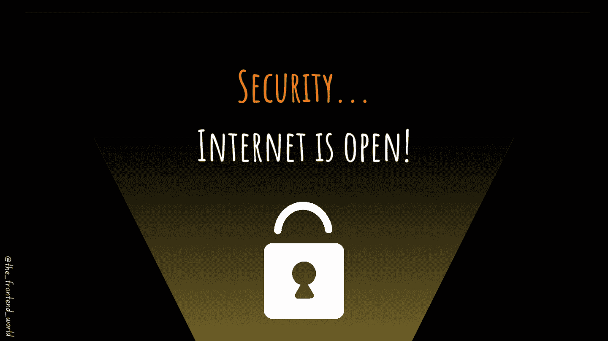

# 互联网是开放的。让我们了解一下安全保护！

> 原文：<https://medium.com/codex/internet-is-open-lets-learn-about-securing-e3052d6a9c36?source=collection_archive---------11----------------------->

## 您需要保护您的应用程序！

作者:FAM

大家好👋

抱歉，我这周的文章晚了。这是如此繁忙的一周，我的工作项目的最后期限。无论如何，让我们用网络变得更强大！

这是 [2022 网络计划](/geekculture/2022-web-program-is-launched-f38a3280af1a?source=your_stories_page----------------------------------------)第一章的最后一个话题。如果你现在设法跟进，你是了不起的，你可以…