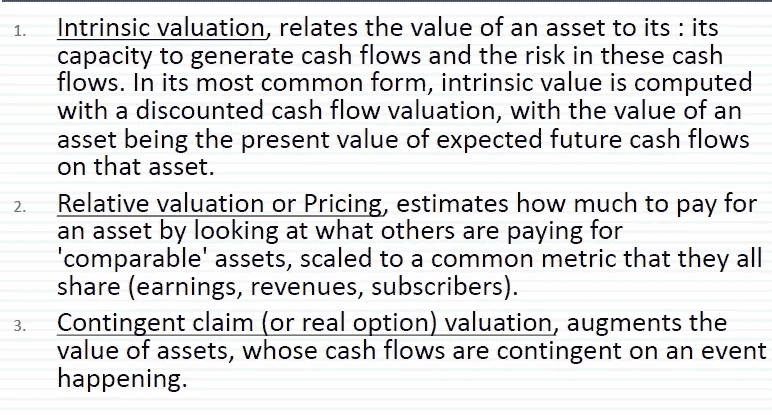
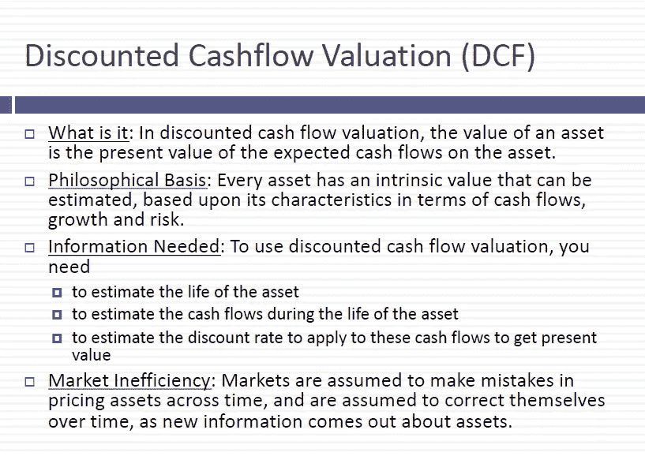
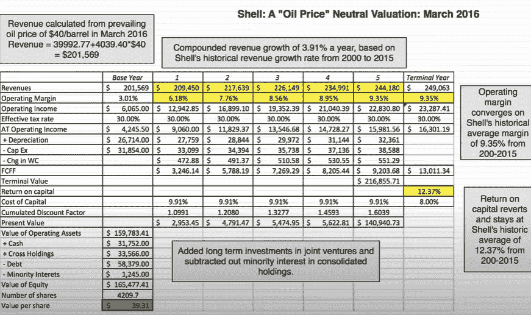
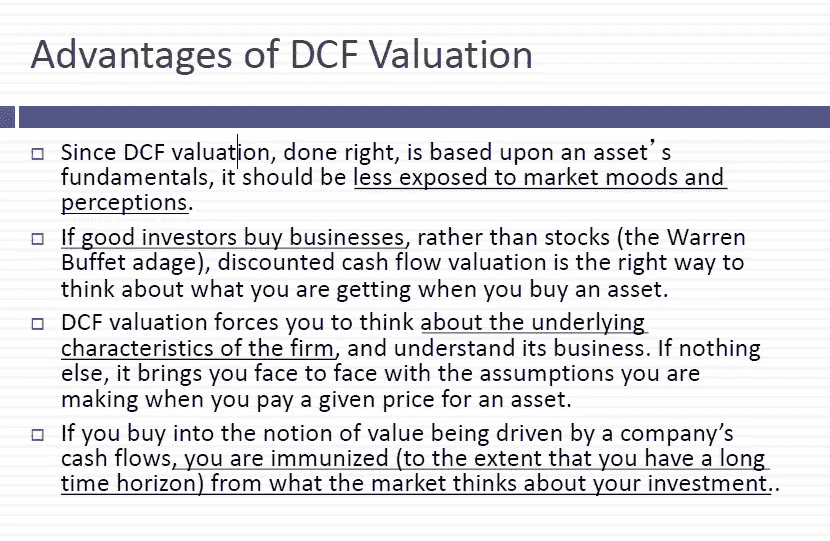
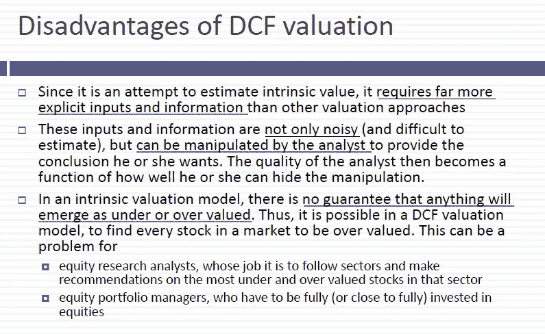
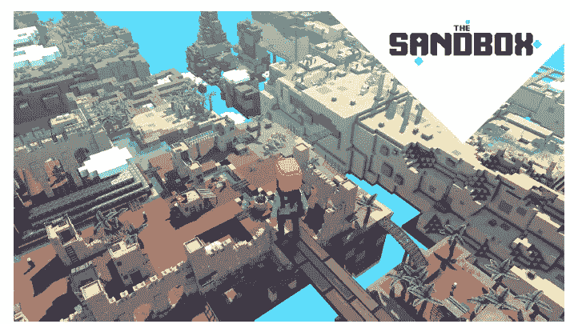
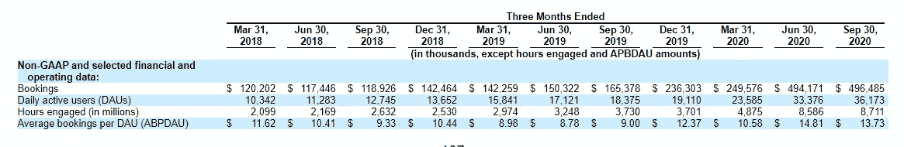
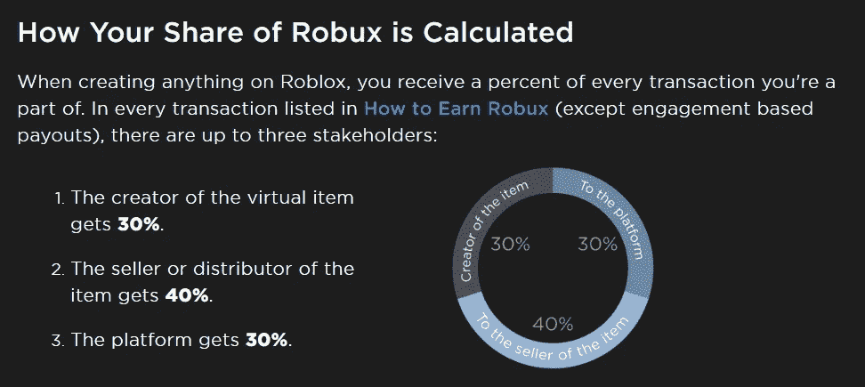
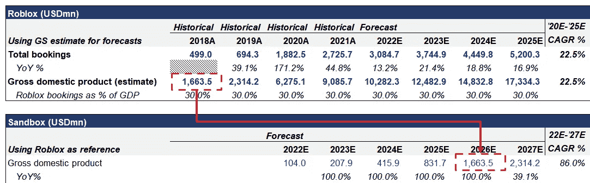
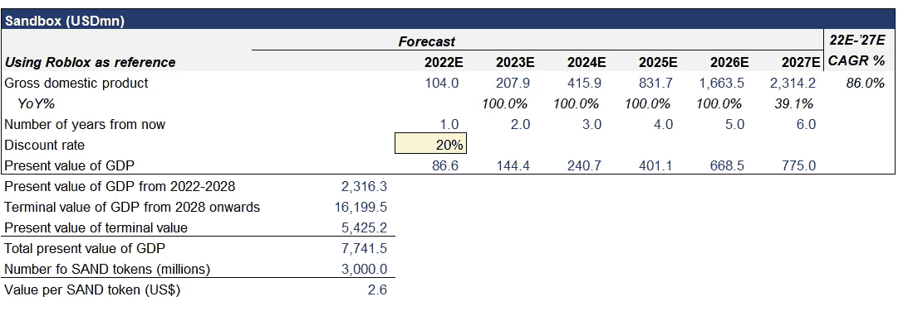

# 理论:加密货币的内在价值

> 原文：<https://medium.com/codex/intrinsic-value-of-a-token-c0e8016b2114?source=collection_archive---------8----------------------->

鉴于加密货币(以下简称“代币”或“密码”)表现出的极端波动性，我认为从长期投资者的角度解释代币的内在价值是谨慎的。令人惊讶的是，鉴于加密货币的高估值，关于如何对这些代币进行估值的文献非常少。由于散户对这些代币的兴趣越来越大，我认为这个框架可以帮助普通投资者了解他们所购买的东西的价值。

快速总结一下你会在这个博客中发现什么:

1.  加密货币确实具有内在价值，因此我们可以应用传统的金融资产内在估值方法
2.  我们如何计算加密货币的内在价值，以及我们如何利用这一点来做出投资决策
3.  实际加密货币上使用的内在估值示例

快速介绍一下——我是一名私募股权投资者，在这个行业有 7 年的经验，毕业于纽约大学斯特恩商学院。顺便说一句，我最喜欢的课是达莫达兰教授的*估价导论，*我将借用下面提到的一些概念和教材:【https://pages.stern.nyu.edu/~adamodar/】T2

## 首先，加密资产有内在价值吗？

传统上，在对证券进行估值时，我们使用内在估值来描述与资产产生现金流的能力和这些现金流中的风险相关的资产价值。与其他形式的估值不同，内在估值允许我们或多或少地对资产*内在*进行估值，而不必依赖受短期供求影响的其他市场决定的价格，加密投资者应该非常熟悉这种风险。

对加密使用内在估值的问题是，加密货币通常不会产生任何现金流(除了赌注奖励，但为了简化，我们现在将忽略这一点)。

困惑的伊隆图片

然而，这实际上从未阻止我们这些传统投资者应用内在估值原则。

内在估值的最初应用首先用于债券，债券有预先确定的现金支付时间表，然后该方法应用于传统股票，传统股票有不确定但可估计的年度股息支付。现在，内在估值也适用于科技股，科技股通常不支付任何股息，在可预见的未来也不打算支付股息。*以$特斯拉为例，特斯拉股票的总市值(估值)为 6730 亿美元，目前或在可预见的未来任何时候，该股票都没有向其股东分配任何现金流。*

相反，传统投资者可以使用“可分配现金流”的概念，即假设如果公司将收益作为现金流分配给股东，这些现金流会是多少。这是有道理的，因为股东代表着公司的股权，而公司又对公司的总留存收益有财务要求权。因此，鉴于股东有权获得该公司产生的潜在可分配收益，我们可以利用这一点为我们的内在估值框架建模，即使股票没有实际现金流。

让我们将同样的概念应用于 crypto。

快乐伊隆的照片

目前，大多数加密令牌都是 ERC-20 令牌，它们或者被描述为治理令牌，或者被描述为实用令牌，或者被描述为两者兼有。示例:

*   ape coin:[https://apecoin.com/about](https://apecoin.com/about)治理和公用事业令牌
*   SAND token:[https://installers . Sandbox . game/The _ Sandbox _ white paper _ 2020 . pdf](https://installers.sandbox.game/The_Sandbox_Whitepaper_2020.pdf)实用令牌

出于估价的目的，可以忽略治理权，就像股票的情况一样。事实上，每家公司的股东治理权差异很大，某些科技公司甚至创建了 A/B 级的股权结构，其中某些股票将获得 10 倍的投票权。然而，由于内在估价只与股东的经济权利有关，我们的内在估价工作可以继续。

所以我们只关心效用。在沙盒白皮书中，令牌的实用程序描述如下:

> 玩家为了玩游戏、购买装备或定制他们的虚拟角色而花费沙子，并且可以通过游戏收集沙子。创造者花费沙子来获得资产、土地，并通过赌注。土地销售推动了购买土地的需求。艺术家花费沙子将资产上传到市场，并购买宝石来定义稀有和稀缺

观看游戏视频，查看沙盒中所有可拥有的产品

我们使用游戏加密令牌作为例子，因为它的效用是最容易定义的。与以太坊、雪崩或索拉纳不同，这些区块链用例仍在进行中，游戏加密令牌给了我们一个简单得多的评估练习。

从沙盒的定义中概括出来，本质上加密货币让持有者能够购买由区块链平台支持的任何应用程序创建的*产品*(例如土地、资产)。**换句话说，加密代币代表拥有这些*产品*的权利，所有加密代币的总和(代币的估值和市值)应该代表在区块链上创造的所有产品的总价值。**

这是一个重大突破。虽然加密货币本身没有现金流，但加密货币授权持有者购买的产品肯定有价值，因此可以使用现金流进行评估。

这在直觉上也应该说得通。以一个农场为例，它一年生产价值 100 美元的谷物。假设这个农民发行了 100 枚名为$GRAIN 的加密货币代币，他将只使用这种代币作为他接受的唯一交换媒介，以便购买他今年的作物(我们将在后面处理永久的案例)。扪心自问，这种加密货币的总价值不就等于粮食总价值的美元价值吗？

**我们可以使用销售加密货币专属产品产生的估计美元(或任何您喜欢的货币)现金流来估计加密货币本身的价值。**

## 我们如何使用内在估值？

通常，内在估值使用贴现现金流估值(DCF)。Damodaran 教授将典型的 DCF 框架总结如下:

我们可以计算几乎任何东西的内在估值，只要我们有这三个输入:1)估计寿命——包括无穷大，2)估计现金流，3)估计贴现率。

见以下案例在对壳牌股票的估值中(来源:【https://www.youtube.com/watch?v=FJrdWOMvvx8】T2)，关键输入是:

1.  5 年预测，最终值反映第 5 年后所有未来年份的总和
2.  FCFF——未来 5 年的自由现金流(理解为我们前面提到的“可分配现金流”),以及此后所有年份的终值。FCFF 是基于对壳牌损益表中报告的运营收入的花哨调整(理解为银行家获得报酬的原因)。
3.  贴现值为 9.91%，反映了权益资产类别的风险，尤其是壳牌的现金流风险

DCF 模型所做的是:它将每年产生的自由现金流按上述贴现率贴现，然后将所有未来现金流相加，得出权益价值(1，654.77 亿美元)，再除以股票数量，得出股票价格(39.31 美元)。

然后，我们会将这一内在价值与股票的当前市场价格进行比较，以确定我们是否认为这是一项好的投资。在 Damodaran 分析的时候，壳牌的股票价格是 48 美元，而他的内在估值决定了股票价格是 39 美元，所以结论应该是它只是被高估了一点点。

内在估值的优势是显而易见的:它为我们提供了一种基于基本面计算资产估值的方法，或根据实际硬法定货币计算现金流，并避免了需要参考其他市场驱动的价格和估值的陷阱。

当然，也有权衡。DCF 估值的关键缺点是，你需要估计未来的现金流，除非我们有可以预见未来的水晶球，否则没有人真正知道它们是什么。然而，正如 Damodaran 教授一直喜欢说的(大意类似)——DCF 只是明确了这些关于未来的假设，你被迫面对它们，而不是退回到市场力量的舒适状态。

对于 crypto 来说，内在估值的优势远远大于劣势，因为该资产非常不稳定，目前缺乏任何基本面因素来帮助投资者确定他们所持投资的价值。DCF 至少可以让投资者对该股票相对于市场是被低估还是被高估有所了解。

## 因此，让我们对真实的加密货币进行实际的 DCF 分析

注意为了这篇博客的目的，我们将保持简单，所以我们将做许多假设。您可以为自己的分析添加额外的调整和不同的假设。

我们将继续使用 SAND，沙盒的实用令牌，作为一个例子，因为游戏相对容易估计未来的现金流。就沙盒游戏而言，该团队将该平台定位为现有游戏(如《我的世界》和 Roblox)的 web3 替代品。来自白皮书:

> 我们的愿景是提供一个深度沉浸的元宇宙，玩家将在其中协作创建虚拟世界和游戏，而无需中央授权。我们的目标是通过向创作者提供他们作品的真实所有权作为不可替代的代币(NFT ),并以我们的实用代币——SAND 奖励他们的参与，来颠覆现有的游戏制造商，如《我的世界》和 Roblox。

由于沙盒被定位为《我的世界》和 Roblox 的颠覆者，我们可以使用这两个现有游戏中的实际玩家支出作为我们如何估计沙盒未来现金流的基础。每年，数百万玩家花费数百万美元，现在是数万亿美元，来购买在《我的世界》和 Roblox 平台上出售的数字资产。根据我们对沙盒将如何成功复制《我的世界》和 Roblox 的成功的看法，我们可以得出一个关于未来沙盒上创建和使用的所有数字资产的总价值的看法。

Roblox 每季度和每年都会公布 Roblox 平台的总预订量。让我们假设总预订量约占所有玩家在 Roblox 平台上支出的 30%(详细说明见脚注 1 ),因此使用预订量披露，我们可以得出 Roblox 上的数字产品总销售额(我们称之为 GDP，因为这与国内生产总值的定义非常接近，即一年中一个国家提供的所有商品和服务的总价值)。

摘自 Roblox F-1 招股说明书

Roblox 于 2006 年首次发布，用了 10 多年的时间，到 2018 年达到 4.99 亿美元的总预订量或约 16.6 亿美元的 GDP。当时，该游戏的日活跃用户(DAU)超过 1200 万，季度参与时间超过 2，000 万小时。

让我们假设沙盒可以在从 2021 年底算起的 5 年内赶上 Roblox 2018 的成功水平(大约是 Roblox 到达那里所需时间的一半)。为了简单起见，让我们假设从现在到 2025 年，GDP 每年都会翻一番。**请注意，这些都不是投资建议，我们只是做出简单的假设来展示数学**。

基于这些假设，沙盒的 GDP 将从 2022 年的 1.04 亿美元增长到 2025 年赶上 Roblox 2018 年的水平，达到 16.6 亿美元。现在，我们要做的就是贴现所有未来的现金流，并得出每个代币的现值。我们还需要考虑两个变量，一个是贴现率，另一个是终值。

贴现率的计算实际上令人惊讶地混乱，因为它们必须考虑资产类别风险，以及与资产类别相关的特定资产风险。我们今天没有时间讨论这些，为了这个练习的目的，我们将假设 20%的贴现率(大多数股票贴现率大约为 8~12%作为参考)，以考虑加密货币的高风险和波动性。

终值是基于一个数学等式，根据固定的增长率和贴现率，将所有未来现金流的现值推导到无穷大。同样，为了简单起见，我们可以假设未来的增长率永远为 5%,并且我们已经确定贴现率应为 20%。

所以输入所有的数字。让我们回顾一下我们的主要假设

*   沙盒将在 5 年内达到 Roblox 2018 的水平，在 2026 年创造超过 16 亿美元的 GDP，在 2027 年超过 23 亿美元
*   20%的贴现率
*   平台 GDP 将永久增长 5%

我们得出沙盒的总 GDP 的现值为 77 亿美元，除以总供应量中的 30 亿代币，我们得出每粒沙子的内在价值为 2.6 美元。

由于内在 DCF 估值得出的每砂 2.6 美元高于每砂 0.8 美元的当前市场价格，相信上述假设为真的投资者应该会发现当前的象征性价格相对有吸引力。**再次声明，这不是投资建议，只是一个展示如何使用 DCF 估值的数学展示。**

## 当前方法的局限性

即使在博客中，我们也遇到了关于加密货币估值的 DCF 估值的明显限制。

1.  目前还不清楚如何计算出除游戏以外的区块链平台的未来现金流或 GDP 数据。

对于区块链游戏来说，这相对容易，猿币应该代表 YUGA 实验室生态系统中所有数字产品的总价值。SAND 应该代表在沙盒上创建和使用的所有数字产品。等等。

然而，在第 1 层和第 2 层令牌的情况下，逻辑变得非常复杂。以以太坊为例，最明显的效用是支付燃气费和购买 NFT，但人们也将以太坊视为价值的一般存储。在我看来，存储值*仍然是*意味着它代表了购买真实产品的未来效用，但不清楚那些产品在未来对以太坊有什么用(因为新的用例仍在探索中)。

对于比特币来说，内在价值和代币价值之间的关系甚至更加复杂，因为比特币的使用案例开始多样化，进入非区块链本地应用。当人们在某些国家开始接受比特币作为法定货币时，我们应该如何看待 GDP？当大多数主要国家仍然坚持使用法定货币时，比特币还重要吗？

2.不清楚加密货币的正确贴现率是多少。

凭直觉，我认为贴现率必须高于传统股票是有道理的，因为加密市场的波动性要高得多。然而，我们应该用什么方法来得出一个确切的数字呢？传统股票使用 CAPM(资本资产定价模型)来确定贴现率，但我不确定这是否适用于这种情况。

最后，我很想听听你的想法。请在下面留下评论。

## 脚注/读者反应:

1.  *童丹:为什么我们不用总预订量来代表总 GDP。*

我的理解是，总预订代表直接向玩家出售 Robux token 的总额，然后通过游戏内资产购买交易在 Roblox 经济中循环。因此，总 GDP 必然高于总预订量，除非在每次交易后，游戏内资产的卖家都将他们的 Robux 收入套现，而不是花在游戏上。

假设 Robux 中的 3 个玩家经济:100 Robux (100R)发放给玩家 A，表示总预订量为 35 美元，玩家 A 将其全部花费在游戏中的物品上，其中 30R 归平台所有，40R 归所有者玩家 B 所有，30R 归最初的物品创建者玩家 c 所有。

让我们探讨一下不同情况下的 GDP 是多少:

*   一轮互动:如果玩家 B 和玩家 C 兑现这些 Robux，并且经济中不再发生交易，那么 GDP 等于总预订量(35 美元)。
*   两轮互动:玩家 B 和玩家 C 不再套现，而是再次将他们的 Robux 花在玩家 A 创造和拥有的其他虚拟物品上，每个价值 40R 和 30R，那么将会创造另外 70R 的 GDP。总国内生产总值将为 170 兰特或 59.5 美元
*   三轮互动:两轮互动后，玩家 A 钱包里还有 49R(玩家 B 和玩家 C 共支付 70R，其中平台抽取 30%费用)。他可以再用这笔钱购买另一个价值 49R 的虚拟物品。总国内生产总值将达到 219 兰特或 76.65 美元
*   无限循环互动:假设玩家从不兑现他们的收入，总 GDP 将等于以下公式 GDP = 100 r+70% * 100 r+70% * 100 r+70% * 100 r…或者简化为:100R * (1+70%^n)，其中 n 接近无穷大。当这个方程发散时，没有解

因此，正确的答案取决于 Robux 在平台上的花费速度，以及 Robux 在所有者和创造者之间的再循环，对此我们没有正确的数据来制表。为简单起见，我们将假设 GDP 约为总预订量的 3 倍，因为四轮互动(似乎合理)将大大证明这一假设。