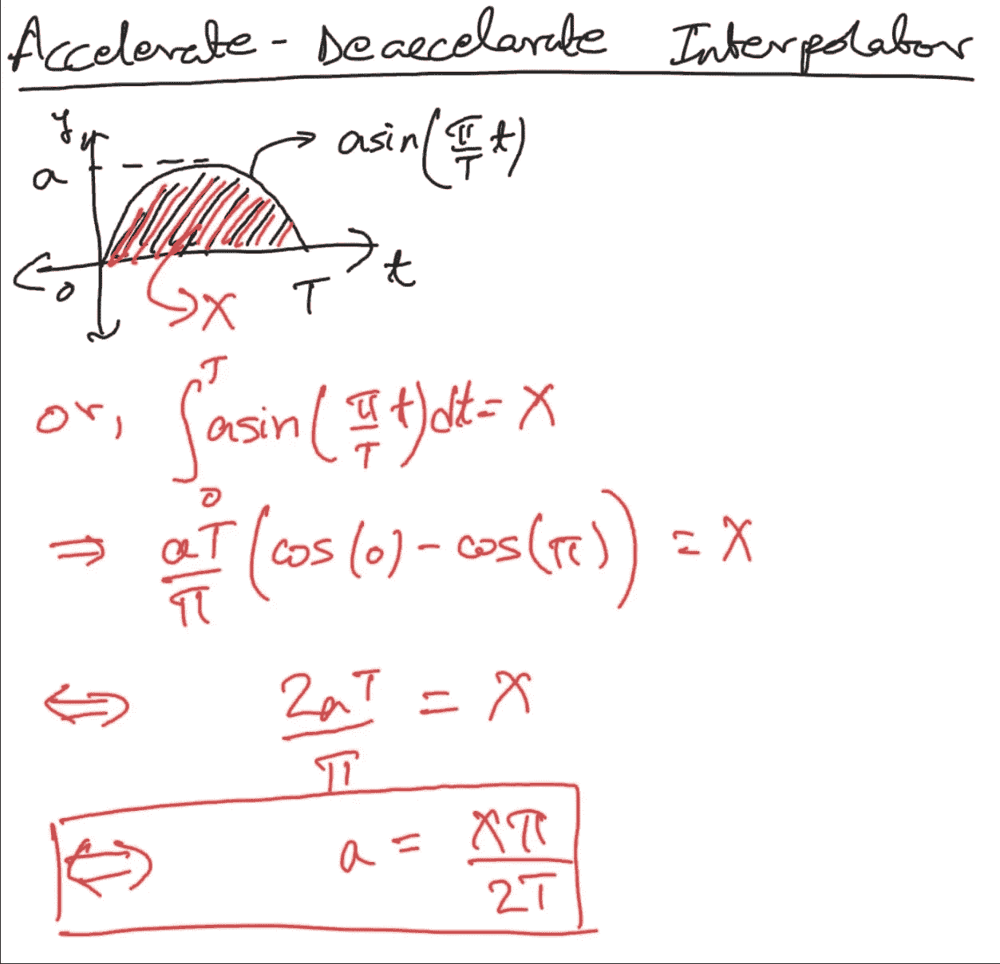

# 动画时间插值器简介

> 原文：<https://medium.com/codex/intro-to-animation-time-interpolators-b304a0ea3117?source=collection_archive---------6----------------------->

## 动画背后使用的数学

> 随着年龄的增长，你发展了理解复杂问题的能力。

去年，我试图理解计算机如何使用时间插值器。我试了又试，但还是找不到解决办法。这是我想自己做的事情，而不是在网上搜索，所以我从来没有这样做。然而，上周，我突然意识到。我在这里与你分享我的数学和我如何通过**逆向工程动画时间插值**。首先，

# 什么是时间插值器？

说你在家，想去朋友家。有不同的路线可以让你到达目的地。也许你走路线 A 或路线 B 或路线 c。假设所有路线花费相同的时间。这些路线走不同的路，但是它们让你到达同一个目的地，并且它们花费相同的时间。

上述路线被称为**时间插值器**。它们是从起始值`*A*`到目的值`*A + X*` *的不同路径。*


插值器的值与时间图。

我将对我为找出这些图形的必要方程所做的数学运算进行解码。

**注 1 —** 对于所有插值器，我们将在 4 秒内从值 2 变为 8。所以，`A = 2, X = 6, T = 4`。这些是我们声明的常量，将在示例中使用。

**注 2—** 在讨论插值器时，**注意速度**。数学上讲，注意无穷小时间内数值的*变化率*。

# 线性插值器

线性插值器非常简单。从起点到终点是一条直线。它们没有**加速度**，因此*速度*始终保持**恒定**。


线性插值器

您需要在`T`时间内覆盖`X`个值。因此速度(或斜率)将是`X/T`。保持这个斜率，并输入初始值(或 y 轴截距)，我们得到等式`y = (X/T)x + A`。


线性插值的手写数学作业

# 加速-减速插补器

这是最常用的插值器。这个插值器的名字是有原因的。在动画持续时间的前半段，你有一个正加速度**，此时*速度*逐渐增加。对于后半段，你有负加速度**和速度逐渐降低的**。这可以被描述为正弦曲线。**


价值与时间图。虚线表示斜率。

如果你理解了我在上面的第二个注释[，你可能已经猜到我们将在本文的剩余部分使用微积分。更具体地说，微分方程。](#07e6)

## 建立方程式

*速度*(或变化率)是一条正弦曲线。注意速度在前半段加速，后半段减速；因此得名。我们以几乎为 0 的速度开始动画，加速到最大值，然后在动画结束时，即`t = T`减速到 0。


`a`是正弦曲线的振幅。我们需要找出这个值是多少。事实上，我们知道动画值的总变化是`X`。换句话说，由曲线和 x 轴限定的区域应该等于`X`——起点和终点之间的净变化。因此，我们得出:


## 寻找斜率曲线的振幅

`a`，在这一点上是一个未知的常数，我们需要找出它的值与我们已经定义的其他常数的关系。通过第二个等式，我们可以找到这个值:



## 解微分方程

从第一个方程，我们可以算出这个加速-减速图的实际函数。


由此，我们可以绘制下面的函数来获得从`**A**` 到`**A + X**` 的动画在`0`和`T`之间任意时刻的具体值。

# 其他时间插值器

按照与上述相同的过程，我们也可以通过改变斜率图来推导加速和减速插值器的公式。您还会发现`a`的值(斜率的正弦幅度)有重要意义。加速插值器是当变化率逐渐增加时，而减速插值器是当变化率逐渐减小时。可以在上面上传的 GIF 中查看。

# 结论

数学是一个很审美的话题，在我看来；将它应用到我的激情——计算机科学——是一个完美的配方。

一年多来，我一直试图理解如何推导出如此复杂题目的数学方程，但我失败了。如前所述，我最近才想到应该如何处理这个问题。因此，我理解，由于各种原因，你们中的一些人可能不会马上完全理解这篇文章。然而，随着时间和经验，这将是有意义的。我强烈建议你再读一遍这篇文章，因为其中有许多涉及数学的活动部分。

这让我想到一个问题:**数学对于计算机科学有多必要？**这要看你接的是什么领域，你想钻研多深。从表面上看，数学对于 Android 或 Web 开发来说并不是至关重要的，但对于高效地构建人工智能模型来说却是如此。

我希望你喜欢读我的文章，并学到了一些东西。谢谢大家！✌️

```
**Want to connect?**My [GitHub](https://github.com/cybercoder-naj) profile.
My [Portfolio](https://cybercoder-naj.github.io) website.
```