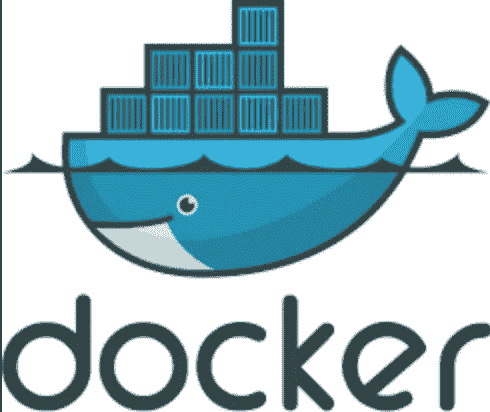
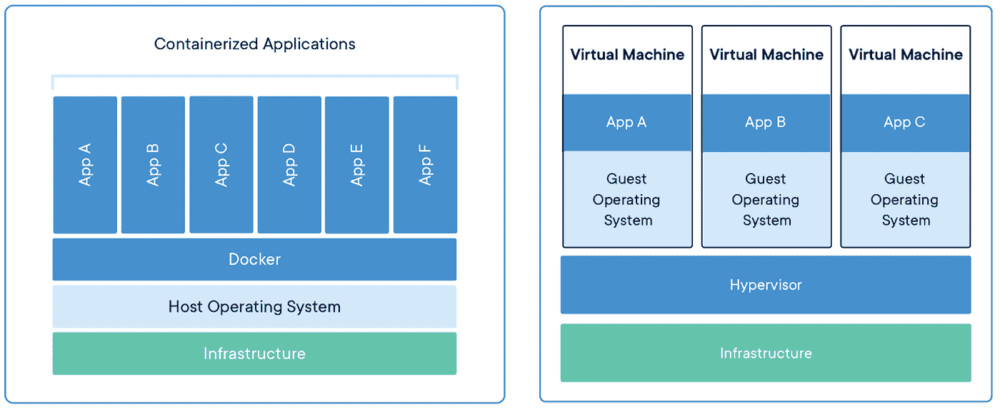
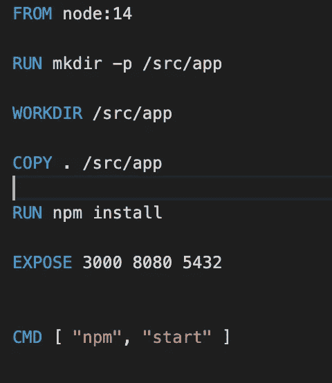
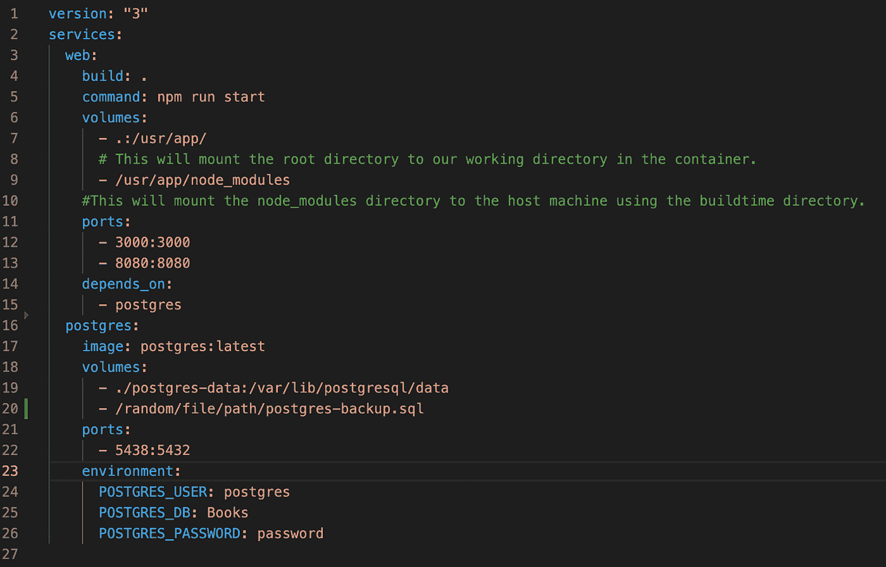

# Docker 简介

> 原文：<https://medium.com/codex/intro-to-docker-647dbb1aee14?source=collection_archive---------12----------------------->

抽象地学习系统设计是一项具有挑战性的任务，尤其是对于早期职业软件工程师。当然，对我来说，我很难理解微服务和负载平衡器等功能在生产中是什么样的，快速搜索行业实践导致了一个非常熟悉的困惑，这些困惑是由范围太大以至于我无法消化的工具引起的。幸运的是，一位从事软件工程的朋友向我推荐了 Docker，这是一个非常容易使用的工具，即使对于像我这样的新手来说也是如此。这篇文章将提供 Docker 是什么的介绍性概述，并希望吸引您也花一些时间学习它！

# **Docker 是什么，为什么？**

Windows 用户可能对虚拟机(VM)很熟悉，虚拟机是一种行为类似于计算机的文件系统，允许 Windows 用户运行只能在 Linux 或 MacOS 等其他操作系统上运行的程序。您还可以运行 Windows 虚拟机来保存同一操作系统的不同配置/版本。虚拟机打包了所有东西，包括代码、系统工具、库等——这被称为软件的“容器化”。每次运行虚拟机时，您都会运行整个客户操作系统和整个应用程序，如果您只想运行单个应用程序，这会占用过多的空间。

相比之下，Docker 使用“容器”,这些容器在主机操作系统上作为独立的进程运行，但共享机器的内核。可以说容器共享相同的模板，但是在完全隔离的环境中运行。本质上，Docker 抓住了虚拟机的效用，但效率更高，占用空间更少。Docker 容器可以在任何计算机或任何基础设施以及任何云中运行。

容器和虚拟机的比较

每个容器中操作系统的省略意味着 Docker 容器是难以置信的轻量级。您可以运行多个容器，而不会过度消耗内存和处理能力。因为 Docker 容器包装了所有必需的依赖项，所以它们总是以相同的方式运行，这在您的程序需要特定版本的依赖项时非常有利。换句话说，如果它能在你的电脑上工作，它也能在你朋友的电脑上工作。

有没有一个看起来可以用 Docker 执行的系统设计方案？微服务是可独立部署的小型模块化服务。与整体应用相比，微服务可以轻松地进行水平扩展，并允许团队处理和部署应用的不同部分，而无需重新启动或破坏整个应用。Docker 容器非常适合微服务架构的执行，因为它们将应用程序分解到单独的容器中。此外，容器可以在 Docker 中轻松地相互通信，解决了构建微服务的主要障碍之一。

# **码头工人图像**

现在，我们可以详细说明初始化一个工作 Docker 应用程序所需的特定组件。如果此时你还没有安装 Docker，去 Docker 的网站[下载适合你的操作系统的版本。](https://www.docker.com/products)

我们已经谈到了 Docker 容器，现在我们将转向 Docker 图像。根据 Docker docs，图像是“一个惰性的、不可变的文件，本质上是一个容器的快照。”它们是包含构建容器的指令的文件，类似于模板。容器又是映像的“克隆”或运行实例。

Docker 有[一个名为 DockerHub 的库](https://hub.docker.com/)(想想 GitHub，不过是针对 Docker 图片的)包含了人们可以拉取和使用的常用图片(node、postgreSQL、mongoDB、NGINX)。例如，您可以使用命令`docker pull postgres`提取 postgreSQL 图像，如果您`docker run`了一个本地不存在的图像，Docker 将自动检查 DockerHub 是否存在并提取该图像。

或者，你也可以建立自己的形象。图像是在 DockerFile 中构建的，docker file 是一个文本文档，包含在命令行上运行的所有命令，用于构建图像。它实际上是连续运行命令。一个重要的注意事项是 DockerFile 必须与 package.json 文件存在于同一个文件路径中，以便访问相关的脚本来构建和启动您的应用程序。

样本文档

有许多不同的方式与 Docker 及其所有组件进行交互。这些工具中最强大的是 Docker 的命令行界面(CLI)。

> 这里有一些使用 Docker CLI 的有用的 Docker 命令:
> 
> `docker images`向您展示缓存在您机器上的图像
> 
> `docker info`显示关于 Docker 安装的系统范围信息
> 
> `docker run <image_name>`运行指定的图像
> 
> `docker build <image_name>`运行 DockerFile 中列出的命令，创建具有特定文件系统的映像
> 
> `docker pull <image_name>:<version>`从 DockerHub 中提取指定版本的特定图像
> 
> `docker rmi <image_name>`从缓存中删除图像

# **码头集装箱**

Docker 将容器定义为“应用程序层的抽象，将代码和依赖项打包在一起。”通常，容器占用几十兆字节，而虚拟机占用几十千兆字节。因为多个容器可以在同一台主机上运行，所以在需要运行多个应用程序但出于安全原因需要将它们隔离的情况下，它们非常有用。此外，这种容器化允许您轻松地旋转同一映像的多个实例，因此对于单个应用程序的水平扩展来说，这是一个很大的好处。

> 容器的 Docker CLI 命令:
> 
> `docker ps -a`显示所有正在运行或已退出的容器
> 
> `docker start <container_name>`运行指定的容器
> 
> `docker stop <container_name>`停止指定的容器
> 
> `docker rm <container_name>`删除指定的容器
> 
> `docker rm -f <container_name>`强制移除指定的容器

在接下来的部分中，我们将讨论如何构造一个容器。但是首先，快速注意一下 remove 命令。Docker 容器和图像即使在不使用的时候也会占用大量内存，因为 Docker 会缓存一些东西以加快运行时间。删除未标记的图像、停止的容器和其他被放弃的进程是一个很好的做法。

# **Docker 卷**

之前在讨论微服务的时候，我暗指了容器之间的通信。Docker 通过卷来做到这一点。Docker 卷是“自由浮动的文件系统”,它允许容器相互通信，在我们的主机上更改源代码，并持久存储数据。容器是无状态的，这意味着对源代码的任何更改都不会在刷新网页时反映出来。查看所做更改的唯一方法是完全重启容器，但这可能会导致您丢失存储在原始容器中的本地数据。与 nodemon 和数据库类似，卷可以解决这些问题。您还可以在容器之外创建和管理卷。同样，删除未使用的卷可以让您回收大量内存。

> 有用的 Docker 音量命令:
> 
> `docker volume ls`列出所有的卷
> 
> `docker volume rm <volume_name>`删除指定的体积
> 
> `docker volume prune`删除所有未使用的卷

# **Docker 撰写**

最后，我们可以用一个叫做 Docker Compose 的便利工具把所有东西放在一起。Docker 将 compose 定义为“定义和运行多容器 Docker 应用程序的工具。使用 Compose，您可以使用 YAML 文件来配置应用程序的服务。然后，只需一个命令，您就可以从您的配置中创建和启动所有服务。”

Docker 撰写文件示例

换句话说，运行合成文件将构建或获取 1)必要的映像 2)指定的容器和 3)构建并保留应用程序使用的所有卷。如果我们查看示例代码，服务将 Docker 指向将构建相应容器的 Docker 文件(如果存在的话)。注意，这个容器有一个依赖项，一个 postgreSQL 映像。它还构建所有指定的卷。

> 重要的 Docker 编写命令:
> 
> `docker compose up`启动并运行您的整个应用程序
> 
> `docker compose down`停止并删除所有相关容器，同时删除连接到容器的网络(注意:不删除图像和卷)

# **结论**

可以想象，使用 Docker 对于新开发人员的入职以及响应性部署和伸缩来说是一个非常有用的工具。从文档中可以看出，“Docker 非常适合高密度环境以及需要用更少的资源做更多事情的中小型部署。”当然，这只是对它的一些优点和基本组件的简要概述。但是我强烈推荐查看像[这种 GitHub repo](https://github.com/dylanlrrb/Please-Contain-Yourself) 这样的资源，其中有更多你可以练习的实例。

> 其他有用的资源:
> 
> [Docker 到底是什么？](/swlh/what-exactly-is-docker-1dd62e1fde38)
> 
> [Docker —初学者指南](/codingthesmartway-com-blog/docker-beginners-guide-part-1-images-containers-6f3507fffc98)