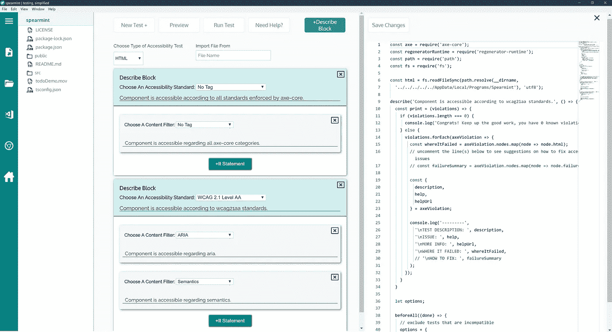

# 介绍留兰香的可及性

> 原文：<https://medium.com/codex/introducing-accessibility-to-spearmint-a2fcdcc71646?source=collection_archive---------20----------------------->

简单地测试您的应用程序

网络的力量在于它的普遍性。无论是否残疾，每个人都能获得服务是一个重要方面。

–[蒂姆·伯纳斯·李](http://www.brucelawson.co.uk/2006/tim-berners-lee-accessibility-quotes/)，万维网的创始人

Spearmint 是一个开源开发工具，可以简化应用程序的测试，最近已经发布了第五代产品。该应用程序的早期版本为开发人员提供了一个用户友好的 GUI，它可以动态地将用户输入转换为可执行的 React、Redux、Hooks、Endpoint 和 Puppeteer 测试代码，以便在整个开发周期中进行测试。

Spearmint 现在提供了一个可访问性测试套件，支持开发人员按照已建立的可访问性标准实现应用程序测试，就像早期的迭代一样简单。Spearmint 的测试生成现在利用 Deque Labs Axe-Core 可访问性测试引擎和 Jest 和 Puppeteer 框架中的库，为开源社区提供一种更简单的方法来执行我们的应用程序的测试驱动开发，以提供用户体验的普遍访问。

**什么是无障碍？**

作为开发人员，我们一直在寻找改进应用程序的方法。无论是通过实现一个新的令人兴奋的功能，还是部署一个采用最新技术的应用程序，来优化我们算法的时间复杂性——我们可能经常会最终得到一个令人惊叹的产品，但不幸的是，部分公众无法获得这个产品。在开发可访问性应用程序时，需要注意的是，在当前技术中针对可访问性标准的测试可能无法解决所有情况，并且一些手动审查是质量保证的必要部分，但是为了讨论的目的，让我们通过引用开发人员社区非常熟悉的资源——MDN 文档来宽泛地定义可访问性主题。"可访问性是指让尽可能多的人可以使用你的网站."

有影响力的指标可能会因项目和客户而异，但是你的产品开发的目标应该是让尽可能多的人接触到。对这种说法可能存在不同程度的意见，但开发更易接近的产品可能有实用主义和道德上的驱动力。

**为什么解决可访问性**

理想情况下，我们开发的令人惊叹的应用程序将为尽可能多的人提供同质的用户体验。撇开小众人口目标不谈，这个理想不是一个可及性的问题，而仅仅是一个经济问题。实事求是地说，我们的工程动力和客户期望的某种结合将决定我们高效和有效地向用户交付我们的内容和信息——正如设计的那样，交付给尽可能多的进入我们领域的人，从而最大限度地扩大我们产品的覆盖范围并最终获得利润。事实是，人口中的弱势群体对我们软件的体验可能与大多数人不同。用户可能有障碍，或者需要辅助技术来访问 web 内容。

揣摩言外之意……开发者很有可能会创造出一种没有考虑到所有在野外发挥作用的观点的用户体验。我们懂了。我们都是创意者——当灵感来临时，你就去追寻它。但是感同身受的工程师总是需要考虑边缘情况！

对于务实的程序员来说，开发更易访问的应用程序也有实际意义。正如有法律规定建筑物的无障碍入口一样，网站内容无障碍指南(WCAG)为发展中社区提供了改善基于网络的应用程序的无障碍所需的技术规范。虽然并非所有问题都能得到解决，但美国信息和通信技术(ICT)可访问性部分 508 的康复法案标准与 WCAG 准则保持一致，并将其视为网络内容和 ICT 的自愿共识标准。WCAG 合规性是根据数字可访问性的成功标准来衡量的，包括可感知、可操作、可理解和强健内容的原则。

简而言之，网站的可访问性受到法律的监管，而以网络内容违规为由提起的诉讼也在加速增加。根据 Usablenet 对 2020 年美国案例的追踪，“网络无障碍案例同比增长了近 25%。12 月份比 1 月份增长了近 100%。”除了立法方面的考虑，创建可访问内容的最实际的原因可能是这种方法不仅扩大了体验你的内容的观众的范围，最终提高了底线，而且通过创建消费你的产品的多样化和深度的体验，提供了普遍性的力量。

**绿薄荷现在提供可访问性测试**

蒂姆·伯纳斯·李指出，网络的力量在于它的普遍性，而这种普遍性的一个重要方面是“每个人都可以访问，无论是否残疾。”网络意味着每个人都可以访问，所以它的应用程序也应该这样开发。Spearmint 的最新发布引入了一个新的可访问性测试套件，为开发人员提供 Jest 和木偶师测试代码的动态生成。

绿薄荷的可访问性测试套件

新套件集成了 Deque Labs 的 Axe-Core，这是一个快速、安全、轻量级的测试库，除了 Spearmint 已经提供的测试功能之外，还可以为自动化的可访问性审计生成测试代码。配置选项目前允许开发者根据 Axe 内置的任何或所有可访问性标准测试 HTML、React 组件和 URL，以及按内容过滤的能力。

展示新的留兰香

留兰香简介

**留兰香团队的笔记**

最重要的是，Spearmint 团队希望开发人员社区继续将易访问性集成到他们的设计决策中。虽然这个项目的主要目标是为易访问性测试提供简单的集成，但我们也希望我们开发工具的这些新增功能有助于继续向更具包容性的 web 体验发展。该产品由操作系统实验室持续开发。我们欢迎并鼓励来自社区的任何反馈！

**获得产品！**
[SpearmintJS](https://www.spearmintjs.com/)
[Github](https://github.com/open-source-labs/spearmint)—>星美上 Github！！！对于每一个明星，绿薄荷队将致力于 5 个小时的时间继续发展

**绿薄荷队:**

>安妮[ [领英](https://www.linkedin.com/in/annieshinn/)]([https://github.com/annieshinn](https://github.com/annieshinn))
>沙龙[ [领英](https://www.linkedin.com/in/sharonzhu/)]([https://github.com/sharon-zhu](https://github.com/sharon-zhu))
>加布里埃尔[ [领英](http://linkedin.com/in/bielchristo)](https://github . com/biel christo)
>托兰[领英]([https://github.com/taoantaoan](https://github.com/taoantaoan))
>阿尔弗雷德[ [领英](https://www.linkedin.com/in/alfred-sta-iglesia/) ]

参考资料:
[https://developer . Mozilla . org/en-US/docs/Learn/Accessibility/What _ is _ Accessibility](https://developer.mozilla.org/en-US/docs/Learn/Accessibility/What_is_accessibility)

[https://medium . com/@ jylglim/a-simpler-way-to-test-your-react-application-61fd 2e 02 E8 ab](/@jylglim/a-simpler-way-to-test-your-react-application-61fd2e02e8ab)

[https://www . pwag . org/resources/general-web-design-and-accessibility/collection-of-web-accessibility-quotes-gathered-by-jojo-esposa/](https://www.pwag.org/resources/general-web-design-and-accessibility/collection-of-web-accessibility-quotes-gathered-by-jojo-esposa/)

[https://github.com/dequelabs/axe-core](https://github.com/dequelabs/axe-core)

[https://www.deque.com/axe/](https://www.deque.com/axe/)

[https://www.access-board.gov/ict/](https://www.access-board.gov/ict/)

[https://www.section508.gov/manage/laws-and-policies](https://www.section508.gov/manage/laws-and-policies)

[https://www.w3.org/TR/WCAG21/](https://www.w3.org/TR/WCAG21/)

[https://blog . usablenet . com/a-创纪录年度-ada-数字无障碍-诉讼](https://blog.usablenet.com/a-record-breaking-year-for-ada-digital-accessibility-lawsuits)