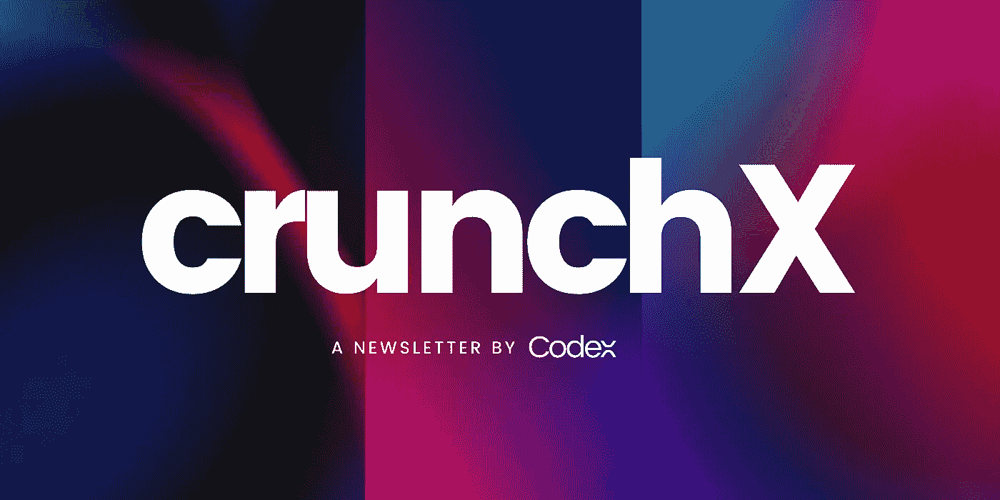

# 介绍克朗彻斯！

> 原文：<https://medium.com/codex/introducing-crunchx-311b445b3ece?source=collection_archive---------2----------------------->

## 法典委员会的技术通讯

作者图片

创办一份时事通讯已经在我们的清单上被检查了很长时间，但是今天我们非常兴奋地用我们的独家时事通讯 CrunchX 检查一下。

很明显，这将是一份涵盖广泛主题的技术通讯，包括未来技术、小工具、编程、数据科学等等。我们已经决定在每周六每周发布新版本的时事通讯(第一版有点延迟)。

## 预期的事情

基本上，每一期的时事通讯都将有十篇文章，这些文章将是一般技术文章和技术文章的混合体。这些文章是由我们的编辑从著名来源如 The Verge、TechCrunch 等精心挑选的。

时事通讯中的每个故事都有自己的简短摘要，由挑选了特定文章的编辑制作，并附有阅读链接。作者的名字也将被突出显示，以给予正确的学分。

我们也不会只坚持一个主题，而是将重点放在不同的技术领域，使简讯每周看起来都很新鲜，而不是以单调的语气撰写。

## 结束语

这份新闻简报是我们团队将食典推向下一个层次的努力之一，我们决定尽可能以最好的方式完成它。为我们的读者带来高质量的内容一直是我们的首要目标，现在在 CrunchX 的帮助下，我们将很快实现这一目标。

如果你想看看第一版的时事通讯，点击这里的链接:[https://medium.com/codex/crunchx-edition-1-7f38bee1b09b](/codex/crunchx-edition-1-7f38bee1b09b)。此外，如果你不想错过任何即将到来的版本，请订阅我们的时事通讯。话虽如此，读写快乐！

## 问候，

法典小组