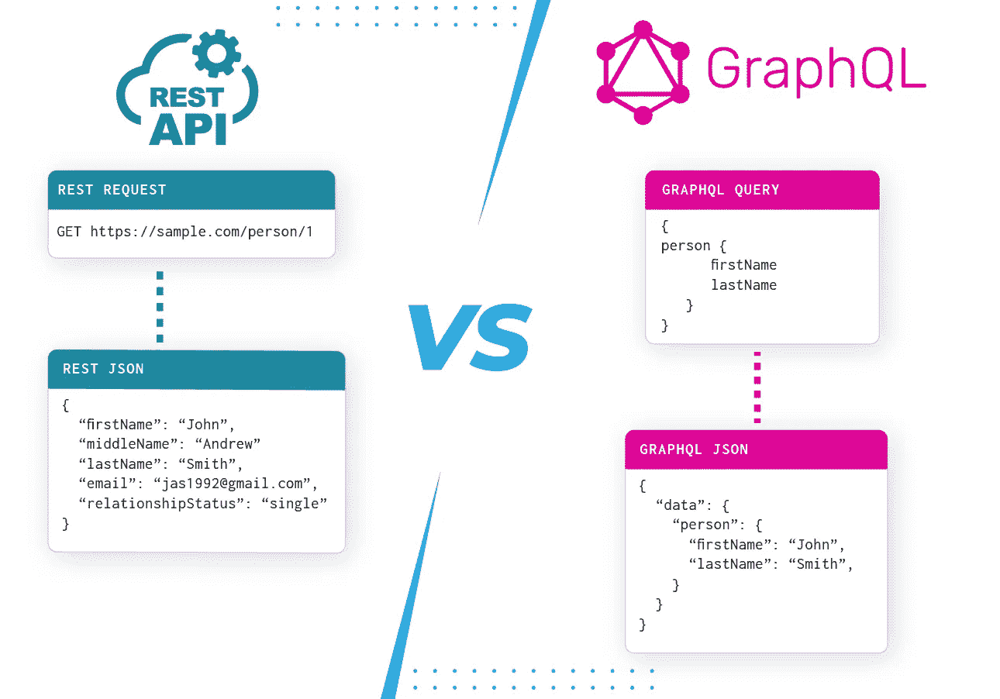
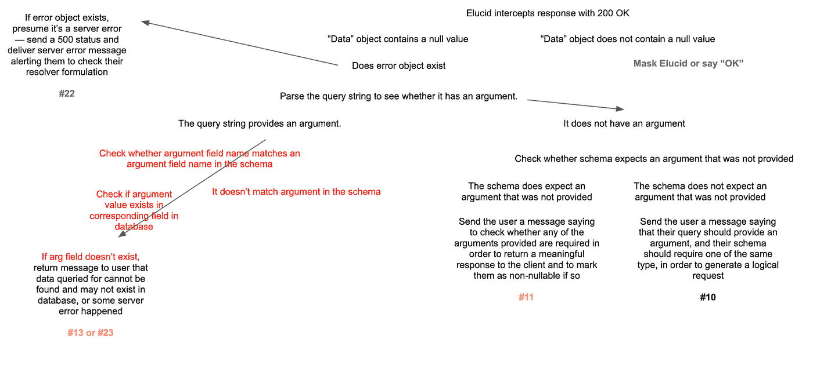
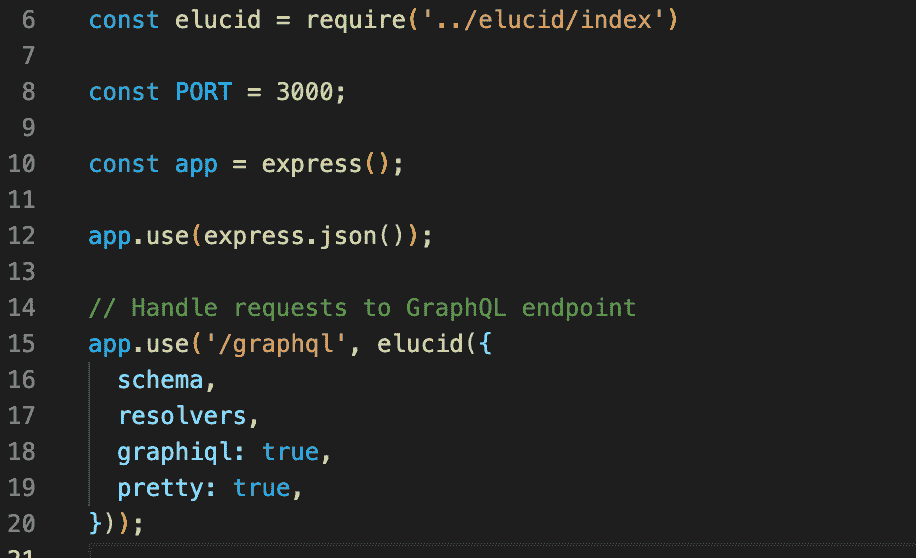
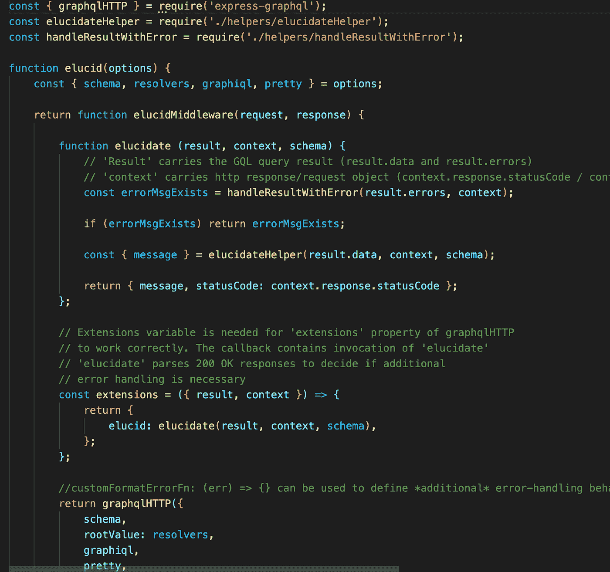

# 向我们介绍 Elucid，一个 GraphQL 错误检测器

> 原文：<https://medium.com/codex/introducing-elucid-a-graphql-error-detector-for-the-rest-of-us-1edd161bc38a?source=collection_archive---------13----------------------->

GraphQL 做了很多很棒的事情，但是它并没有让通过 HTTP 发送的请求的错误检测变得特别容易。**想改变这一点。**

**

# *问题是*

*自从 GraphQL 在 2015 年公开发布以来，越来越多的软件开发人员转向脸书的开源查询语言来支持他们的 API 游戏。GraphQL 的灵活性和提供精确响应的潜力意味着开发人员需要的数据更少。这在一个对复杂、丰富和动态移动计算的期望越来越高的时代尤为重要，在这个时代，传输的每个字节都要根据时间和使用情况进行权衡。*

*然而，伴随着所有这些潜力而来的是更多的复杂性。作为比较，考虑 GraphQL API 正在取代的现有 RESTful API 架构。在这种配置下，客户端向特定的 URL 发出 HTTP 请求(“GET”、“POST”、“PUT”或“DELETE”)，该 URL 可能类似于“https://www . example . com/users/{ username }”。web 地址的最后一部分是后端端点，客户端可以在这里查询给定用户的信息。如果客户机错误地请求关于一个不存在的用户的信息，并且在服务器的数据库中找不到这个用户，那么服务器很容易在它的响应中返回一个 4xx 错误代码，向客户机表明它发出了一个错误的请求。*

*就其本质而言，GraphQL 往往会给这个过程带来麻烦:您的公式化 GraphQL 查询(很可能)是作为标准 HTTP 协议“POST”请求的一部分发送的，但它们都去往同一个地方:单个 GraphQL 端点。服务器将用一个 JSON 响应对象来响应发送到这个位置的任何请求。我说“很可能”通过 HTTP 发送，因为 GraphQL 是传输层不可知的。虽然它经常出现在通过 HTTP 提供服务的领域中，但是在 GraphQL 规范中没有任何关于 GraphQL 应该如何处理的内容，例如，在 HTTP 响应中设置状态代码，因为 GraphQL 本身并不是 HTTP 的替代品，也可以很容易地通过 WebSockets 提供服务。*

**

*来源:[https://www.cosmicjs.com/blog/graphql-vs-rest-a-quick-guide](https://www.cosmicjs.com/blog/graphql-vs-rest-a-quick-guide)*

*这么说吧:如果你问它一个问题，而 GraphQL 的回答是，“我找不到你要找的东西”，甚至“你问我的问题没有任何意义”，就 GraphQL 而言，这是一次成功的交互，也是一次完全有效的回应。对于习惯于传统 RESTful 范式的客户端开发人员来说，这有点令人失望，因为通常依赖服务器设置的响应状态代码来通知客户端应用程序应该如何处理收到的响应。通过替换 RESTful API 的静态、显式架构，GraphQL 增加了希望与之交互的开发人员的概念复杂性，因为现在他们的负担是以他们以前不必担心的方式理解响应。*

*除了缺乏现成的状态代码操作，错误消息还可能变得模糊不清，因为当“null”响应字段是服务器中不存在的查询数据点的结果，而不是错误查询的结果，甚至是 GraphQL 安装部分的内部服务器错误时，这一点并不总是很清楚。*

**

*一个自鸣得意的绝地图书馆员像对待 GraphQL 一样不透明地处理着欧比-万的搜索请求。*

*现在，使用 GraphQL 的这一方面已经为人所知很长时间了，市场上有很多现有的产品都包含了针对基于 HTTP 的 GraphQL 实现的某种版本的错误处理。一个是 Apollo，它是一个强大的全功能平台，将自己定位为一个完整的数据管理解决方案；Relay，脸书的早期产品，为 React 应用而构建；和 Hasura，一个用于数据库的“实时 GraphQL API 引擎”,等等。这些都是经过市场检验的、健壮的、非常有用的工具。那我们为什么决定自己做呢？*

*我们希望构建一些东西，不需要像 Apollo 那样选择客户端和服务器之间的整个网络层生态系统，也不需要像 Relay 那样固执己见地看待如何处理服务器的响应。我们只是想要一些轻便、直接、容易起飞的东西。它不像是一个你必须采用的完整框架，更像是一个插件，让开发人员在与 GraphQL 服务器通信时更容易、更直观。我们知道我们将构建扩展 graphql.js 功能的代码，graphql . js 是面向希望在 graph QL 领域工作的 Javascript 开发人员的简单的“香草”客户端。*

*从那以后，我们开始着手解决这个问题，在 GraphQL 和错误行为方面的大量文章的指导下，我们建立了一个测试环境，并探索了尽可能多的可能的错误场景。我们创建了一个“错误分类”来跟踪如何重现我们的错误，以及它们如何在从服务器发回的响应中表现出来。由此，我们讨论了如何对有用的错误处理语言进行逆向工程，以及何时改变与响应一起返回的默认 200 OK 状态代码，以使它们更符合 RESTful 状态编码。*

****

*当我们试图全面理解与 GraphQL 服务器对话时潜在的错误出现点时，我们的一些工作文档。*

*在这个阶段，我们必须决定是直接在 graphql.js 上构建，还是引导 express-graphql，这是 graphql 官方文档中推荐的一个流行的包，作为一种轻松启动和运行 graphql 服务器的方法。构建在 express-graphql 之上的一个明显的缺点是将我们的潜在用户锁定在使用 express 来处理他们的服务器设置。结果是，express-graphql 已经带有内置逻辑，可以识别许多可能导致 4xx 响应的常见错误请求，因此我们可以将精力集中在它尚未处理的问题上。后来，我们可以扩展 Elucid 的能力，使其包含 express-graphql 所处理的内容，使我们的工具更加不可知。鉴于 Express 如此受欢迎，这在目前看来是一个公平的交易。*

*尽管 Express-graphql 提供了可选的定制错误处理配置，但是它有一个默认的方式来处理它检测到的错误。此外，它为扩展提供了空间，这意味着我们可以为通过 express-graphql 错误检查的响应定义一些额外的后处理行为。在那里，我们可以通过定制的`euclid()`函数开发错误发现和处理的第二层。*

**

*这就是神奇的地方:就在您自己的 GraphQL 服务器设置中。*

**

*深入了解 Elucid 的逻辑。*

*我们相信 Elucid 是目前 GraphQL 的 Javascript 实现中最简单的错误检测库。在未来，我们希望消除 Elucid 对 express-graphql 的依赖，使其成为真正独立的解决方案。我们希望您尝试一下，并发现它有助于照亮您自己项目的前进道路。*

****登陆***[***www . Elucid . dev***](https://www.elucid.dev)访问 Elucid 在线*

****有兴趣投稿或查看 Elucid 的代码？访问***[***Github***](https://github.com/oslabs-beta/Elucid)***项目页面。****

****团队洗脱液是:****

**Khayal Alasgarov:*[*LinkedIn*](https://www.linkedin.com/in/khayal-alasgaroff/)*|*[*Github*](https://github.com/Alasgaroff)*

**邬君梅* [*领英*](https://www.linkedin.com/in/viv-wu/)*|*[*Github*](https://github.com/vw-in-github)*

**斯潘塞深圳*[*LinkedIn*](https://www.linkedin.com/in/spencer-szu)*|*[*Github*](https://github.com/Szuay)*

**乔瓦尼雅各布奇* [*领英*](https://www.linkedin.com/in/gioiacobucci)*|*[*Github*](https://github.com/garyiacobucci)*