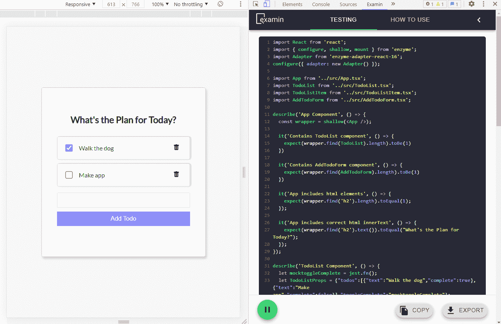

# 介绍 examina——React 的自动化单元测试生成工具

> 原文：<https://medium.com/codex/introducing-examin-an-automated-unit-test-generation-tool-for-react-19aaeacf6ff6?source=collection_archive---------4----------------------->

# **简介**

开发人员知道为应用程序编写测试可能是耗时、乏味和麻烦的。然而，我们都知道测试是开发高效、高性能和可靠的产品代码的基本要素。当在整个开发过程中没有编写全面的测试套件时，产品很容易积累错误，变得难以维护，并积累技术债务。另一方面，有效的自动化测试可以提高生产率并节省宝贵的时间，使开发人员能够专注于更高优先级的任务。

了解这一痛点后，我们开发了一个工具，可以显著简化 React 应用程序的测试创建。迎接**考试**。

# **什么是考试？**

examinate 是一个开发工具，作为 Chrome 扩展部署，为开发中的 React 应用程序动态生成单元测试。examinate 允许开发人员在应用程序的任何状态下直观地检查特定组件的单元测试，并在组件被安装和卸载时不断更新测试。通过基于应用程序的当前状态自动生成单元测试，examinate 节省了开发人员编写测试的时间，因此他们可以专注于代码库本身，从而更容易维护代码质量，有效地识别 bug，并减少技术债务。

# **examina 自带的特性:**

*   允许用户指定要生成测试的组件
*   识别伴随测试的组件之间的父/子关系
*   在装载、卸载和更新时跟踪组件
*   为每个组件关联道具，并模仿伴随的功能
*   暂停/开始特性，用于暂停单元测试生成的状态
*   允许用户编辑、剪切、复制和粘贴代码的可编辑代码查看器
*   将代码导出到文本或 JavaScript 文件
*   为组件的绝对文件路径动态生成导入语句，并为相对文件路径输入可编辑的根目录

# **如何使用**

使用 Examin 真的很简单。要开始，只需安装 chrome 扩展，在 localhost 上运行 React 应用程序，Examin 将在加载时为所有组件生成单元呈现测试。examinate 允许开发人员在应用程序的任何状态下直观地检查和修改测试，做出他们认为合适的更改，并将 Jest 测试代码导出到他们自己的代码库中。

# **工作原理**

为了理解 Examin 是如何工作的，我们必须首先了解 React Fiber。React Fiber 是 React 版本 16.0.0 中引入的新协调算法，用于管理更平滑的 UX 和动画的优先级。Fiber 消除了在每次渲染时重新创建组件的需要，并改进了用于遍历组件的数据结构。

Examin 利用 React Fiber 的单链表来遍历用户的应用程序，并访问生成单元测试所需的组件数据。Examin 在运行时访问 React 纤程数据结构，方法是将 javascript 代码注入用户应用程序，以便在组件被安装、卸载和更新时读取纤程数据。然后，该数据通过在浏览器的活动标签中运行的脚本和后台脚本之间的进程间通信系统发送，在后台脚本中，使用应用特定算法处理和转换数据，以输出 Jest 和酶单元测试。(Jest 是具有断言和嘲讽功能的主要测试运行程序。Enzyme 允许开发人员浅层渲染和挂载多层嵌套组件。)

# **未来**

目前，考试是在积极的测试。这是一个开源产品，可以接受来自 React 开发者社区的建设性反馈。我们邀请开发人员测试应用程序，提交问题，并为项目做出贡献。

## **作者**

*   克里夫·阿松曹—[@ Github](https://github.com/WizardSource)—[@ LinkedIn](https://www.linkedin.com/in/cliff-assuncao-1b2593211/)
*   kirsten Yoon—[@ Github](https://github.com/kirstenyoon)—[@ LinkedIn](http://linkedin.com/in/kirstenyoon)
*   尼古拉斯刷——[@ Github](https://github.com/Njbrush)——[@ LinkedIn](https://www.linkedin.com/in/nicholas-j-brush/)
*   ty Doan—[@ Github](https://github.com/tdoan35)—[@ LinkedIn](https://www.linkedin.com/in/ty-thanh-doan/)

## Chrome 网上商店扩展

[https://chrome . Google . com/web store/detail/examina/ihhopbmcfgkpjklemfdbhgingabdkcpe](https://chrome.google.com/webstore/detail/examin/ihhopbmcfgkpjklemfdbhgingabdkcpe)

## **GitHub**

 [## OS labs-beta/examina

### Examin 是一个 Chrome 扩展，为你的应用程序生成 React 单元测试。确保您的应用程序呈现为…

github.com](https://github.com/oslabs-beta/examin) 

## **网站**

[https://examin.dev/](https://examin.dev/)