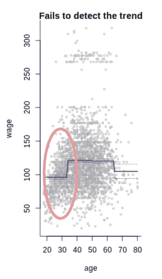
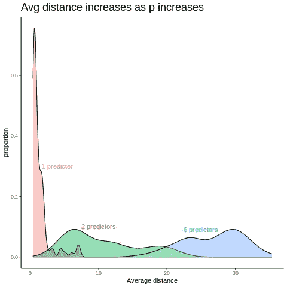

# 引入样条来描述非线性关系

> 原文：<https://medium.com/codex/introducing-splines-to-describe-nonlinear-relationships-e8b9c6edbacc?source=collection_archive---------9----------------------->


里卡多·戈麦斯·安吉尔在 [Unsplash](https://unsplash.com?utm_source=medium&utm_medium=referral) 上的照片

每个模型都是错的。什么？是的，每个模型都是错的。尤其是线性关系，因为现实世界中的大多数关系都不是线性的。想想吧。随着你花更多的钱，你对购物的满意度会直线上升吗？一个公司的利润会随着在一个项目上花费更多的时间而线性增长吗？因此，为了更好地预测，我们需要一种方法来表示非线性关系。有很多，这里有一些你可以使用的样条。

# 多项式回归

这是实现非线性的最简单方法。你只需要

1.  包括多项式项作为预测值
2.  为了获得更高的灵活性，使用更高的功效，并通过交叉验证或方差分析来检查它们的有效性

这种方法的局限性之一来自于模型的灵活性。增加灵活性的唯一方法是通过包含更高的预测项。然而，随着最高功率的增加，该模型的两端可能会变得过于摆动。因此，很难期望拟合良好的多项式回归具有高于 3 或 4 的幂。

```
fit.n = lm(response~poly(predictor, n), data=Data.set)plot(predictor, response, bty="l")
preds = predict(fit.n, newdata=list(predictor.grid), se=T)
lines(predictor.grid, preds$fit)
se.bands=cbind(preds$fit+2*preds$se.fit, preds$fit-2*preds$se.fit)
matlines(predictor.grid, se.bands)
```


随着功率的增加，曲线显示了摆动的末端

这种方法的另一个限制是它总是产生全局结构。也就是说，一个公式适用于整个预测值范围，因此您不能实施区域更改，因为模型中的一个小修改会完全改变模型的形状。因此，对不同区域应用不同公式的算法将是优选的。

# 阶跃函数

与多项式回归不同，阶跃函数给出了一个非全局结构。因此，其过程在拟合模型之前有一个额外的步骤。

1.  将预测值的范围划分为 K 个不同的区间
2.  将不同的常数放入这些容器中
3.  要获得更高的灵活性，请增加箱子的数量

```
fit.n = lm(response~cut(predictor, n), data=Data.set)
```


灵活性随着箱数量的增加而增加

从图中可以看出，阶跃函数类似于如下所述的分段常数函数。


阶跃函数方程

那么阶跃函数的限制是什么呢？因为它将预测值划分为不同的范围，所以如果没有任何自然断点(如下图中的红圈所示),它可能无法识别趋势。



红色圆圈表示阶跃函数未能检测到上升趋势的区域

然而，如果我们换句话说，这意味着如果有自然断点，阶跃函数可能是有用的。因此，在生物统计学和流行病学中使用它是很常见的，在那里你可以将年龄分解成不同的类别。

# 回归样条

解决多项式回归局限性的另一种方法是回归样条。其过程介于多项式回归和阶跃函数之间。

1.  用结划分预测器的范围
2.  将多项式函数拟合到每个区域
3.  为了灵活，通过交叉验证调整结的数量

因此，就像阶跃函数一样，回归样条可以视为分段多项式回归。


三次样条方程

分段函数的优点是，它在提高灵活性方面比多项式回归更稳定，因为它需要增加节点数而不是幂。

使用没有任何修改的回归样条的一个问题是，模型在节点处是不连续的，如下图所示。或者换句话说，样条太灵活了。因此，降低灵活性以使其更加自然会有所帮助，您可以通过向模型添加约束来实现这一点。


显示结处不连续性的三次样条曲线

您可以添加的第一个约束是使模型在结处连续。


一个三次样条显示了结处的 V 形/这个图形被人为地修改以证明一个点

但是，由于结处的 v 字形，模型看起来仍然不自然。为了解决这个问题，您可以添加另外两个约束:一阶和二阶导数——曲线的斜率和粗糙度——在节点处保持连续。


具有 5 个约束的光滑三次样条

因此，要制作平滑的样条，二阶导数应该存在，以便我们可以应用约束。因此，通常使用三次多项式来拟合回归样条。

所以现在你明白了，给模型添加约束会使模型更平滑，灵活性更差。但是这样做的代价是什么呢？

原始回归样条由两个三次多项式组成，每个多项式有 4 个系数。因此，该模型总共有 8 个自由度。这些自由度是增加约束的代价。一个约束对应一个自由度。因此，在上面的最终模型中，有 8–3 = 5 个自由度。另一种计算三次样条自由度的方法是通过 *4+K* ，其中 K 代表使用的节点数。

现在的问题是，你应该把结放在哪里？

这个问题没有一个最佳答案，但基础是在数据点聚集的地方放置更多的结，以便模型可以处理非线性。一种方法是在你认为数据点变化快的地方多打几个结，这需要领域知识。另一种更常见的方法是根据自由度均匀分布结。例如，当您用三次样条曲线要求 7 个自由度时，在第 25、50 和 75 个百分点处将有 3 个节点。

```
fit = lm(response~bs(predictor, knots=c(n1, n2, n3)), data=Data.set)
fit = lm(response~bs(predictor, df=n), data=Data.set)
```


带有用户选择的节点的三次样条/带有由函数自动选择的节点的三次样条

# 自然三次样条

尽管三次样条曲线中的约束使模型的中间部分变得平滑，但在没有应用约束的样条曲线的两端，模型可能会有很大的变化。为了解决这个问题，我们可以在每一端设置两个约束:一阶和二阶导数都为 0。有了这些额外的约束，两端变成了具有较低方差的线性，我们称这种方法为自然三次样条。

```
fit.n = lm(response~ns(predictor, df=n), data=Data.set)
```


显示三次样条比自然三次样条的置信区间更宽的图

# 平滑样条

另一种生成样条曲线的方法遵循脊和套索回归的类似概念。

1.  找到一个使σ(yᵢ最小的函数 g(x)——g(xᵢ)
2.  为灵活起见，选择一个合适的λ值


随着 lambda 的减少，显示灵活性增加的图(上)/平滑样条方程(下)

因此，就像脊和套索回归一样，平滑样条方程由损失函数-σ(yᵢ-g(xᵢ)-和代表模型粗糙度总和的惩罚项- λ∫g"(t) dt -组成。因此，当λ=0 时，罚项对模型的粗糙度没有影响。因此，g(x)将尝试对大多数训练观测值进行插值。另一方面，当λ增加时，惩罚项对粗糙度的影响更大。因此，模型变得更加平滑，并最终达到完美的线性。因此，使用平滑样条时，通过交叉验证选择合适的λ至关重要。

```
fit.n = smooth.spline(predictor, response, cv=T) 
```


由 CV 选择的 lambda 值为 0.0233 / 6.895 df 的平滑样条线

# 局部回归

与以前的方法不同，以前的方法是一次给出所有的观测值来拟合一个模型，局部回归在拟合过程中使用来自目标点的局部观测值。

1.  选择多少个观测值将被包含在跨度 s 中，跨度 s 通过*邻近观测值* / *总观测值*来计算
2.  将较大的权重- Kᵢ₀ -应用于更接近目标点的观测
3.  拟合最小化σkᵢ₀(yᵢ-β₀-β₁xᵢ的加权最小二乘回归)
4.  要获得更高的灵活性，请选择较小的 s 值

```
fit.n = loess(response~predictor, span=n, data=Data.set)
```


随着跨度的减小，曲线显示灵活性增加

因为局部回归使用附近的观测值进行预测，所以当局部观测值很少时，它的局限性就很明显。但是这是什么时候发生的呢？

让我们假设所有的预测值都显示正态分布，我正在尝试找出 10 个附近的观测值与目标点有多大关系。为了衡量这一点，我使用了欧几里德距离。



根据预测值数量显示不同平均距离分布的图

随着预测值数量的增加，目标点和附近观测值之间的平均距离也会增加。这意味着随着 p 的增加，获得与目标点密切相关的观测值变得更加困难，这最终会降低模型的性能。因此，我们可以说，当有大量预测因子时，局部回归往往表现不佳。

即使有这个缺点，局部回归还是有用的，因为没有固定的结构。因此，如果有足够的数据点，这是一个建模复杂结构的好选择，其他方法不能。

# 以此为基础的广义可加模型

到目前为止，我给了你各种方法，你可以使用非线性拟合。有了广义加性模型(GAM ),你就不必局限于只应用其中的一个。GAM 作为一个框架，上面的所有方法，加上你知道的其他方法，作为构建模块，这样你就可以将你选择的方法组合到 GAM 中，并做出预测。

使用 GAM 的主要优势来自于它的附加性质，因为它允许我们在保持其他因素不变的情况下，检查每个预测因素对反应的单独影响。因此，如果您对推理感兴趣，GAM 可能是一个不错的选择，因为您可以从其输出中直观地看到每个人的效果。

```
gam.mix = gam(response~ns(predictor1,df=4) + lo(predictor2,span=n) 
              + predictor3,data=Data.set)
```


GAM 的输出允许我们检查每个人的效果

具有讽刺意味的是，其中一个缺点也来自于加法行为，因为它不考虑交互项，除非我们明确地指定它们。因此，我们可能会错过一些重要的。

# 最后的话

正如所有事情一样，没有一种方法在任何情况下都可以支配所有其他方法。使用哪种方法几乎总是取决于数据集的样子。因此，与其偏爱一种方法，不如先探索数据集，尝试不同的方法，看看哪种更适合。如果上面的任何样条曲线不符合数据集，您可能需要考虑其他方法，如决策树。

# 参考

[1]红衣主教。“在 r 中设置自然三次样条中的结”.*交叉验证*，2011 年 2 月 17 日，stats . stack exchange . com/questions/7316/Setting-Knots-in-Natural-Cubic-Splines-in-r。

[2]威廉·格思里。【4.1.4.4】T2。黄土，【www.itl.nist.gov/div898/handbook/pmd/section1/pmd144.htm.】黄土

[3]詹姆斯，加雷斯。统计学习介绍:在 R 中的应用。斯普林格，2021。

[4]拉尔森，金。" GAM:预测建模银弹."*多线程*，2015 年 7 月 30 日，multithreaded.stitchfix.com/blog/2015/07/30/gam/.

[5]用户 11852。"为什么自然样条几乎总是三次的？"*交叉验证*，2018 年 10 月 28 日，stats . stack exchange . com/questions/374081/why-are-natural-splines-almost-almost-cubic。