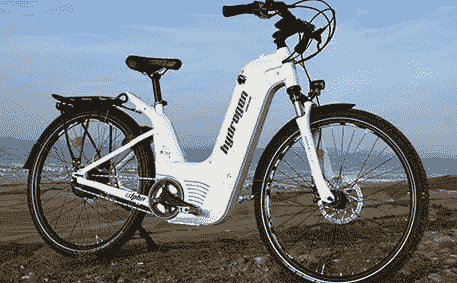

# 推出配备氢燃料电池的 Alpha Neo 电动自行车！

> 原文：<https://medium.com/codex/introducing-the-alpha-neo-e-bike-with-hydrogen-fuel-cells-7a5c6a87b073?source=collection_archive---------4----------------------->

## 不需要插头

[Alpha Neo(Pragma Industries 的媒体)](https://www.pragma-industries.com/wp-content/uploads/2020/11/light-mobility-situations_mountain.jpg)

你是一个城市旅行者，正在寻找一种更有效的方式在城里四处游览吗？或者你是一个厌倦了为你的电动自行车充电而等待数小时的通勤者？别再找了——来自 [Pragma Industries](https://www.pragma-industries.com/light-mobility/) 的 Alpha Neo 氢燃料电动自行车就在这里！这款创新的新型自行车旨在提供一种坚固耐用的解决方案…