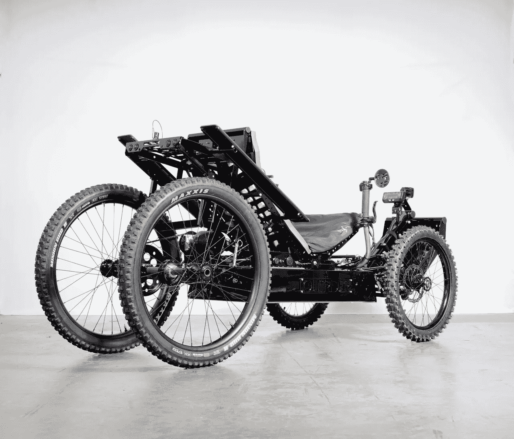

# 介绍 Coyote 4WD 电动全地形车:适用于所有车手的适应性解决方案

> 原文：<https://medium.com/codex/introducing-the-coyote-4wd-electric-atv-an-adaptive-solution-for-all-riders-736ce193dfd4?source=collection_archive---------11----------------------->

## 户外是为每个人而生的

[Coyote 4WD(Outrider USA 媒体)](https://outriderusa.com/products/coyote-quad-compact-electric-atv)

[Outrider USA](https://outriderusa.com/) 认为每个人都应该能够享受大自然。这就是为什么他们开发了 Coyote 四轮驱动电动全地形车，这是一种为健全和残疾骑手设计的紧凑型轻型车辆。这种适应性解决方案确保每个人都可以…