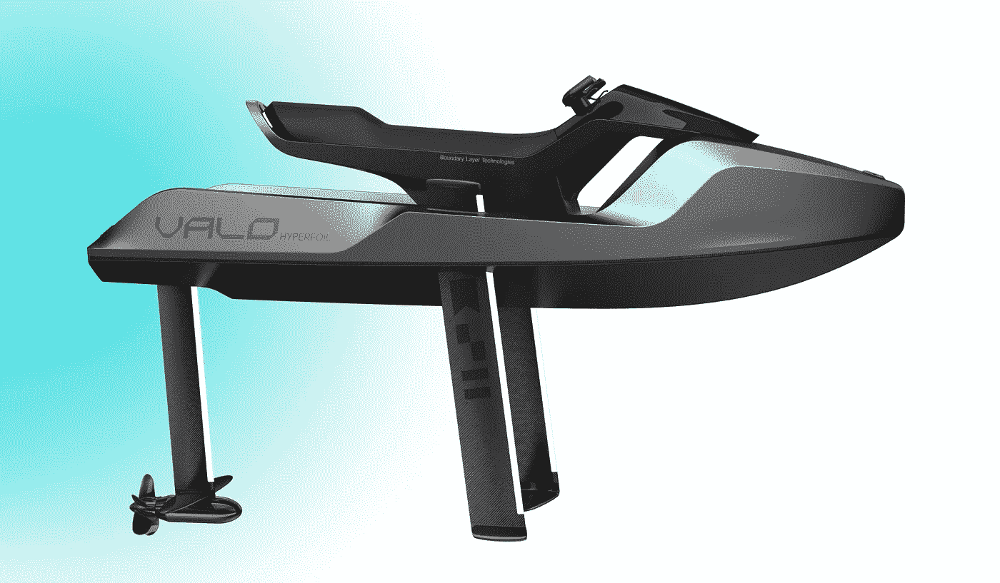

# 介绍电动瓦洛 Hyperfoil

> 原文：<https://medium.com/codex/introducing-the-electric-valo-hyperfoil-b23217f955a7?source=collection_archive---------7----------------------->

## 准备好飞越那些汹涌的波浪

[瓦洛海飞丝(瓦洛媒体)](https://images.squarespace-cdn.com/content/v1/63610b04ed3ea73921980eab/1669214877590-BOXA9A1XT3VGW8V9RD79/Side.png?format=2500w)

在过去的几年里，我们看到了船艇领域的许多创新。我已经写了几个这样的交通工具，但是现在另一个条目结合了水翼艇和摩托艇。总部位于加州的初创企业边界层技术公司生产的[瓦洛 Hyperfoil](https://www.ridevalo.com/) ，配备了一系列令人印象深刻的…