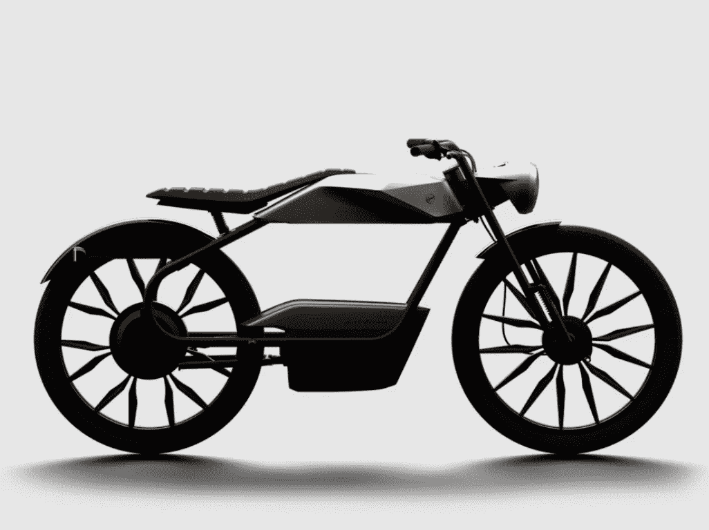

# 介绍 Eysing PF40——融合了意大利设计和荷兰工艺

> 原文：<https://medium.com/codex/introducing-the-eysing-pf40-a-fusion-of-italian-design-and-dutch-craftsmanship-ce398b580a9b?source=collection_archive---------3----------------------->

## 一辆有档次的电动助力车

[Eysing PF40(Eysing 媒体)](https://eysing.com/models/pf40/)

Eysing PF40 是一款革命性的两轮车，融合了最好的意大利设计[(宾尼法利纳)](https://pininfarina.it/en/)和最高品质的荷兰 [(Eysing)](https://eysing.com/) 工艺。它推动了豪华电动助力车领域的发展，以前瞻性的方式设计…