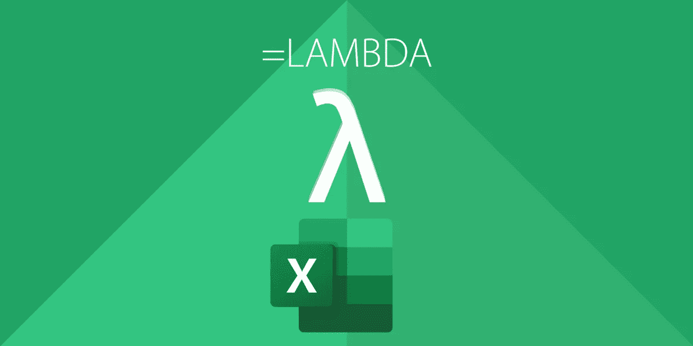

# 在 Excel 中引入新的 LAMBDA 函数

> 原文：<https://medium.com/codex/introducing-the-new-lambda-function-in-excel-4846c1b101db?source=collection_archive---------0----------------------->

## 微软的另一个游戏规则改变者

公平地说，Excel 公式正变得像一种编程语言。在过去的几年里，微软已经从根本上改变了 Excel 的计算引擎，并引入了一套功能，使我们能够构建公式，以更少的资源做更多的事情。