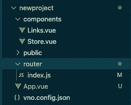
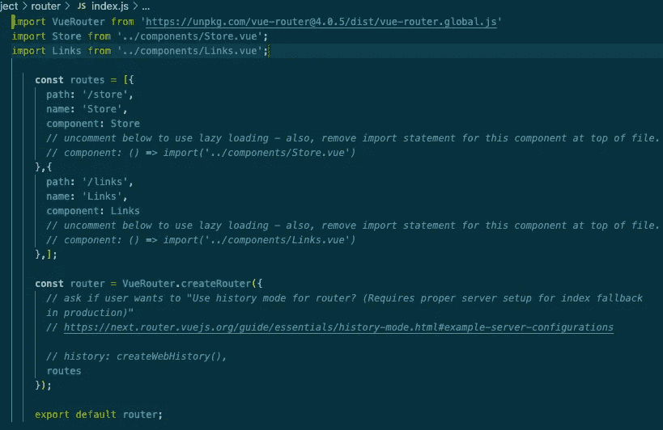
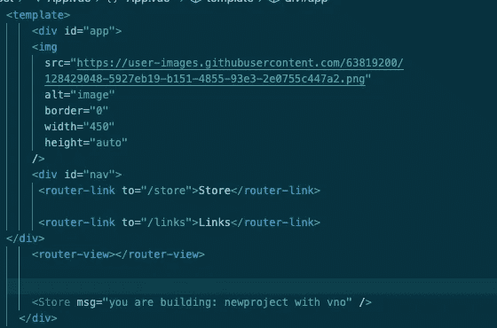

# vno 1.5:一个具有强大新特性的 Vue 构建工具

> 原文：<https://medium.com/codex/introducing-vno-1-5-a-more-powerful-build-tool-for-vue-9c0fae0fca4f?source=collection_archive---------4----------------------->

第一个在 Deno 运行时环境中创建、编译和捆绑 Vue 项目的构建工具

vno 让你有能力将 Vue.js 和 Deno 结合起来，轻松推出自己的水疗中心

想象一下建立一个传统的单页面应用程序的过程——与 webpack 搏斗，建立附加的配置文件，安装依赖项和测试库——你可能要花上几个小时才能看到样板代码或定义组件！这可能会让所有技能水平的开发人员感到沮丧，他们宁愿将精力集中在解决棘手的问题上，而不是运行另一个“npm 安装”来了解为什么软件包版本的轻微变化会在整个应用程序第一次启动之前就崩溃。

除此之外，还有更多问题需要回答。你想用什么框架？为什么？你真的考虑过 React 的好处吗？如果你想接触另一个框架呢？就此而言，您的运行时环境如何呢？你可能熟悉 node . js——你确定它是最适合*这个*项目的吗？您在五篇中型文章之前读到的另一个运行时呢？如果这一次你重组了你备受尊敬的技术，尝试了一些新的东西，会怎么样呢？

这些问题可能会让人不知所措。现在*开始编码的愿望*对你来说太多了，以至于你无法整理出更多的问题。如果有一个构建工具不仅能帮助你找到答案，还能为新的运行时、新的框架做好所有的准备，将你的开发时间减半，那会怎么样？

认识 vno

# 👋vno 1.5 简介

[vno](https://www.vno.land/) 是第一个在 Deno 运行时编译和捆绑 Vue 单文件组件的原生构建工具。自 2021 年初推出以来，vno 已经成为开发人员的一个有用工具，这些开发人员希望快速设置新的 Vue.js 应用程序，同时利用 Deno 运行时的许多好处、安全性和简单性。vno 采用了一些最强大的 Deno 功能——其简单的设置(一个可执行文件)、增强的安全功能和内置的类型脚本支持——并增加了 Vue.js 中的增量式渐进可伸缩性。

vno 为开发人员提供了一个易于理解、简单而高效的构建工具，将编译器和捆绑器集成到一个轻量级、高效的 CLI 中，而不管他们的经验水平如何。vno 使得在 Deno 运行时使用 Vue 语法开始一个新项目变得前所未有的简单。

# 🆕**vno 中的新特性**

vno 1.5 允许开发者在运行 *vno create* 命令后，在 Vue 2 和 Vue 3 语法之间进行选择。开发人员可以利用 Vue 3 的复合 API 获得更好的内置类型脚本支持。Vue 3 还提高了渲染速度，依靠完全重建的虚拟 DOM 来实现更快的挂载、补丁和树抖动功能。如果开发人员更熟悉 Vue 2 语法，vno 也提供了这个选项。

vno 现在提供了将最流行的 Vue 库之一的 [Vue 路由器](https://router.vuejs.org/)实现到单页应用程序中的能力，只需简单的“使用 Vue 路由器？”在 *vno 创建*过程中的选项。vno 已经理解了用 SSG 生成的页面的路由，但是合并 Vue Router 给了开发人员更多的选项来设置他们的初始样板代码。Vue 路由器由 Vue 社区开发，具有灵活性，像 Vue 生态系统的其他部分一样，可以逐步采用。它的速度和响应速度令人震惊，对于常见的案例设置来说简单易用，但对于更复杂的项目来说也是可定制的。

因为我们是在 Deno 中构建我们的新应用程序，所以这甚至更容易——同样，没有 webpack 设置或依赖项安装。Deno 根据需要直接在每个文件上导入模块。通过回答“是”到“使用 Vue 路由器？”在 vno 的项目设置中，您已经建立了父组件和子组件，导入了 Vue 路由器并创建了基本的页面路由，所有这些都只需在命令行上简单输入即可完成。

提醒一下，在这些新特性出现之前，vno 是一个强大的工具。vno 的静态站点生成允许您在构建时快速启动预先呈现的页面，无需额外配置。此外，vno 的实时重新加载提供了快速、可靠的 DX。vno 还支持组件级和全局 CSS 样式表。

这些新的更新推动了 vno 的发展，使它成为一个更有用的构建工具。

# 🏁如何开始使用 vno

下面是如何从命令行安装 vno

您可以按照我们的 [GitHub 页面](https://github.com/open-source-labs/vno)上的说明在 vno 中创建新项目。

# 🚘**vno 如何在引擎盖下工作？**

vno 的核心是一个适配器，它将解析一个 Vue 组件文件(或多个文件),并将其编译和捆绑成一个 JavaScript 文件，供浏览器读取和呈现。

在 vno 文档中可以找到对该流程的详细解释。 vno 通过使用几个简单的 CLI 命令，提供了相当于 create-vue 应用程序的功能。虽然 vno 在没有这种功能的情况下也可以轻松使用，但 vno create 降低了那些希望在 Deno 环境中使用 Vue，但以前由于这两种技术的新颖性及其不兼容性而受阻的人的进入门槛。

当给定根组件的相对路径时，vno 将递归地遍历文件结构，找到全部。vue 文件，并开始解析过程。每个组件的单独标签被隔离和存储，并且文件之间的所有必要连接被考虑，以便构建以正确的顺序发生。成功完成 vno 构建后，用户将看到创建了一个 vno-build 文件夹，其中填充了 build.js 文件和 style.css 文件。构建完成后，build.js 和 style.css 将需要链接到服务器，并在 index.html 内部引用。在初始化服务器时，很清楚 vno 是如何调整 Vue 文件以通过 Deno 提供给浏览器的。

# 🔧**vno 的‘添加 Vue 路由器’是如何工作的？**

让我们更深入地了解一下 vno 将 Vue 路由器纳入 SPA 的能力。vno 去掉了建立这个流行的路由库所涉及的许多步骤。

在项目创建提示中选择使用 Vue Router 之后，vno 会填充应用程序的父组件和子组件，并在📁项目中的**/路由器**文件夹。因为不需要通过单独的包管理器安装依赖项，vno 只需使用 Deno 的导入模块(使用类似浏览器的模块解析)在页面顶部导入路由器。Deno 缓存这些导入，减少了整体文件大小和响应时间。

vno 生成一个新的/components 文件夹和/router/index.js，其中内置了路由

vno 为您创建的每个组件定义路由，然后在/router/index.js 文件中初始化一个新的 Vue Router 实例，并将其导出以在应用程序中使用。

在父组件页面上，vno 还创建了一个 **< router-view / >** 实例。 **< router-view / >** 是一个功能组件，为给定路径渲染匹配组件。最后，路由器实例被导出并装载到父组件，将功能传递给整个 SPA。

vno 导入 Vue 路由器，为每个组件生成路由，创建 Vue 路由器的新实例并将其导出

<router-links>与<router-view>的实例一起被填充到父组件中</router-view></router-links>

# 💻**下一步是什么以及如何做出贡献**

我们希望很快将更多的特性整合到 vno 中，包括对作用域 CSS 样式的支持，以及整合其他流行的 Vue 库，如 [Vuex](https://vuex.vuejs.org/) 。vno 是在 Deno 运行时构建 Vue 应用程序的唯一构建工具，我们还可以添加更多。

当房间里有多种声音时，开源软件是最好的——我们很乐意在我们的 [GitHub 页面](https://github.com/open-source-labs/vno)或查看我们的网站 [vno.land](https://vno.land/) 上听到你的评论、抱怨、要求的功能等。

***队伍 vno*** 是:

**李孟贤**//[LinkedIn](https://www.linkedin.com/in/edwinlee89/)/[github](https://github.com/elcapitan89)

**凯恩伊藤-科尔** // [领英](https://www.linkedin.com/in/kitocole/) || [github](https://github.com/kitocole)

**迈克尔·罗斯**//[LinkedIn](https://www.linkedin.com/in/michaelalross)| |[github](https://github.com/MALRMALR)

**乔希·克雷泰拉** // [领英](https://www.linkedin.com/in/josh-cretella/) || [github](https://github.com/strangesongs)

vno = Vue.js🤝德诺