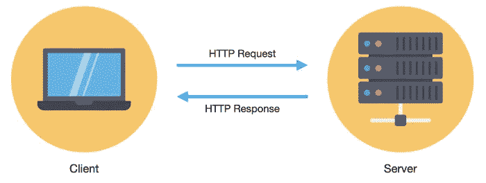
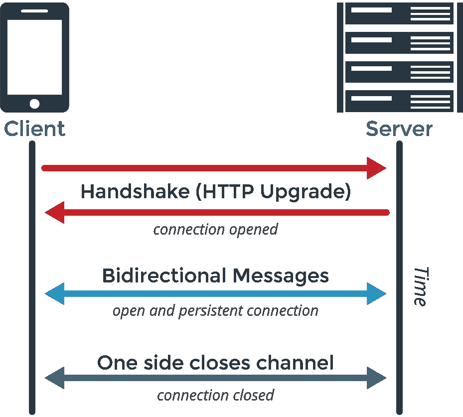

# WebSockets 简介—构建实时应用

> 原文：<https://medium.com/codex/introducing-websockets-building-real-time-apps-8ce1575cd69d?source=collection_archive---------9----------------------->

## 什么是 WebSockets，它们是用来做什么的？


照片由[克里斯托弗·罗宾·艾宾浩斯](https://unsplash.com/@cebbbinghaus)在 [Unsplash](https://unsplash.com/) 上拍摄

# **实时网络应用的简史**

web 是围绕着客户机的请求和服务器的回答而构建的。2005 年左右，AJAX 引入后，人们开始在客户端和服务器之间建立 ***双向*** 连接。

## 什么是 HTTP？

在超文本传输协议(HTTP)中使用的传统请求-响应模型中，客户端请求资源，服务器进行响应。如果您想在浏览器中查看某个页面，则需要通过 HTTP 请求从服务器中检索数据。因为客户端总是发起这种交换，所以没有客户端的请求，服务器不能发送任何数据。当客户偶尔发出请求时，这种模式在万维网上工作得很好，但是随着内容的快速变化，这种模式的局限性变得越来越重要。为了克服客户端发起的事务，设计了几种不同的策略来允许服务器将数据推送到客户端。



由 [DinosoftLab](https://www.flaticon.com/authors/dinosoftlabs) 从 [flaticon](https://www.flaticon.com/) 制作的图标

## HTTP 的问题

然而，所有这些使用 HTTP 的方法都有一个共同的问题:它们必须是低延迟的应用程序，能够支持由客户机或服务器发起的事务。这正是 WebSockets 所提供的，在这篇文章中，我们将看到它们做什么以及如何在实时 web 应用程序中使用它们。

## **什么是 WebSockets？**

WebSocket 是一种计算机通信协议，它提供客户端和服务器之间的全双工通信，以便双方可以随时开始发送数据。WebSockets 是一个建立在 TCP/IP 协议栈之上的瘦传输层。

## WebSockets 是如何工作的？

WebSocket 是另一种发送和接收消息的协议。要建立与服务器的 WebSocket 连接，客户端应该发送一个 HTTP“握手”请求。请求被发送到一个 **ws:** 或 **wss:** URI，如果连接成功，服务器发送一个成功的握手响应。一旦连接升级，协议从 HTTP 切换到 WebSocket，这是一个全双工协议，客户端和服务器都可以同时发送消息。



[图尼克](https://www.cleanpng.com/users/@tunike.html)在[清洁](https://www.cleanpng.com/)时拍摄的照片

# 【WebSocket 入门

通过调用 WebSocket 构造函数，可以简单地打开 WebSocket 连接:

这个简单的例子创建了一个新的 WebSocket，在`wss://example.com/socketserer`连接到服务器。在这个例子中，在对套接字的请求中命名了一个定制协议“protocolOne ”,尽管这可以省略。

```
const websocket = new WebSocket(“wss://www.example.com/socketserver", “protocolOne”);
```

如果您想要打开一个连接并使其在协议方面更加灵活，您可以指定一组协议:

```
const websocket = new WebSocket("wss://www.example.com/socketserver", ["protocolOne", "protocolTwo"]);
```

## 向服务器发送数据

一旦打开连接，就可以开始向服务器传输数据。要做到这一点，所有的`WebSocket`对象的`send()`方法为你想要发送的每条消息:

```
websocket.send("This is some text!");
```

我们可以通过定义一个`onopen`事件处理程序来完成这项工作，从而确保仅在连接建立后才尝试发送数据:

```
websocket.onopen = function (event) {
  websocket.send("This is some text!");
};
```

## 从服务器接收消息

WebSockets 是一个事件驱动的 API。当收到消息时，一个消息事件被发送到`WebSocket`对象。为了处理它，为消息事件添加一个事件监听器，或者我们可以使用`onmessage`事件处理程序。

```
websocket.onmessage = function (event) {
  console.log(event.data);
}
```

由于`event.data`是一个 JSON 对象，我们可以使用`JSON.parse()`将 JSON 对象转换回原始对象。

## 关闭连接

当您使用完 WebSocket 后，调用 WebSocket 方法`close()`来关闭连接。

```
websocket.close();
```

# 有哪些流行的 WS 库？

有一些流行的 WS 库，有很多框架。

*   节点。JS: [插座。IO](http://socket.io/) ， [WebSocket-Node](https://github.com/Worlize/WebSocket-Node) ， [ws](https://github.com/einaros/ws)
*   爪哇:[码头](http://www.eclipse.org/jetty/)
*   Ruby: [EventMachine](http://github.com/igrigorik/em-websocket)
*   Python: [pywebsocket](http://code.google.com/p/pywebsocket/) ，[龙卷风](https://github.com/facebook/tornado)
*   二郎:[白苏](https://github.com/michilu/shirasu)
*   C++: [libwebsockets](http://git.warmcat.com/cgi-bin/cgit/libwebsockets/)
*   。NET: [SuperWebSocket](http://superwebsocket.codeplex.com/)

# 插座。超正析象管(Image Orthicon)

在本帖中，我们将看看 Socket.IO. Socket。IO 支持基于事件的实时双向通信。它包括:

*   一个 [Node.js](https://nodejs.org/) 服务器
*   浏览器的一个 [Javascript 客户端库](https://github.com/socketio/socket.io-client)(或者一个 Node.js 客户端)

## 装置

```
// with npm
npm install socket.io

// with yarn
yarn add socket.io
```

## 如何使用

```
const server = require('http').createServer();
const io = require('socket.io')(server);
io.on('connection', client => {
  client.on('event', data => { /* Here is your code */ });
  client.on('disconnect', () => { /* Here is your code */ });
});
server.listen(3000);
```

## 与 Express 一起使用

在 3.0 版本之后，`express`应用程序已经成为请求处理器函数。你需要通过`server`到`socket.io`，而不是`express`申请。

```
const app = require('express')();
const server = require('http').createServer(app);
const io = require('socket.io')(server);
io.on('connection', () => { /* Here is your code */ });
server.listen(3000);
```

# WebSocket 的托管解决方案

除了 socket.io 这样的 WebSocket 开源软件，还有付费和托管的解决方案。最受欢迎的管理解决方案之一是[推送器](https://www.pusher.com/)。Pusher 是一个托管的 API 服务，可以向应用程序添加实时数据和功能。与 WebSockets 的唯一区别是 Pusher 是一个托管的服务/API，它需要更少的工作来开始。Pusher 很好用，不需要写很多代码就能实现实时应用。

# 参考资料和进一步阅读

*   [WebSockets 维基百科](https://en.wikipedia.org/wiki/WebSocket)
*   [WebSocket 基础知识:简介](https://blog.teamtreehouse.com/an-introduction-to-websockets)
*   [介绍 WebSockets:将套接字引入 Web](https://www.html5rocks.com/en/tutorials/websockets/basics/)
*   编写 WebSocket 客户端应用程序
*   [插座。IO](https://github.com/socketio/socket.io)