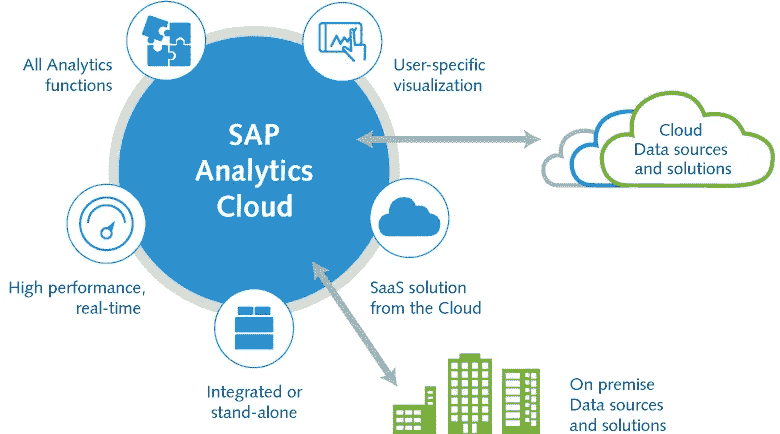
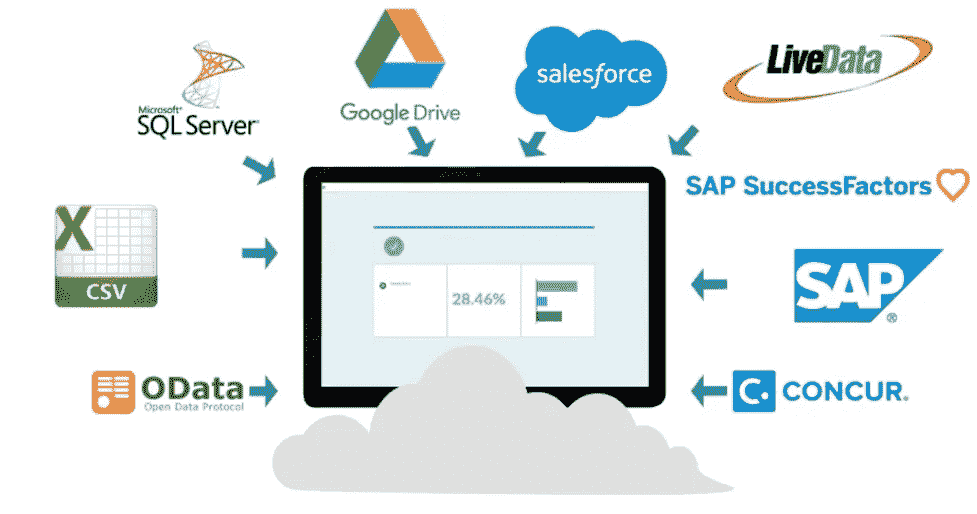
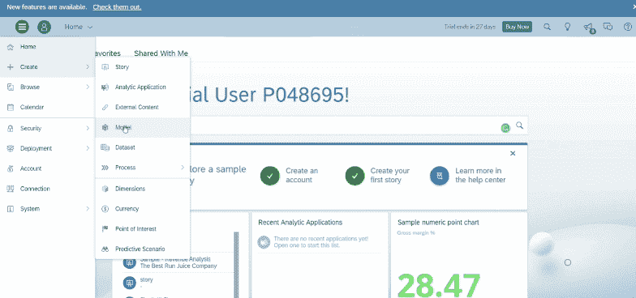
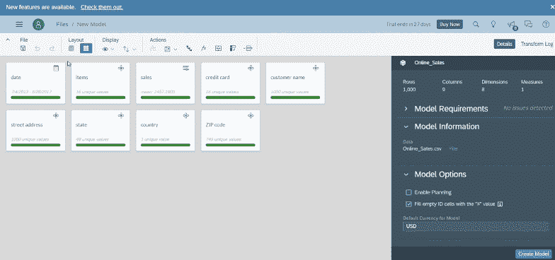
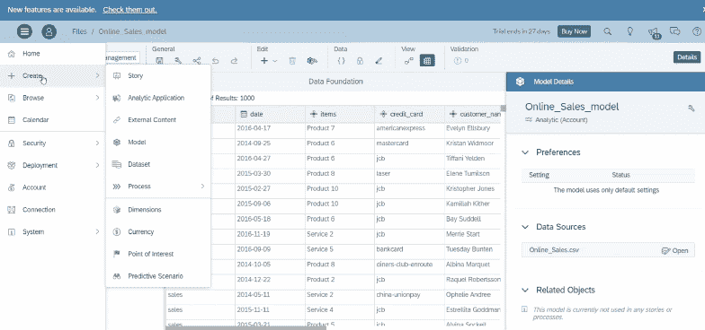
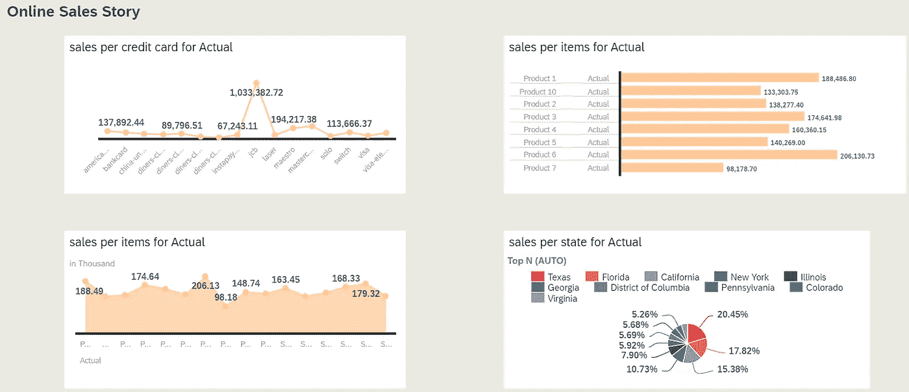

# SAP 分析云简介

> 原文：<https://medium.com/codex/introduction-on-sap-analytics-cloud-f1bdec22180b?source=collection_archive---------0----------------------->

讲故事是一种和世界一样古老的艺术形式。介于“耶！该讲睡前故事了”和“嘿！“你有什么故事，我们长大了。
但是在当今世界用**数据**讲故事是什么感觉？

数据故事讲述是一种一致的方法，用于**交流来自静态电子表格的数据见解，**并且它涉及三个关键方面的联盟:*数据*、*视觉效果*和*叙述*。

*数据可视化专家 Stephen worth 曾经说过，“数字有一个重要的故事要讲。他们依靠你给他们一个清晰而令人信服的声音。”*

在本帖中，让我们学习 SAP 分析云的基础知识。

**SAP 分析云**是一款 SaaS 解决方案，结合了:

> **云的**功能可与其他应用集成，包括 SAP 应用和其他第三方应用。
> **分析**功能，如用户友好界面中的规划、数据可视化、预测、商业智能，通过更好的决策和更深入的洞察。

**SAP 分析云构建于 SAP 云平台之上。**

SAP 分析云专注于三个主要模块:*数据、模型和故事。*

**数据** 要执行分析，第一步是收集业务组织的销售、客户、运营、财务等方面的数据。SAP Analytics Cloud 支持三种类型的数据源:通常驻留在本地系统上的文件(如 CSV 或 Excel 文件)、来自连接的远程系统的实时数据连接以及云应用。

**模型
提高分析数据质量的过程称为建模。这时我们可以定义度量和维度，设置数据的层次结构，设置单位和货币，自定义公式，还允许我们使用下钻功能来呈现数据的高级视图。**

**故事** 这是数据获得生命并为观众绘制有趣见解的地方。在 Story 模式中，我们可以用图表和图形来可视化我们的数据，进而提供一种全新的洞察力，从而要求利益相关者做出决策。

在 SAP Analytics Cloud 中，所有故事都可以与其他用户共享，并可以组织到 SAP 数字会议室议程中，以呈现给主要利益相关方。

因此，我们在这里，所有设置把我们的分析结果捕捉有意义的商业见解。

到目前为止，在本文中，我们了解到 SAP Analytics Cloud 包含数据、建模和故事功能，旨在满足商业智能和详细检查的需求。从灵活的数据连接到机器学习智能特性，SAP 分析云帮助企业自信地做出数据驱动的决策。

我准备讲一个关于网上销售数据的故事。如果您也想讲述您的故事，并在 SAP Analytics Cloud 上探索更多，那么您可以在[https://www.sapanalytics.cloud/try-for-free/](https://www.sapanalytics.cloud/try-for-free/)使用 90 天试用登录