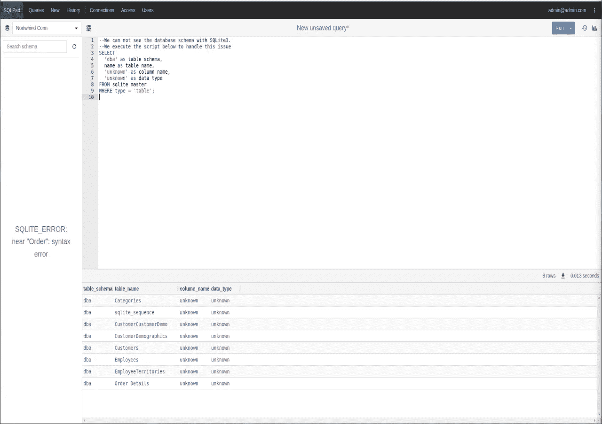
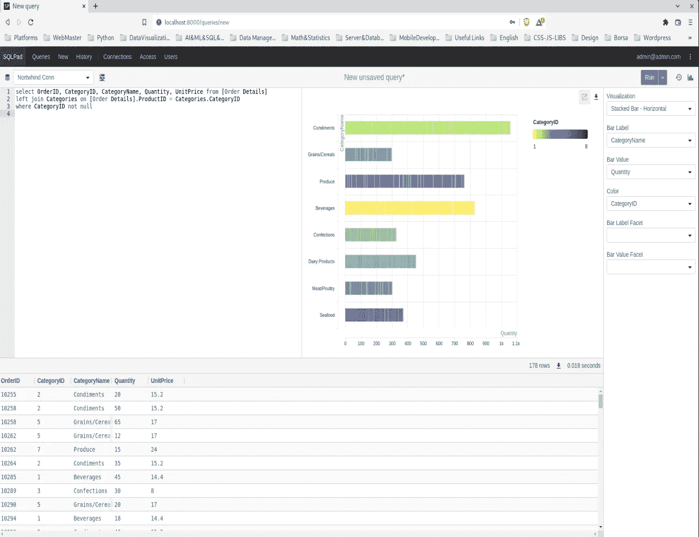

# 数据调查工具介绍:SQLPad

> 原文：<https://medium.com/codex/introduction-to-a-tool-for-data-investigation-sqlpad-3d20c127556c?source=collection_archive---------5----------------------->

## 在本地机器上安装 Docker，创建一个虚拟数据库，创建 SQLPad 连接，将 SQLite 与 Docker 卷绑定，运行一些查询

# 介绍

在这个故事中，我们将谈论我本周遇到的一个用于数据调查的开源工具:SQLPad。也许你知道，我已经在我以前的论文中写道，我在我的职业生涯中取得了一些进展。如今，我遇到一些新技术。此外，在接下来的几周里，我会写一些关于他们的东西。


由[克劳迪奥·施瓦茨](https://unsplash.com/@purzlbaum?utm_source=unsplash&utm_medium=referral&utm_content=creditCopyText)在 [Unsplash](https://unsplash.com/s/photos/data-investigation?utm_source=unsplash&utm_medium=referral&utm_content=creditCopyText) 上拍摄的照片

基本上，SQLPad 是一个运行查询的 SQL 编辑器。我们可以在 SQLPad 中做一些基本的可视化。在我的用例中，我们用它作为数据调查的工具。我们将在本地机器上设置它，并与 Docker 一起使用。你可以通过下面的链接访问它的官方网站。

 [## SQLPad

### 描述

getsqlpad.com](https://getsqlpad.com/#/) 

# 让我们开始设置

运行 SQLPad 有 [2 种方式。我们将遵循使用 Docker 的方式。我们需要在机器上安装一个 Docker 引擎。我猜你有引擎。如果您还没有，您可以通过下面的链接获得引擎。](https://getsqlpad.com/#/getting-started?id=running-sqlpad)

[](https://docs.docker.com/get-docker/) [## 获取码头工人

### 更新 Docker 桌面条款 Docker 桌面在大型企业(超过 250 名员工或…

docs.docker.com](https://docs.docker.com/get-docker/) 

## 拉图像

我在 Debian 机器上工作。因此，我将在 Debian 的终端中执行我将在本文中使用和解释的代码。SQLPad 的 Docker 映像可以在 Docker Hub 上访问。

 [## 码头枢纽

### 编辑描述

hub.docker.com](https://hub.docker.com/r/sqlpad/sqlpad/) 

> 实际上，我不打算在本文中解释所有的 Docker 命令。因为解释 Docker 命令不是本文的主题。

为了将该图像下载到我的本地，我将执行下面的代码。

```
docker pull sqlpad/sqlpad
```

该图像将被下载到我的本地。


作者图片

我们肯定可以执行`docker image ls`。


作者图片

## 使用映像运行 SQLPad

现在，我们可以使用已经绘制的图像创建一个容器。为了创建一个容器，我将使用下面的代码。

```
docker run -p 3000:3000 sqlpad/sqlpad
```

我们将机器的端口 3000 绑定到容器的端口 3000。因此，我们可以通过使用机器的端口 3000 来访问 SQLPad。如果成功，您应该会在终端上看到类似下面的输出。


作者图片

如果你在你的机器上点击`localhost:3000`，你会看到下面同样的屏幕。


作者图片

现在，我们可以稍微深入一下 SQLPad 配置。

## 创建虚拟数据库:Northwind

在本文的这一部分，我们将创建一个从 SQLPad 连接的虚拟数据库。我们使用 [SQLite](https://www.sqlite.org/index.html) 作为数据库，使用 [SQLiteBrowser](https://sqlitebrowser.org/) 作为 DBMS。

在 Debian 中，我们可以通过使用下面的代码来安装它们。

```
sudo apt-get install sqlite3 && sudo apt-get install sqlitebrowser
```

我将使用下面的 SQL 脚本创建一个数据库:

[https://raw . githubusercontent . com/jp white 3/north wind-SQLite3/master/north wind。Sqlite3.create.sql](https://raw.githubusercontent.com/jpwhite3/northwind-SQLite3/master/Northwind.Sqlite3.create.sql)


作者图片

我在我的桌面文件夹上创建了数据库。记住数据库的文件路径很重要。我们将在通过 Docker 卷将数据库绑定到 Docker 容器时使用它。

## SQLPad 为 Docker 容器配置和创建脚本

我们可以使用 SQLPad 的配置来设置我们是否需要使用身份验证机制，等等。您可以访问下面的链接来查看 SQLPad 配置的所有选项。

 [## SQLPad

### 描述

getsqlpad.com](https://getsqlpad.com/#/configuration) 

我准备了一个脚本文件来自动创建 Docker 容器。您可以在本文的最后一节访问该脚本。


作者图片

在我的脚本中，我们创建了一个默认的 admin 用户，设置了一个运行 SQLPad 的端口，并创建了一个默认的连接。这里，我们使用在上一节中创建的数据库文件路径。我们在 Docker CLI 中使用`-v REAL_PATH:CONTAINER_PATH`将一个卷绑定到容器。

在我们的例子中，我们将在桌面上创建的数据库绑定到容器中的`/databases/NorthwindDB.sqlite`路径。否则，SQLPad 无法访问 SQLite 数据库。因为数据库是我们机器上的一个物理文件。我们绑定了这个卷，以便在我们的机器和容器之间建立一个桥梁。

## 运行一些查询

我们设置了一个容器来运行 SQLPad。我将执行我们上面编写的脚本。

```
./start-sqlpad.sh
```

如果我们转到`localhost:8000`地址，在通过我们在脚本文件中设置的管理员用户凭证登录后，我们会看到下面相同的屏幕。


作者图片

SQLPad 不能通过处理 SQLite 来显示模式。为了显示我们拥有的表，我们将执行一个查询。

```
--We can not see the database schema with SQLite3.
--We execute the script below to handle this issue
SELECT 
  'dba' as table_schema, 
  name as table_name, 
  'unknown' as column_name, 
  'unknown' as data_type 
FROM sqlite_master 
WHERE type = 'table';
```



作者图片

此外，我们可以在 SQLPad 上进行一些可视化操作。举个例子，我将执行另一个查询。

```
select OrderID, CategoryID, CategoryName, Quantity, UnitPrice from [Order Details]left join Categories on [Order Details].ProductID = Categories.CategoryIDwhere CategoryID not null
```



作者图片

# 最后

我认为 SQLPad 是一个有用且简单的工具。很可能，我会在自己的项目中使用它来解决客户的要求。

此外，我为我们用来调整 Docker 容器的 bash 脚本创建了一个要点。

作者编写的脚本

我喜欢写作和编码。希望你也喜欢它。我们有一些 SQLPad 的额外特性，比如添加用户、添加数据库连接、管理用户角色等。我没有展示它们，因为您可以通过 GUI 轻松地应用它们。我认为我们做了核心功能的例子，如玩配置，绑定卷等。

亲切的问候。