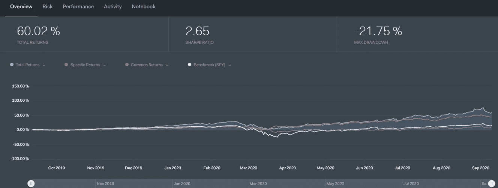

# Quantopian 算法交易简介

> 原文：<https://medium.com/codex/introduction-to-algorithmic-trading-with-quantopian-7ac424a28d49?source=collection_archive---------3----------------------->

米卡·鲍梅斯特在 [Unsplash](https://unsplash.com?utm_source=medium&utm_medium=referral) 上的照片

## 了解如何在 Quantopian 中创建简单的交易算法

# 算法交易

在开始研究算法交易之前，了解算法是很重要的。基本上，算法是用来解决简单或复杂问题的一组指令。由于技术和编程的发展趋势，交易者和投资者改变了股票交易系统，以适应技术，这就是算法交易开始发挥作用的地方。算法交易是股票交易的自动化过程，当一组给定的指令被满足时，该过程执行指令。这种特殊类型的交易主要是为了速度和克服市场情绪而开发的。

# 算法交易的量子乌托邦

Quantopian 是一家总部位于美国的公司，人们可以在这里合作、学习、开发、测试和分享他们的交易算法和回溯测试结果。Quantopian 为其用户提供免费教育、各种 quant 工具和数据，这样任何人都可以从事定量分析和算法交易。要获得 Quantopian 的实际操作，您必须对 python 代码有一些基本的了解，因为它是 Quantopian 控制台上唯一支持的编程语言。让我们用 Quantopian 编写一个算法，并对其进行回测！

# 在 Quantopian 中创建算法

在本文中，我们将创建一个基本的简单移动平均线(SMA)交易策略来交易 FAANG(脸书、亚马逊、苹果、网飞和谷歌)的股票。除此之外，我们还将利用我们的交易获得更好的夏普比率和回报

## 步骤 1:在 Quantopian 中创建帐户

在进入我们的编码部分之前，请记住，您必须拥有一个 Quantopian 帐户才能访问其编码控制台和笔记本。如果您在 Quantopian 中成功创建或拥有了一个帐户，您可以在导航栏中找到“研究”,然后在选项下选择“算法”。之后，你将登陆“算法”页面，在那里你可以找到“新算法”选项。选择该选项，您将进入一个编码控制台页面，我们将在这里对我们的交易算法进行编码。

## 步骤 2:初始化和安排我们的交易功能

按照下面提到的代码及其解释来初始化和安排我们的交易功能。

**解释:**首先，我们定义一个名为‘initialize’的函数，它将 context(一个存储信息的 Python 字典)作为参数，只在我们的程序开始运行时运行一次。在里面，我们使用一个名为“sid”的函数来存储我们感兴趣的公司的信息。不要担心里面的数字，因为当你在 Quantopian 控制台中键入“sid”时，会弹出一个搜索栏，你只需输入你感兴趣的公司名称。之后，我们调用“schedule_function”来运行我们的交易算法，稍后我们将创建该算法。

## 步骤 3:创建交易算法

我们创建交易算法的第三步分为三个部分:获取历史数据，创建 SMA 指标，最后创建交易策略和杠杆。

**a)获取历史数据:**

正如我之前提到的，我们将获得 FAANG 的股票价格，并使用它们来制定我们的战略。按照代码和解释提取 FAANG 的价格数据。在此之前，我们必须定义一个函数“ma_strategy ”,我们已经在前面的代码中初始化了它。

**解释:**正如我说过的，我们通过定义一个函数‘ma _ strategy’来开始我们的代码，我们创建的所有算法都在这个函数中实现。定义函数后，我们使用一个名为“history”的函数提取历史价格数据。在这个函数中，我们传递一些特定的参数来获取公司的价格数据。

**b)创建 SMA 指示器:**

在我们刚刚创建的函数“ma_strategy”下，我们将计算 FAANG 的 SMA 20 和 SMA 50，以建立我们的交易策略。按照代码和说明创建 FAANG 的 SMA 指标。

**解释:**我们通过使用简单的函数‘mean’为 FAANG 创建 SMA 20 指标，然后创建 SMA 50 指标来开始我们的代码。

**c)创建交易策略和杠杆:**

在本节中，我们将创建一个 SMA 交叉交易策略，我们还将创建一个变量，以避免为一个单一的 SMA 交叉交易执行多个订单。通过查看代码和解释，您将清楚地了解我所说的内容，并记住每个代码都属于“ma_strategy”函数。

**解释:**首先，我们通过传递函数“get_open_orders”来创建一个名为“open_orders”的变量，该函数只返回具有活动状态的订单对象。之后，我们正在创建一个“买入”策略，当 FAANG 的 SMA 20 大于 SMA 50 时，返回买入。您还可以观察到，只有在变量“open_orders”中没有列出时，订单才会被执行，这有助于我们避免在一次交易中多次执行订单。在我们的“买入”策略之后，我们正在创建一个“卖出”策略，当 FAANG 的 SMA 50 大于 SMA 20 时，做空该股票。在我们的整个策略中，我们使用了“order_target_percent”函数，该函数帮助我们执行指定公司和指定百分比的订单。例如，我们在所有的“买入”策略中都提到了“0.20”，也就是说，我们的投资组合中有 20%是这只股票。最后，我们使用“记录”功能创建一个自定义变量，以创建一个利用我们所有交易的变量“杠杆”。

我们现在开始回测我们的交易算法。为此，您可以点击“构建算法”选项进行样本回溯测试，或者点击“运行完整回溯测试”获得完整的回溯测试报告。

# **回溯测试结果**

作者图片

我们得到了很好的回溯测试结果！我们创建的交易算法总回报率为 60.02%，相对高于我们的基准(间谍)。我们还获得了 2.65%的夏普比率。上述结果的时间范围为 2019 年 9 月 11 日至 2020 年 9 月 10 日，我的初始资本金额为 1000 万英镑。您还可以通过将鼠标悬停在“风险”、“性能”等其他选项上来查看更多详细信息。您还可以在“活动”选项中查看您的交易。请注意，每一段代码和解释都严格用于教育目的，不应被视为投资建议。如果您错过了任何编码部分，请不要担心，因为我已经提供了这个交易算法的完整代码

除了这个算法，你还可以用 Quantopian 做更多的事情。您还可以利用 Quantopian 中的笔记本部分进行进一步的分析，并使用 pipeline 等工具。更多工具可以参考 Quantopian 文档。所以永远不要停止学习，永远不要停止编码！

**快乐的 Algo 交易！**

**完整代码:**