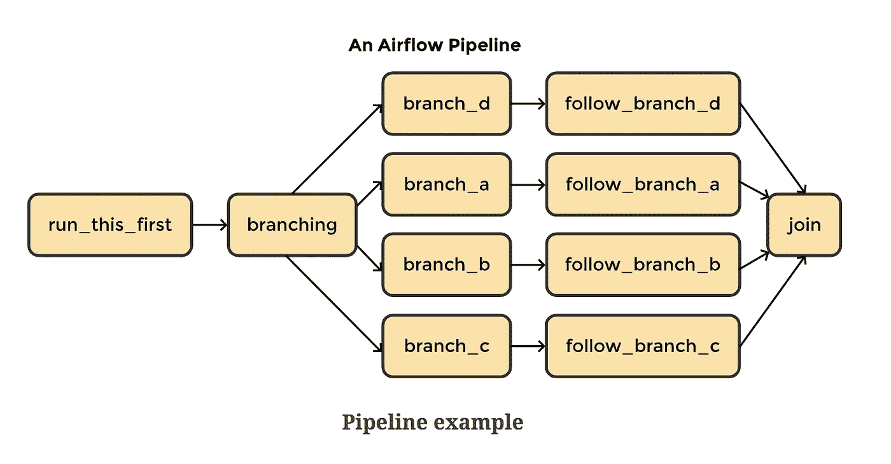
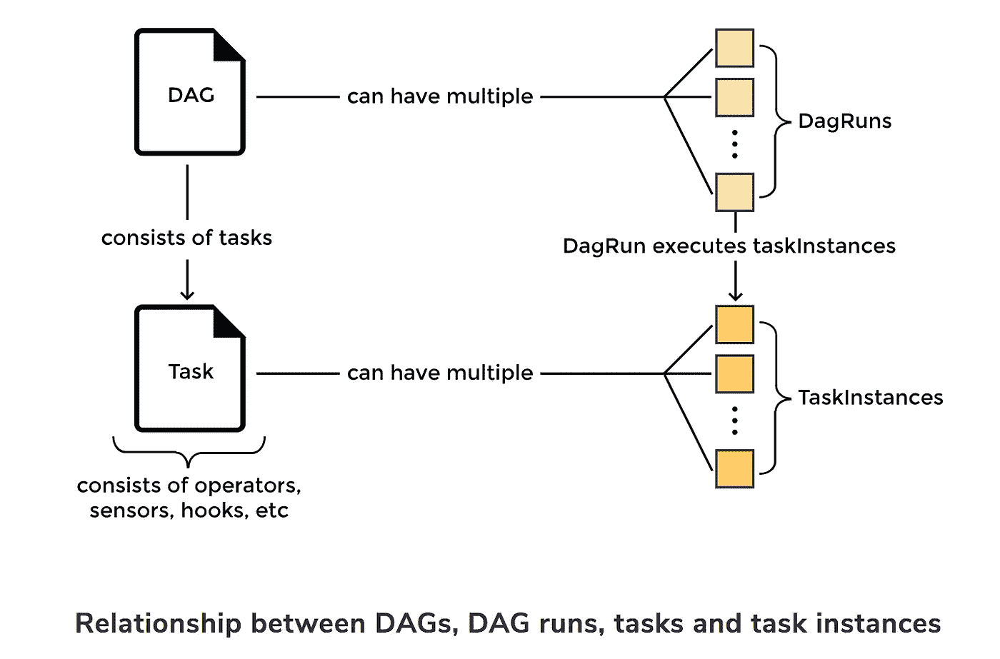
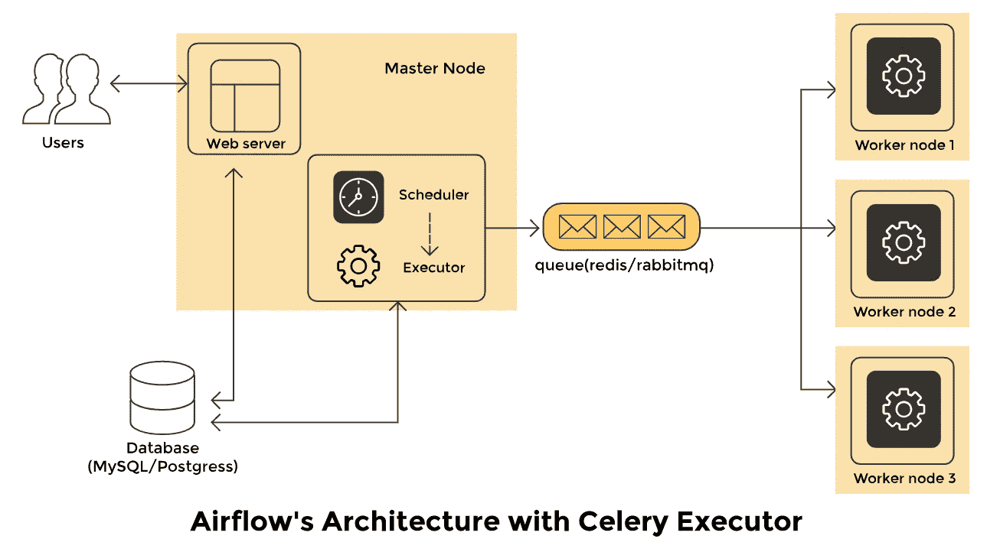

# Apache Airflow 简介:5 分钟内开始

> 原文：<https://medium.com/codex/introduction-to-apache-airflow-get-started-in-5-minutes-3c9e24f12888?source=collection_archive---------6----------------------->


如果您从事大数据工作，您很可能听说过 Apache Airflow。它始于 2014 年 Airbnb 的一个开源项目，旨在帮助该公司处理其批量数据管道。从那时起，它已经成为数据工程领域最受欢迎的开源工作流管理平台之一，接受来自 Lyft、沃尔玛和彭博等组织的公共贡献。

Apache Airflow 是用 Python 编写的，这实现了灵活性和健壮性。其功能强大、装备精良的用户界面简化了工作流管理任务，如跟踪作业和配置平台。由于它依赖代码来定义其工作流程，用户可以编写他们希望在流程的每一步执行的代码。Apache Airflow 不会对您如何安排工作流施加限制，从而提供非常可定制和令人满意的体验。

成千上万的公司使用 Apache Airflow，而且这个数字还在继续增长。今天，我们将探索这一流行工具的基础知识。我们还将讨论您可以开始的第一步。

**我们将介绍:**

*   什么是阿帕奇气流？
*   为什么要用阿帕奇气流？
*   阿帕奇气流的基本原理
*   阿帕奇气流是如何工作的？
*   使用 Apache Airflow 的第一步

# 什么是阿帕奇气流？

Apache Airflow 是一个**健壮的调度器**，用于以编程方式创作、调度和监控工作流。它旨在处理和编排复杂的数据管道。最初开发它是为了解决与长期 cron 任务和大量脚本相对应的问题，但它已经发展成为市场上最强大的数据管道平台之一。

我们可以将气流描述为定义、执行和监控工作流的**平台**。我们可以将*工作流*定义为你为实现特定目标而采取的任何一系列步骤。成长中的大数据团队面临的一个常见问题是，在端到端工作流中整合相关作业的能力有限。在 Airflow 之前，有 Oozie，但它有许多限制，但 Airflow 在复杂的工作流方面已经超过了它。

Airflow 也是一个**代码优先的平台**，其设计理念是数据管道最好用代码来表达。它是可扩展的，有可用的插件，允许与许多常见的外部系统进行交互，如果你愿意，还可以使用这个平台来创建自己的平台。它能够每天运行数千个不同的任务，简化工作流管理。

**气流用于很多行业:**

*   大数据
*   机器学习
*   计算机软件
*   金融服务
*   信息技术服务
*   银行业务
*   等等。



# 阿帕奇气流有什么不同？

下面列出了 Airflow 和其他工作流管理平台之间的一些差异。

*   有向无环图(Dag)是用 Python 写的，学习曲线平滑，比 Oozie 用的 Java 应用更广泛。
*   有一个很大的社区为 Airflow 做出了贡献，这使得为主要服务和云提供商找到集成解决方案变得很容易。
*   Airflow 功能多样，富有表现力，专为创建复杂的工作流程而打造。它提供了关于工作流的高级指标。
*   与其他工作流管理平台相比，Airflow 拥有丰富的 API 和直观的用户界面。
*   它对 Jinja 模板的使用允许引用与 DAG 运行日期相对应的文件名等用例。
*   有托管气流云服务，比如 Google Composer 和天文学家. io。

# 为什么要用阿帕奇气流？

在这一节中，我们将看看气流的一些优点和缺点，以及一些值得注意的用例。

**优点:**

*   **开源:**你可以下载 Airflow 并立即开始使用，还可以与社区中的同行一起工作。
*   **与云的集成:**气流在云环境中运行良好，给你很多选择。
*   **可伸缩:**气流上下高度可伸缩。它可以部署在单台服务器上，也可以扩展到具有大量节点的大型部署。
*   **灵活且可定制:** Airflow 被构建为与大多数软件开发环境的标准架构一起工作，但是它的灵活性允许许多定制机会。
*   **监控能力:**气流支持多种监控方式。例如，您可以从用户界面查看任务的状态。
*   **代码优先平台:**这种对代码的依赖让你可以自由地编写你想在流水线的每一步执行的代码。
*   **社区:** Airflow 庞大而活跃的社区有助于扩展信息，并提供与同行交流的机会。

**缺点:**

*   **对 Python 的依赖:**虽然许多人认为 Airflow 如此依赖 Python 代码是件好事，但那些没有多少 Python 工作经验的人可能会有一个更陡峭的学习曲线。
*   **故障:**虽然气流通常是可靠的，但像任何产品一样，也会有故障。

**使用案例**

Airflow 可以用于几乎所有的批量数据管道，有许多不同的记录在案的用例，最常见的是大数据相关项目。以下是 Airflow 的 Github 资源库中列出的一些用例示例:

*   使用 Google BigQuery 的气流来驱动 Data Studio 仪表板
*   使用气流帮助构建和治理 AWS 上的数据湖
*   利用气流解决生产升级问题，同时最大限度地减少停机时间

# 阿帕奇气流的基本原理

现在，我们已经讨论了气流的基础知识以及优势和使用案例，让我们深入了解这一强大平台的基础知识。

# 有向无环图

工作流是使用有向无环图(Dag)定义的，它由要执行的任务及其连接的依赖关系组成。每个 DAG **代表一组您想要运行的任务**，它们在 Apache Airflow 的用户界面中显示任务之间的关系。让我们来分解首字母缩写词:

*   **定向:**如果您有多个具有相关性的任务，每个任务至少需要一个指定的上游或下游任务。
*   **非循环:**任务不允许产生自引用的数据。这避免了产生无限循环的可能性。
*   **图:**任务是一个逻辑结构，具有清晰定义的流程和与其他任务的关系。例如，我们可以使用 DAG 来表示三个任务之间的关系:X、Y 和 Z。我们可以说:“只有在 X 执行之后才执行 Y，但是 Z 可以在任何时候独立执行。”我们可以定义额外的约束，比如失败任务的重试次数和开始任务的时间。

> ***注意:****DAG 定义了如何执行任务，但没有定义特定的任务做什么。*

可以通过实例化`airflow.models.dag.DAG`的对象来指定 DAG，如下例所示。DAG 将在 web 服务器的 UI 中显示为“Example1 ”,并将运行一次。

```
dag = DAG('Example1', schedule_interval='@once', start_date=days_ago(1),)
```

# DAG 运行

**当一个 DAG 被执行时，它被称为 *DAG 运行*** 。假设您计划每小时运行一次 DAG。DAG 每个实例化建立一个 DAG 运行。可以有多个 DAG 运行连接到同时运行的 DAG。

# 任务

任务是操作符的实例，它们的复杂性各不相同。您可以将它们想象成由 DAG 中的节点表示的工作单元。他们**描绘了在你工作流程的每一步所做的工作**，他们所描绘的实际工作是由操作员定义的。



# 经营者

Dag 定义工作流程，**操作员定义工作**。操作符就像执行特定任务的模板或类。所有操作符都源于`BaseOperator`。许多常规任务都有操作符，例如:

*   `PythonOperator`
*   `MySqlOperator`
*   `EmailOperator`
*   `BashOperator`

这些操作符用于指定要在 Python、MySQL、email 或 bash 中执行的操作。

有三种主要类型的操作符:

1.  执行操作或请求不同系统执行操作的操作员
2.  将数据从一个系统转移到另一个系统的操作员
3.  在满足特定条件之前一直运行的运算符

# 钩住

挂钩允许气流**与第三方系统**连接。使用钩子，可以连接到外部数据库和 API，比如 MySQL、Hive、GCS 等等。他们就像运营商的积木。钩子中不包含任何安全信息。它存储在 Airflow 的加密元数据数据库中。

> ***注:*** *Apache Airflow 有社区维护的包，包括核心的* `*operators*` *和* `*hooks*` *用于 Google 和 Amazon 等服务。这些可以直接安装在您的气流环境中。*

# 关系

Airflow 在定义任务之间的复杂关系方面超过了。假设我们想要指定任务`t1`在任务`t2`之前执行。我们可以用四种不同的陈述来定义这种确切的关系:

```
1\. t2.set_upstream(t1)2\. t1.set_downstream(t2)3\. t1 >> t24\. t2 << t1
```

# 阿帕奇气流是如何工作的？



这个健壮且可扩展的工作流调度平台由四个主要组件组成:

1.  **调度器:**调度器监控所有 Dag 及其相关任务。当满足任务的相关性时，调度程序将启动该任务。它定期检查要启动的活动任务。
2.  **Web 服务器:**Web 服务器是 Airflow 的用户界面。它显示作业的状态，并允许用户与数据库进行交互，并从远程文件存储中读取日志文件，如 S3、谷歌云存储、微软 Azure blobs 等。
3.  **数据库:**Dag 及其相关任务的状态保存在数据库中，以确保调度记住元数据信息。Airflow 使用 SQLAlchemy 和对象关系映射(ORM)来连接元数据数据库。调度器检查所有 Dag 并存储相关信息，如调度间隔、每次运行的统计数据和任务实例。
4.  执行者:执行者决定如何完成工作。不同的用例有不同类型的执行器。

遗嘱执行人示例:

*   `SequentialExecutor`:这个执行程序可以在任何给定的时间运行单个任务。它不能并行运行任务。这在测试或调试情况下很有帮助。
*   `LocalExecutor`:该执行器支持并行和超线程。它非常适合在本地机器或单个节点上运行气流。
*   `CeleryExecutor`:这个执行器是运行分布式气流集群的首选方式。
*   `KubernetesExecutor`:这个执行器调用 Kubernetes API 为每个要运行的任务实例创建临时 pod。

*那么，气流是如何工作的呢？*

气流在某个时间段检查背景中的所有 Dag。该周期使用`processor_poll_interval`配置进行设置，等于一秒。检查 DAG 文件后，将根据计划参数运行 DAG。为需要执行的任务实例化任务实例，并在元数据数据库中将其状态设置为`SCHEDULED`。

调度查询数据库，检索处于`SCHEDULED`状态的任务，并将它们分发给执行器。然后，任务的状态变为`QUEUED`。那些排队的任务由执行它们的工作者从队列中取出。当这种情况发生时，任务状态变为`RUNNING`。

当一个任务完成时，worker 会将其标记为*失败*或*完成*，然后调度器在元数据数据库中更新最终状态。

# 使用 Apache Airflow 的第一步

现在，您已经了解了 Apache Airflow 的基础知识，可以开始了！学习这个工具的一个很好的方法是用它来构建一些东西。下载 Airflow 后，你可以**设计自己的项目或者在线贡献给一个开源项目**。

一些有趣的开源项目:

*   允许您在浏览器中编辑 Dag 的插件
*   Docker 阿帕奇气流
*   从 YAML 配置文件动态生成 Dag
*   更多

关于气流还有很多东西要学。接下来推荐的主题包括:

*   子标签
*   SLA
*   气流传感器

*快乐学习！*