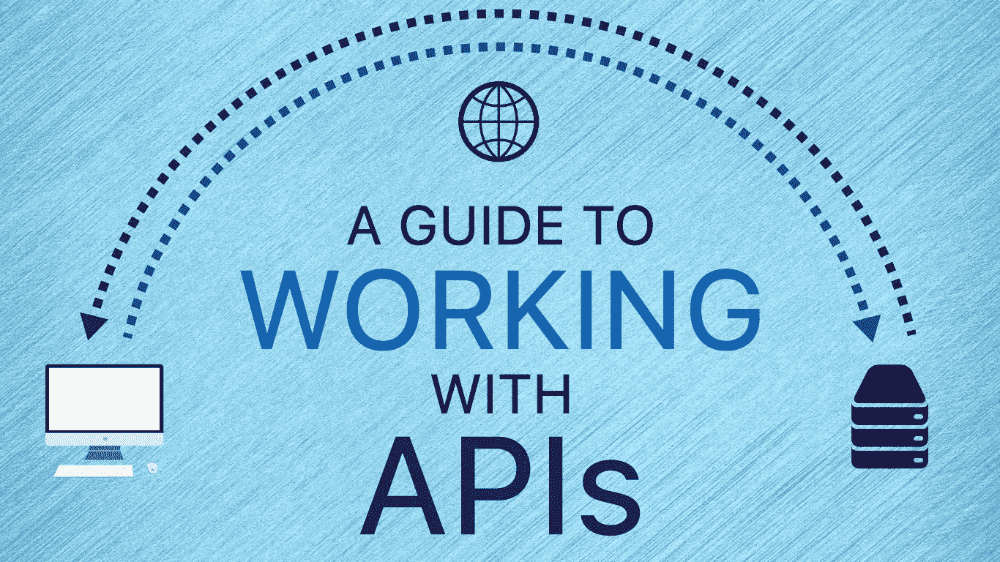
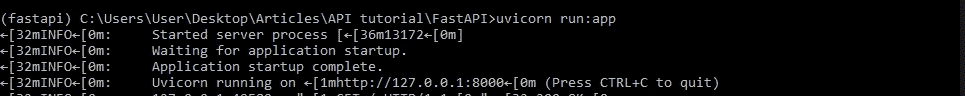
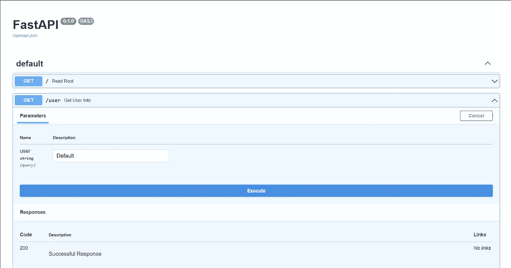
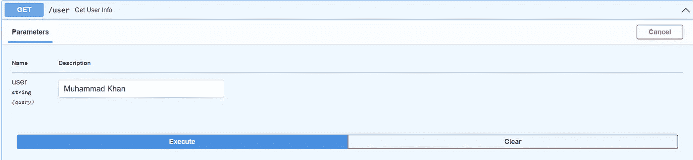
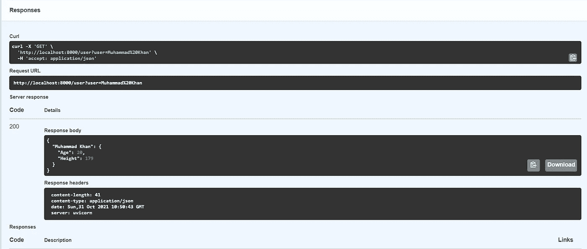
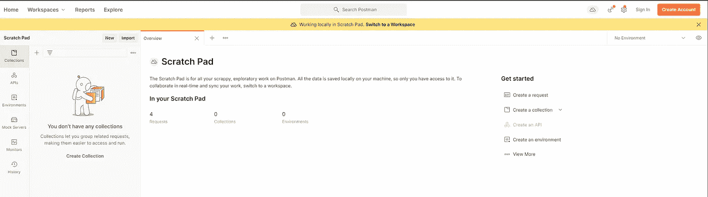
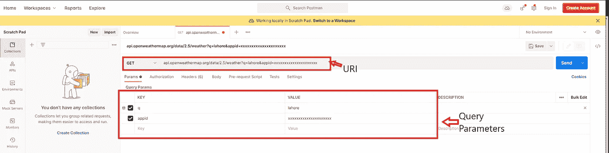

# Python FastAPI 简介

> 原文：<https://medium.com/codex/introduction-to-apis-with-python-fastapi-bd72601e5ab5?source=collection_archive---------2----------------------->



随着**软件即服务** (SaaS)模式的兴起，API 已经成为软件开发中非常重要的一部分。SaaS 模式的一个简短总结是，软件开发人员不再需要创建可安装的桌面应用程序，他们只需在 web 上创建应用程序，并将其部署在 web 服务器上，然后使用 API 向外界公开终端。

[](https://writersbyte.com/programming/introduction-to-apis-with-python-fastapi/) [## Python FastAPI-WritersByte API 简介

### 随着软件即服务(SaaS)模式的兴起，API 已经成为软件中非常重要的一部分

writersbyte.com](https://writersbyte.com/programming/introduction-to-apis-with-python-fastapi/) 

> 但是什么是 API 呢？

这就是我们要回答的问题！

SaaS 模型中的 Web 应用程序有三个组成部分。

1.  **客户端**
2.  **服务器**
3.  **API**

第一点应该是不言自明的。你，用户，就是*客户端*。使用产品的人。*服务器*是实际的软件后端，所有的处理都在这里进行。**客户端**通常从**服务器**请求一些东西，然后服务器传递所需的信息。反之亦然，但更重要的是，这种数据/信息的传递正是 API 的用武之地。*API*是连接客户端和服务器的桥梁，实现数据从客户端到服务器的无缝传输，反之亦然。


用更简单的话来说，想象你坐在一家餐馆里，你点了一些食物。服务员把你点的菜拿给厨师，然后拿着你的菜回来。在这个场景中，你是客户端(用户)，厨师是服务器(处理/烹饪发生的后端)，服务员是 API(你和厨师之间的桥梁，你食物的载体)。

## 关于 API 的更多信息

API 代表**“应用编程接口”。**我可能让 API 听起来很简单，但实际上，它包含了更多的东西。

每当你加载一个网站时，你实际上是在调用该网站的 API，然后它会给你带来所请求的网页。当你输入你想访问的网站的域名，并点击**‘回车’，**一个请求被发送到该网站的*服务器*，请求中包含了所有需要的信息，在响应中，整个网页被返回。该响应由您的浏览器解释，并处理网页及其所有资产的加载，例如，当您到达 www.google.com 的时，网站的 HTML 文件将返回到您的浏览器。该 HTML 文件包含有关要加载的图像或任何其他元素的信息，如搜索栏、这些资源在网页上的位置以及到其他网页的链接(按钮)。阅读和显示这个文件是你的浏览器的责任，你真的不需要担心它。


使用 API 的另一种方式是简单的数据传输。没有花哨的资产，没有网页，只有简单的数据。通过 API 传输数据有几种标准化的格式。最常见的格式是 **JavaScript 对象符号(** JSON **)** 格式。其他格式包括 XML、YAML 等。这可能会让一些人感到困惑。为什么我们只在互联网上请求这样的数据？但是您使用这样的 API 的次数比您意识到的要多。当您在手机或电脑上使用天气应用程序时，该应用程序通常使用第三方 API 来获取天气信息。当您点击 refresh 时，它会向 API 发送一个请求，其中包含一些信息，例如您的位置或一些其他授权参数(如果 API 需要的话),在响应中，API 会以 JSON 格式将天气信息返回给应用程序，然后应用程序根据其接口格式化数据并显示给您。这只是 API 的一个用例。请继续阅读，最后我将向您展示如何构建自己的 API，然后看看我们如何从第三方 API 请求数据。

这里要提到的另一件重要事情是，所有这些通信都是使用 HTTP 协议完成的。HTTP 是用于各种网络通信的标准协议。HTTP 有它自己的技术细节，但是我们不在这里谈论它，所以让我们回到 API。

在继续构建 API 之前，我还需要提到最后一件事； **API 方法(HTTP 方法)**。

使用 API 总共可以执行 4 种操作。

*   得到
*   邮政
*   放
*   删除

一个 ***GET*** 请求就像您(客户端)请求 API 为您获取某些东西(一个网页或简单的 JSON 格式的数据— *服务器→客户端*

一个 ***POST*** 的方法在你向服务器发送一些数据的时候使用(*客户端→服务器*)。这是在注册社交媒体应用程序时填写表格时完成的。服务器存储您发送给它的数据。

当您希望编辑服务器上已经存在的一些数据时，可以使用 ***PUT*** 方法。这种方法只是改变服务器上的现有数据。

一个 ***删除*** 请求— *惊喜惊喜！！—* 发送请求给**删除**您存在于服务器数据库中的数据。

[](https://writersbyte.com/programming/best-features-in-python-3-10/) [## Python 3.10 中的最佳特性- WritersByte

### 如果你的工作或学习与数据或人工智能有关，那么你必须意识到…

writersbyte.com](https://writersbyte.com/programming/best-features-in-python-3-10/) 

## 构建我们自己的 API — FastAPI


[来源](https://fastapi.tiangolo.com)

现在我们已经了解了足够多的 API，让我们构建一个并测试它。对于本教程，我们需要安装以下软件:

*   FastAPI
*   紫玉米

FastAPI 是用 python 构建 API 的一个非常轻便快速的框架，而*uvicon*是 FastAPI 需要运行的一个 ASGI 服务器。使用以下命令可以很容易地安装它们。

```
pip install fastapi
```

而且，

```
pip install uvicorn
```

接下来，只需将以下代码复制到您的 IDE 中

> 瞧啊。您的 API 已经可以进行测试了。

这里我们创建了两个不同的路径，可以通过 API 访问。API 路径是我们用来访问端点的 URI。我们有一个基本路径，用***"/***表示，第二个路径用 ***"/user"*** 表示。函数上方的装饰符表示调用哪种 HTTP 方法(在我们的例子中，两个函数都生成 GET 请求)。

让我们开始吧。我们需要在终端启动 uvicorn 服务器。

```
uvicorn run:app
```

在上面的语句中，“run”是包含我们代码的 python 文件的名称，“app”是在该文件中创建的 fastAPI 对象的名称。



终端响应

现在我们只需要在浏览器中输入 **localhost:8000/**

这将触发基本响应，我们会在浏览器中看到以下内容。

```
{"Response":"Default"}
```

就像我们编的程序一样！

FastAPI 使用 SwaggerUI，它提供了一个很好的小接口来测试 API 端点。为此，我们需要转到路径 **localhost:8000/users**

这将打开以下页面。



斯瓦格瑞

这里我们看到了我们的两个端点。让我们测试第二个端点，并提取所需用户的信息。



为 Muhammad Khan 执行查询



响应正文

在响应正文中，我们可以看到我们返回了作为输入发送的用户的数据。

这是如何构建和测试 API 的基础。

[](https://writersbyte.com/anime/mpv-configuration-guide-to-upscale-and-enhance-your-anime-experience/) [## MPV 配置指南，以提高和增强您的动漫体验

### 我是一个忠实的动漫迷，通常会花我大部分的空闲时间来挑选一个新的季节，并在它的…

writersbyte.com](https://writersbyte.com/anime/mpv-configuration-guide-to-upscale-and-enhance-your-anime-experience/) 

## 使用邮递员测试服务

在结束本文之前，我想向您展示公司是如何利用 API 来做生意的。为此，我们将使用 **Postman** 应用程序从 API 获取数据。

为此，我们将使用[*openweathermap*](https://openweathermap.org)*提供的 API。*

要获得 API 密钥，您必须创建一个免费帐户，API 密钥将发送到您的电子邮件中。API 密钥用作授权参数，以确保数据仅发送给注册用户。

当你打开邮差你会看到以下画面。



邮递员接口

点击右侧的*创建请求*按钮，创建一个获取请求。



API 文档中总是提供端点和所需的参数。上面我已经输入了 2 个参数:1)我想要天气数据的城市和由[*openweathermap*](https://openweathermap.org)*提供的 API 键(*中的 x 只是截图的虚拟条目，您将需要一个实际的键*)。*

这是这个请求的结果。

```
{"coord": {"lon": 74.3436,"lat": 31.5497},"weather": [{"id": 721,"main": "Haze","description": "haze","icon": "50n"}],"base": "stations","main": {"temp": 297.14,"feels_like": 296.8,"temp_min": 291.21,"temp_max": 297.14,"pressure": 1012,"humidity": 46},"visibility": 4000,"wind": {"speed": 0,"deg": 0},"clouds": {"all": 0},"dt": 1635693814,"sys": {"type": 1,"id": 7585,"country": "PK","sunrise": 1635643056,"sunset": 1635682484},"timezone": 18000,"id": 1172451,"name": "Lahore","cod": 200}
```

他们的所有信息你需要(或不需要)，取决于需求。

## 结论

最后简单介绍一下 API。在本文中，我们学习了什么是 API，如何构建 API，以及不同的企业如何利用它们来销售产品。在现代世界中，API 在 web 开发中起着重要的作用，对于每个软件开发人员来说，了解它们的基础知识是至关重要的。

[](https://writersbyte.com) [## WritersByte

### 这是一个由两部分组成的系列。第一部分(这一部分)将是所有关于理论上的理解…

writersbyte.com](https://writersbyte.com)