# Azure 数据工厂中的“追加变量”活动简介

> 原文：<https://medium.com/codex/introduction-to-append-variable-activity-in-azure-data-factory-2bb495967c42?source=collection_archive---------5----------------------->

# 什么是附加变量活动

***追加变量******活动*** 是**用来将***值添加到******类型数组中的现有变量只有******中定义的******数据工厂流水线*** 。**

# **先决条件**

*****阅读******文章*** 关于 [***如何使用设置变量活动***](https://oindrila-chakraborty88.medium.com/introduction-to-set-variable-activity-73bcddcf0318) 创建管道。**

# **通过添加附加变量活动，更新使用设置变量活动创建的管道**

***第一步*-**-*打开******蔚蓝门户***(***portal.azure.com***)。**

****

*****第二步*** - ***点击******Azure 数据工厂资源******ADF-Oindrila-2022-3 月*** 。**

****

*****第三步*** -将 ***Azure 数据工厂******ADF-Oindrila-2022-3 月******设置页面*** 为 ***打开*** 。 ***点击******打开 Azure 数据工厂工作室******链接*** 。**

****

*****第四步*** -第 ***Azure 数据工厂资源******ADF-Oindrila-2022-3 月*** 是 ***在*** 中打开的一个 ***新标签在*****【T127 现在， ***点击******作者******链接打开*****蔚蓝数据工厂*** 。*******

**

****第五步*** - ***点击*******管道******类别*******资源浏览器*** ， ***打开******

***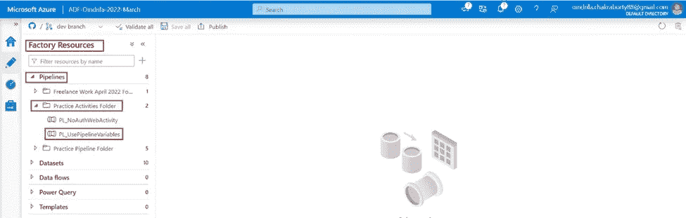***

******第六步***-**-*转到******变量******选项卡的*** 管道*****PL _ UsePipelineVariables***。 ***点击******+新建******链接添加*** 一个 ***变量******列表******数组*** ******提供*******纽约******伦敦******东京******新加坡城市************

****另外 ***增加*** 一个 ***变量******追加******数组******类型*** 。做 ***不提供*** 任何 ***默认值*** 。****

****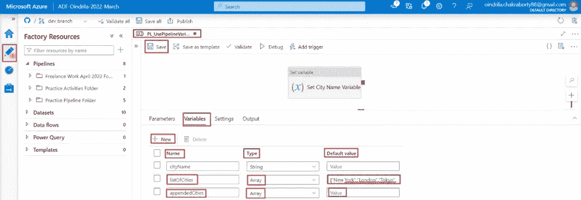****

*******第七步*** - ***搜索******追加变量******活动*******活动浏览器******将其拖动到******设计器窗格的*** ***设置变量******活动为******输入******追加变量******活动*** 。*****

***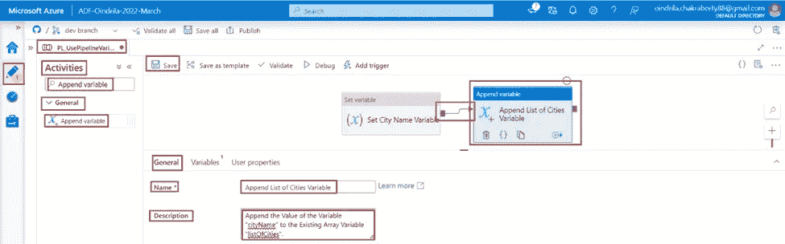***

******第 8 步*** - ***转到******变量******标签******追加变量****活动*** 。 ***点击*******名称属性*** 。这将 ***显示所有******变量出现在******管道范围*** 中。 ***选择******变量******list of cities******从******下拉选项*** 。******

********文本框中的值属性*** ，****硬编码值*** ， ***或*** ，*，即 ***组合的系统变量*** ， ***函数 ***点击******文本框******值属性*** 。 ***链接******添加动态内容【Alt+Shift+D】***是 ***显示在******文本框*** 下。 ***点击******链接*** 。**********

***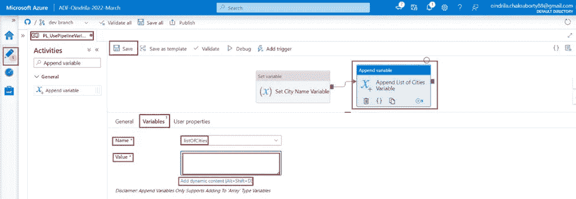***

******第九步***-的 ***值***city name******变量*** 是已经****设置*** 使用 ***设置变量**于是， ***点击******变量******城市名******从******列表中的可用变量******点击*** 即可**********

*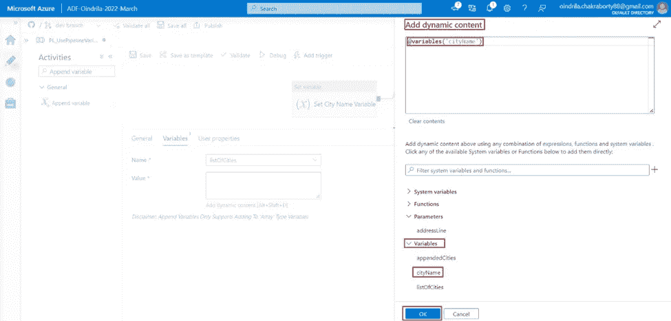*

*的 ***值 ***变量******list of cities******现设置为****表达式语言******@变量(' city name)*********

*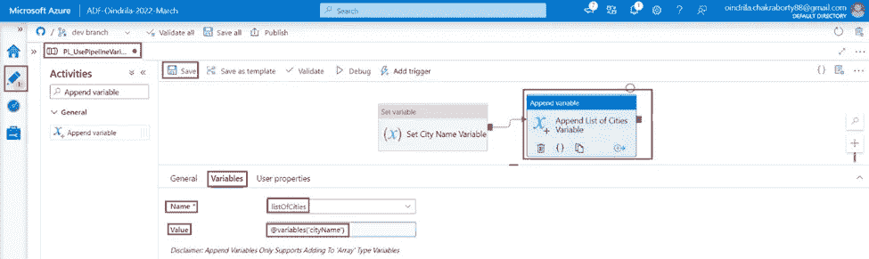*

> ****调试*******流水线*******PL _ UsePipelineVariables*******查看**********追加变量*** ***查看如果*******值为******city name***********变量*** *是* ***的追加到* 一个 ***设置变量*******活动*** *需要* ***使用*******其中*************

*******第十步***-**-*搜索******设置变量******活动*******活动浏览器******将其拖动到******设计器窗格*** ****追加变量******输入******第二个******设置变量******活动*** 。******

**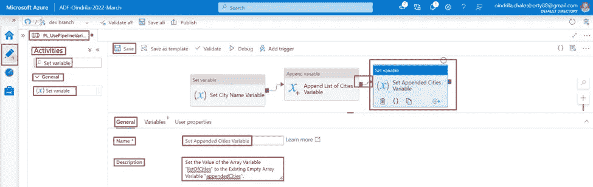**

*****转到******变量******标签 ***第二个******设置变量******活动*** 。 ***点击*****名称属性*** 。这将 ***显示所有******变量出现在******管道范围*** 中。 ***选择******变量******附属城市******从******下拉选项*** 。********

*****点击******文本框******值属性*** 。 ***链接******添加动态内容【Alt+Shift+D】***是 ***显示在******文本框*** 下。 ***点击******链接*** 。**

**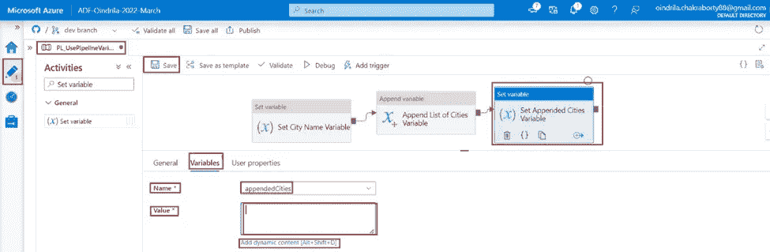**

*****附随城市******变量*** 的 ***值需要设置为******列表城市******变量*** 的 ***值。 ***选择******list of cities******变量从******可用变量列表*** 。最后， ***点击******确定******按钮*** 。*****

**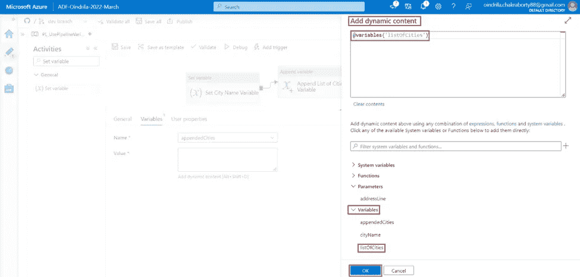**

**中的 ***值 ***变量******附属城市*** "现被 ***设置为******表达式语言******@变量(' list of cities)********

**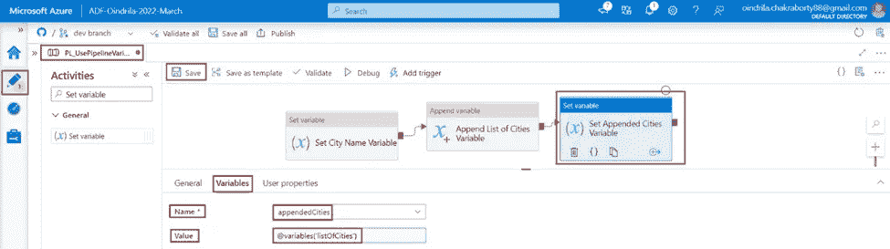**

*****第十一步***-**-*调试*** 流水线***PL _ UsePipelineVariables******查看******输出*** ******管道******PL _ UsePipelineVariables******已经成功运行完毕*** 。*****

**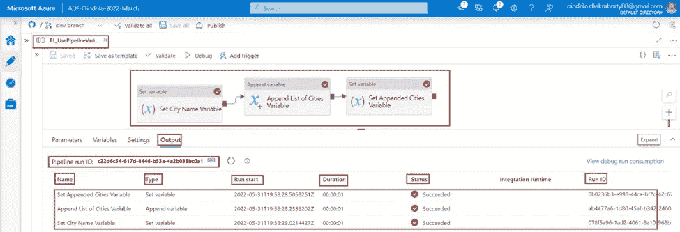**

**在 ***输出******选项卡*** 中，将 ***输出*** 为 ***显示*** 为**的 ***城市名称*******

****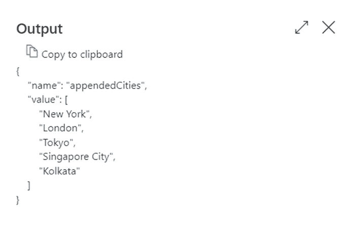****