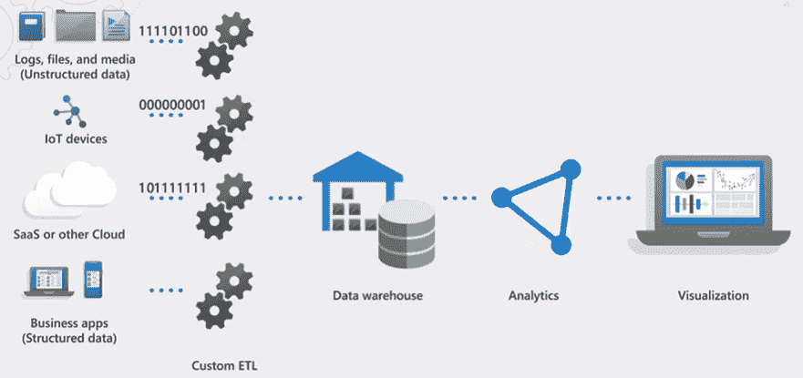
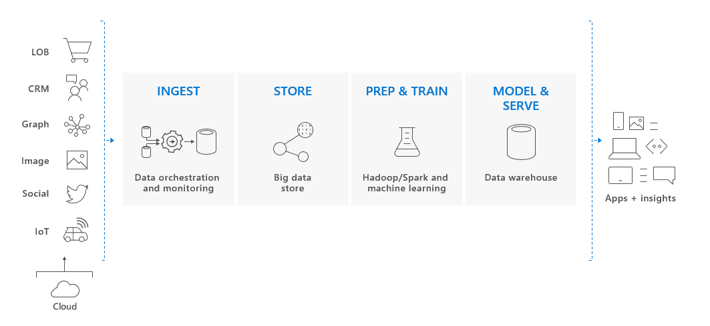
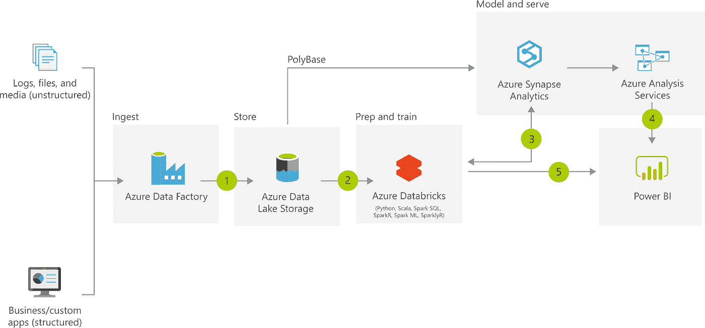

# Azure Synapse 分析简介

> 原文：<https://medium.com/codex/introduction-to-azure-synapse-analytics-ff317e782f7b?source=collection_archive---------9----------------------->

## [法典](http://medium.com/codex)

照片由 [CHUTTERSNAP](https://unsplash.com/@chuttersnap?utm_source=medium&utm_medium=referral) 在 [Unsplash](https://unsplash.com?utm_source=medium&utm_medium=referral) 上拍摄

*本文由 Betacom 分析和创新团队撰写。Betacom 是一家总部位于意大利和德国的公司，在 IT 领域使用创新技术、数字解决方案和尖端编程方法开展业务。你可以在我们的* [*网站*](https://betacom.eu/) *了解更多。*

# 介绍

欢迎阅读 Azure Synapse Analytics 及其特性系列的第一篇文章。今天，我们将介绍这一新的微软服务，并解释其主要特性。

首先，我们将了解一些历史和术语。然后，在第三部分，我们将讨论 Azure Synapse 的主要属性。

# 历史

> 今天，我们宣布推出 Azure Synapse Analytics，这是一项无限的分析服务，将企业数据仓库和大数据分析结合在一起。

2019 年 11 月，Azure Data 的企业副总裁 Rohan Kumar 展示了 Azure Synapse Analytics，作为一种统一的体验，用于摄取、准备、管理和提供数据，以满足即时的商业智能和机器学习需求。

它是作为 Azure SQL 数据仓库(SQL DW)的扩展而诞生的，该数据仓库于 2015 年首次发布，并于 2018 年升级到第 2 代。

# 术语

在探索 Azure Synapse Analytics 及其功能之前，我们需要了解一些术语。如果您已经熟悉了，请直接进入下一节。

Azure **数据湖存储** (ADLS) Gen2 是一套专用于大数据分析的功能，建立在微软的云对象存储解决方案 Azure Blob storage 之上。ADLS 第二代帐户可以与 Synapse **工作区**相关联，以在 Azure 中执行基于云的企业分析。工作区还有一个相关的文件系统，用于存储临时数据，位于**资源组**下，允许您使用 SQL 和 Apache spark 执行分析。

一个工作区可以包含任意数量的**链接服务**，它们是定义工作区连接到外部资源所需的连接信息的连接字符串。

**Synapse SQL** 能够在 Synapse workspace 中进行基于 T-SQL 的分析。Synapse SQL 有两种消费模式:专用和无服务器。第一个是指**专用的 SQL 池**，在一个工作区中可以是无限的。而第二个是指**无服务器 SQL 池**，它在每个工作区都可用。在 Synapse Studio 中，您可以通过创建和运行 SQL 脚本来使用 SQL 池。

要使用 Spark analytics，您可以在 Synapse 工作区中创建和使用无服务器的 **Apache Spark pools** 。当您开始使用 spark 池时，工作区会自动创建一个 Spark 会话来处理与该会话相关的资源。

管道是 Azure Synapse 提供数据集成的方式，允许您在服务之间移动数据并处理活动。让我们来看看一些细节:

*   **管道**是一起执行任务的活动的逻辑分组。
*   **活动**被定义为管道内对数据执行的动作。一些例子是复制数据、运行笔记本或 SQL 脚本。
*   **数据流**是一种特殊的活动，用于通过使用 Synapse Spark 的无代码体验来转换数据。
*   **触发器**执行流水线。它可以手动或自动运行(计划、滚动窗口或基于事件)。
*   **集成数据集**是属于链接服务的数据的命名视图，它简单地指向或引用在活动中作为输入和输出使用的数据。

# 体系结构

如前所述，Azure Synapse Analytics 是一种新的分析服务，它在一个共享空间中结合了数据集成、数据仓库、业务功能和大数据分析。

您可能想知道为什么云中的数据仓库(DW)是一个好的选择。我们来看一些原因。

*   不需要大的资本支出。
*   不需要硬件维护。
*   由于可扩展性，扩展云数据仓库比本地系统更快、更便宜，因为它不需要购买新的硬件，并且可以根据需要自动进行扩展。
*   成本非常低，因为存储和计算是分开支付的，并且仅在需要时支付。
*   它允许与其他可用的服务集成。
*   大规模并行处理(将在下一篇文章中解释)提高了查询速度。
*   上市时间比其他数据仓库解决方案所需的时间短，而且没有“版本”或软件升级的概念。

传统的内部数据仓库体系结构过去看起来像下图。

*来源:微软*

如您所见，有许多不同格式的不同数据源，例如关系数据库、CSV 文件、excel 文件、结构化或非结构化数据。然后，您必须通过通常位于内存中的 ETL 过程提取、转换和加载这些数据。这个过程对数据进行标准化、整合和清理，最终将它们和一些描述它们的元数据一起发送到数据仓库。注意，在后台也有一些管理和监控数据库的工作。

然后是分析，在那里你可以查询 API 服务器。这里需要注意的重要一点是，在分析中，服务器计算和存储紧密结合在一起。

然后，您运行查询并再次进行分析。将会有一些服务器，您最终会使用 Power BI 或其他报告工具向业务用户发布某种类型的报告。

现代数据仓库体系结构可以概括如下:

*来源:* [*什么是专用 SQL 池(原 SQL DW)？— Azure Synapse Analytics*](https://docs.microsoft.com/en-us/azure/synapse-analytics/sql-data-warehouse/sql-data-warehouse-overview-what-is)

同样，首先要做的是从各种来源获取数据。Azure 中有很多服务可以做到这一点。其中一个就是**数据工厂**。该服务可以从不同来源获取数据，并将其接收到存储中。对于存储，越来越多的客户正在使用**数据湖**架构，该架构提供了一种存储数据并决定以后如何处理数据的便捷方式。

那么这些数据就可以由数据科学家或者数据工程师去探索。所以他们去查看这些数据，然后通常他们会准备和收集这些数据。由于数据可能来自不同的来源，可能是结构化的，也可能是非结构化的，当我们将它们组合在一起时，我们经常会遇到许多质量问题。因此，数据质量在现代数据仓库系统中至关重要，人们花费的大部分时间都是在清理和准备数据。

准备好数据后，我们可以将这些数据建模给业务部门，以便业务部门可以提出问题。这意味着创建一个数据的结构模型和一个业务可以依赖的单一事实来源。最后，在该解决方案的基础上还有 BI、报告和高级分析。

这里需要注意的一件非常重要的事情是，在现代数据仓库解决方案中**计算和存储是分开的**。这意味着它们是分开充电的，只有在使用时才打开。因此，对于存储，您只需为存储量付费，存储交易没有任何成本，而计算能力是按照数据仓库单位(DWU)付费的，它由 CPU、内存和 IO 提供。

例如，让我们说你的 DW 在周末没有用。然后，您可以完全暂停它，为自己节省成本。请注意，当您暂停计算能力时，您仍将收取存储费用，但非常便宜。

上面描述的架构模式是实现现代数据仓库解决方案的一种非常常见的方式，这就是为什么许多客户正在将他们的数据仓库解决方案迁移到云中。

现在，让我们更多地从服务的角度来看这个体系结构。

来源:[现代数据仓库架构— Azure 解决方案理念](https://docs.microsoft.com/en-us/azure/architecture/solution-ideas/articles/modern-data-warehouse)

你可能知道，Azure 中有许多服务，它们都提供了强大的功能。如果我们深入研究现代数据仓库解决方案，就会发现我们确实可以将一系列服务整合在一起。

1.  第一个是 **Azure Data Factory** ，无服务器集成产品。它已经进入市场很多年了，这些年来已经非常成熟，可以在混合场景中实现数据集成。数据工厂可以从内部、情景应用程序或几乎任何类型的来源获取数据。它可以处理大规模的数据，巨大的速度和数据量，它有很多组件(超过 90 个内置插件)。它提供了对数据流的完全控制，数据流是数据在生命周期中所经过的部分(创建、接收、转换)。
2.  引入数据后，您可以将其放入存储解决方案中，进行数据准备和清理。这是一个数据汇集、合并和清理的地方，各种各样的转换都在这里发生。 **Azure** **数据湖存储**是最便宜的存储，因为没有真正的处理在进行。
3.  当数据在数据湖中时，也有用于探索该数据的服务。DW 本身具有基于 SQL 池的功能，允许您查询数据湖或 DW 本身中的数据。另一种方法是使用 PolyBase 直接从数据湖中获取数据，并将其存储到 DW 中。Databricks 是另一个我们可以用来探索数据的服务，它支持多种语言来查询和利用数据湖中的数据:Python、Scala、SQL 等。
4.  Databricks 可以将这些数据写入到 Azure Synapse Analytics 中，也可以与您的分析服务协同工作。因此，在将数据引入大数据存储并做了一些准备和探索之后，现在他们终于准备好有效地发布数据了。正如我们所讨论的，云数据仓库将计算和存储分开，因此当您有更多用户和更多工作负载时，您可以扩大计算能力，当您空闲时，您可以缩小计算能力。

我们刚刚介绍的四项服务，除了可以单独使用之外，还可以归入 Azure Synapse 分析服务。

Azure Synapse 分析核心是 **SQL 池**(以前的 Azure SQL 数据仓库)，一个大规模并行处理数据库。我们将在下一篇文章中讨论它的架构。现在，您应该知道有**专用的**和**无服务器的** SQL 池。在第一种情况下，资源专用于您的数据，并且随时准备就绪，无论您是否在使用它们。而在第二种情况下，资源仅在必要时才被激活，并且您通常将它们用于特定的操作。

# 结论

您现在应该了解 Azure Synapse 分析架构和主要属性。在下一篇文章中，我们将探索 SQL 池架构和引擎。

两周后见！👋