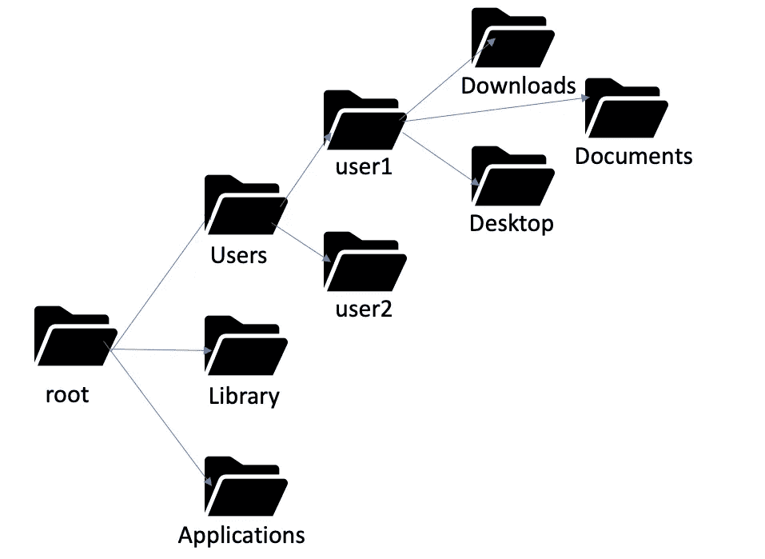

# 生物医学研究 BASH 简介(第 2/3 部分)

> 原文：<https://medium.com/codex/introduction-to-bash-for-biomedical-research-part-2-3-62daa725fe53?source=collection_archive---------26----------------------->

## 开始访问 shell、路径和 BASH 命令

在我们的上一篇教程中，我们介绍了 BASH 并讨论了它在生物医学研究中的用途。在本教程中，我们将介绍如何访问 shell 和路径，并以一些有用的 BASH 命令结束。

# **使用猛击**