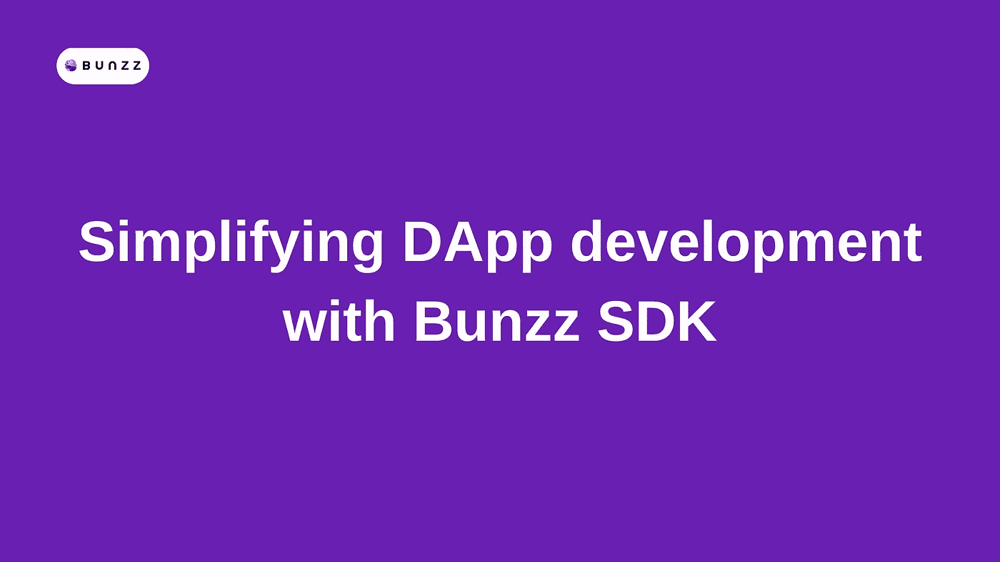

# 如何用 Bunzz SDK 简化和加速 DApp 开发

> 原文：<https://medium.com/codex/introduction-to-bunzz-sdk-simplifying-dapp-development-37387708fe22?source=collection_archive---------21----------------------->

通过 Canva 设计

Bunzz SDK 是一个客户端库，用于与由 [Bunzz](https://bunzz.dev/) 部署的智能合约进行交互。

它的 API 允许您将部署在 Bunzz 中的智能合约与您的前端应用程序连接起来以完成您的 DApp，从而节省开发时间。

当你新建一个 Bunzz 项目时，你可以在客户端 *SDK* 页面获得 ***API key*** 和 ***DApp ID*** 。通过将这些值传递给 Bunzz SDK 并将其连接到您创建的 Bunzz 项目，您可以执行以下操作以及更多操作:

*   连接到不同的链
*   连接并获取智能合同地址，包括 ABI 和交易
*   读取链上状态

与使用 Ethers.js 编写一整套函数和方法调用相比，使用 Bunzz SDK 可以更顺畅、更容易地完成所有这些工作。

# Bunzz SDK 功能

让我们简要概括一下 Bunzz SDK 的功能和其中包含的依赖项。

Bunzz 团队一直在为区块链开发者改进 Bunzz SDK，通过减少代码行和许多 Javascript 和 Ethers.js 方法调用中涉及的麻烦，尤其是在前端，来简化和改进他们的 Dapp 开发过程。

# Bunzz SDK 能做什么？

作为一名区块链开发者，您可能想知道 Bunzz SDK 到底能为您做些什么。为了回答这个问题，让我们从更新你对 SDK 的概念开始。

SDK 代表*软件开发工具包*，是一个可安装包中软件开发工具的集合。SDK 通过拥有编译器、调试器，有时还有软件框架来简化应用程序的创建。它们通常特定于硬件平台和操作系统的组合。

Bunzz SDK 是一个 Javascript 库，它提供了可访问的接口来与 Bunzz 部署的智能合约(Bunzz 模块)进行交互。它将前端应用程序与 Bunzz 中部署的智能合同同步，允许前端应用程序与智能合同无缝交互。

它包括以下功能:

*   智能合同编制
*   与 JSON-RPC 接口交互
*   使用钱包地址连接(元掩码和 WalletConnect)
*   连接并获取智能合同的地址和 ABI
*   构造和发送事务并读取链上状态
*   合同订阅事件
*   用 ABI 编码和解码数据

# 属国

Bunzz SDK 包括以下安装的依赖项:

*   [@元掩码/检测提供者](https://www.npmjs.com/package/%40metamask%2Fdetect-provider)
*   [@元掩码/提供者](https://www.npmjs.com/package/%40metamask%2Fproviders)
*   [@walletconnect/ethereum-provider](https://www.npmjs.com/package/%40walletconnect%2Fethereum-provider)
*   [@Dotenv-cli](https://www.npmjs.com/package/dotenv-cli)
*   (T4) 其他 (T5)
*   [事件(T7)](https://www.npmjs.com/package/events)
*   [luxon(T9)](https://www.npmjs.com/package/luxon)
*   [@types/jest](https://www.npmjs.com/package/%40types%2Fjest)
*   [@types/luxon](https://www.npmjs.com/package/%40types%2Fluxon)
*   [@typescript-eslint/eslint-plugin](https://www.npmjs.com/package/%40typescript-eslint%2Feslint-plugin)
*   [@typescript-eslint/parser](https://www.npmjs.com/package/%40typescript-eslint%2Fparser)
*   [esbuild](https://www.npmjs.com/package/esbuild)
*   [eslint (T21)](https://www.npmjs.com/package/eslint)
*   (T22) eslint-config-prettier (T23)
*   [eslint-plugin-prettier](https://www.npmjs.com/package/eslint-plugin-prettier)
*   [ganache-cli](https://www.npmjs.com/package/ganache-cli)
*   [玩笑(T29)](https://www.npmjs.com/package/jest)
*   [Jest-fetch-mock(T31)](https://www.npmjs.com/package/jest-fetch-mock)
*   (T32) npm-run-all (T33)
*   (T34) Prettier (T35)
*   [Rimraf (T37)](https://www.npmjs.com/package/rimraf)
*   (T38) Source-map-loader (T39)
*   (T40) Ts-jest (T41)
*   [ts-loader(T43)](https://www.npmjs.com/package/ts-loader)
*   [typescript (T45)](https://www.npmjs.com/package/typescript)
*   [webpack-cli](https://www.npmjs.com/package/webpack-cli)

# 安装和版本:

本文发布时最新的 Bunzz SDK 版本是 [***版本 1.2.3***](https://www.npmjs.com/package/bunzz-sdk)

你可以在 Bunzz 的 NPM 官方页面[这里](https://www.npmjs.com/package/bunzz-sdk)查看最新版本

关于如何安装 Bunzz SDK 的更多细节，请参考官方 Bunzz 文档[这里](https://docs.bunzz.dev/product-docs/sdk/guides)

[*Bunzz*](https://www.bunzz.dev/) *正在帮助增加想要为 Web3 空间做贡献的区块链开发者的数量。*

*随时向**[***伸出不和谐之手！***](https://discord.gg/ZsqvmdBA4e)*

**来自 Bunzz 博客的原创文章，作者*[*Marcel Clarembaux*](https://blog.bunzz.dev/introduction-to-bunzz-sdk-key-functionality-for-a-speedy-dapp-development-process/?ref=hackernoon.com)*