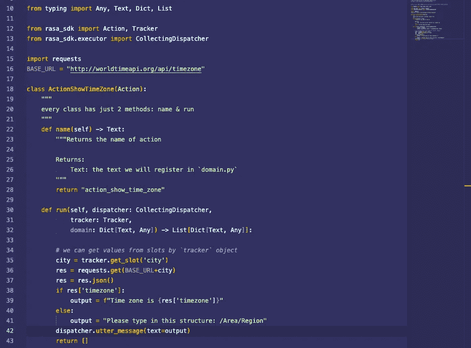

# Rasa 和 Python 聊天机器人简介

> 原文：<https://medium.com/codex/introduction-to-chatbots-with-rasa-python-463d9df058e9?source=collection_archive---------6----------------------->

## *没必要了解机器学习，只关注实用面*

你好。上周末，我在 Coursera 上闲逛，寻找高质量的内容来消费。我偶然发现了“用 [Rasa](https://rasa.com/) 和 Python 创建你的第一个聊天机器人”指导项目。当然我消费了，做了一些笔记。在这个故事中，我们将尝试了解什么是 [Rasa](https://rasa.com/) 以及如何使用 [Rasa](https://rasa.com/) 。我们将创建一个聊天机器人来找出我们的目标所在的时区。其实你可以在 Coursera 引导的项目里找到类似的项目。但是，我们将创建我稍微扩展了一下的项目。我们将创建的机器人，获取输入，并显示输入区域的时区。


照片由[刘宇英](https://unsplash.com/@yuyeunglau?utm_source=unsplash&utm_medium=referral&utm_content=creditCopyText)在 [Unsplash](https://unsplash.com/s/photos/bot?utm_source=unsplash&utm_medium=referral&utm_content=creditCopyText) 上拍摄

# 什么是 Rasa？

我们可以说 Rasa 是一个创建对话应用的框架。我们可以使用 Rasa 创建自己的虚拟助手。

# Rasa 的第一步

如果我们想使用 Rasa，首先我们需要在本地安装它。你可以通过下面的代码安装它。

```
pip install rasa
```

现在我们可以使用 Rasa CLI 创建一个项目模板。

```
rasa init
```


作者图片

对于 CLI 问我的问题“您想训练一个初始模型吗？”我说“是”。我们将获得一个由 Rasa 训练模型的基础模板。

我将转到我在 CLI 中作为默认工作控制器键入的`myfirstbot`文件夹。

```
cd myfirstbot
```

我们可以通过执行以下命令来运行聊天机器人并开始对话:

```
rasa shell
```


作者图片

## 什么是 NLU？

NLU；自然语言理解。我们将设置句子(意图)来让机器人理解我们正在键入的内容，它将从我们键入的上下文中理解它，并将通过使用我们的句子来生成响应。

你可以通过使用这个链接从维基百科获得更多关于 NLU 的信息。

# 基本 Rasa 术语

## 意图

这些术语需要从机器人的角度来理解。我们将在`data/nlu.yml`文件中设置它们。此外，我们还将写出与相关意图有关的术语和句子。通过使用这些例子，机器人将理解我们键入的内容。例如，我们在下面看到一个缺省设置意图。


作者图片

意图由 Rasa 自动编写。当机器人得到类似“嘿”、“你好”、“你好”等输入时。在`examples`变量下，它会理解我们在问候它。

每个意图都必须在`domain.yml`文件中定义。


作者图片

## 反应

我们可以在`domain.yml`文件中定义响应。我们在下面看到了 Rasa 自动设置的默认响应。


作者图片

例如，当我们想让机器人说“再见”时，我们需要使用`utter_goodbye`变量。

## 故事

我们可以在`stories.yml`文件中定义会话流。


作者图片

我们在上面看到了 Rasa 自动添加的故事(流)。我想深入研究一下这个学期。

*   我们通过`— story`开始定义一个流。
*   然后，我们在`steps`下定义它的步骤。
*   我们可以通过`intent`设置瞄准意图。
*   我们可以通过`action`来设置机器人将要完成的动作。

注意这里，我们必须将所有这些参数(意图、动作、响应)写入`domains.yml`文件。

## 规则

我们可以在`rules.yml`文件中定义一般流程。我们在下面看到了 Rasa 添加的默认规则。例如，当机器人得到一些与`goodbye`意图相关的输入时，总是会采取`utter_goodbye`动作。


作者图片

# 开始改进我们的第一个机器人

现在，我们可以通过使用上面的信息来改进机器人。事实上，我们仍然需要学习一些关于 Rasa 的基本术语，但是我想一步一步来。我将删除除`greet`和`goodbye`之外的所有回应和意图。文件如下所示。


domain.yml


rules.yml


stories.yml


nlu.yml

如上所述，我们的机器人将显示输入区域的时区。为了模拟我们的场景，我将在`nlu.yml`文件中添加 3 个意图。


nlu.yml

当机器人从示例部分获得类似句子时，将理解与机器人交互的人类的意图。并且，我将向`domain.yml`文件添加一些响应。还有，这里要注意。我们必须在这个文件中添加我们在上面创建的新意图。


domain.yml

现在创建一个故事来完成`stories.yml`文件中的场景。

在这个故事中，我们模拟了这个流程:

*   一个人询问时区
*   机器人询问哪个城市的时区
*   关于该地区的人类类型
*   机器人搜索时区并显示出来
*   一个人说谢谢
*   机器人欢迎人类


stories.yml

如果您执行直接的`rasa shell`代码来与机器人开始对话，您将与旧的机器人进行交互。我们必须在每次更新后执行`rasa train`来更新机器人。

```
rasa train && rasa shell
```


现在我们可以继续学习基本的 Rasa 术语。

# 继续学习基本的 Rasa 术语

## 实体

如果我们想从意图中提取数据，我们使用`entities`。我们需要像这样在`nlu.yml`文件中使用这些:`[VARIABLE Name](variable_name)`。我们需要定义`domain.yml`文件中的所有实体。

```
entities:
  - entitiy_one
  - entity_two
```

## 时间

我们使用`slots`来存储`entities`。Rasa 将`slots`存储为键值对。我们必须在`domain.yml`文件中定义`slots`。下面我们可以看到一个定义`slots`的例子。

```
slots:
  slot_one:
    type: text
    mappings:
      - type: from_entity
        entity: entity_one
```

我们可以这样使用这些值:

```
f"The time zone is {tz_slot} in {entity_one}"
```

## 行动

到目前为止，我们只使用默认动作从机器人返回字符串。我们可以创建自定义操作。要创建自定义动作，我们需要编辑`actions/actions.py`文件。我们需要按照以下步骤来创建自定义操作:

*   更新这两个文件:`domain.yml`和`stories.yml`
*   在`action.file`文件中创建自定义动作
*   在启动聊天机器人之前，我们需要启动动作服务器来创建机器人和动作之间的通信。
*   `rasa run actions`启动操作服务器

我们可以在下面看到一个示例操作。实际上，我们将在我们的项目中使用这个动作。



作者图片

`name`方法帮助我们在`domain.yml`文件中注册该动作。`run`方法帮助我们通过使用这个动作来定义要执行的流程。我们可以通过使用`tracker` 实例来获取存储的实体。我们需要这样更新`domain.yml`文件:

```
actions:
 - custom_action
```

我们需要做最后一件事来激活动作。我将取消`endpoints.yml`文件中`action_endpoint`变量的注释。通过这样做，机器人和动作可以通信。


endpoints.yml

# 继续改进我们的机器人

我将在`domain.yml`文件中添加一个实体和一个槽。


我创建了一个名为`target_timezone`的实体。我将实体存储在`target_timezone`槽中。

我将更新我们的`city_info`意图。


nlu.yml

然后更新故事。我加了`action_find_timezone`。


stories.yml

现在我将在`actions.py`文件中创建动作。


actions.py

为了完成 bot，我将取消对`endpoints.yml`文件中端点的注释。


endpoints.yml

现在，我们可以试试我们的聊天机器人。我将更新 bot 模型并重新运行它。

```
rasa train && rasa shell
```

同时，我将在一个新的终端中执行下面的代码。

```
rasa run actions
```

我们可以从我们的聊天机器人^^开始对话


作者图片

# 最后

希望你喜欢读它。我本人喜欢写作和编码。我们从 Rasa 的门口走了一步。现在，我们有了开始在 Rasa 上提升自己的基础知识。

此外，您可以通过下面的链接获得我们在上面编写的代码。

[](https://github.com/mebaysan/IntroductionToChatbotsWithRasa) [## GitHub-mebaysan/IntroductionToChatbotsWithRasa:我的第一个带 Rasa 的聊天机器人

### 框架:https://rasa.com/安装 rasa 在您的本地 pip 安装 rasa 我们可以创建一个 Rasa 项目 rasa init NLU 是…

github.com](https://github.com/mebaysan/IntroductionToChatbotsWithRasa) 

亲切的问候。