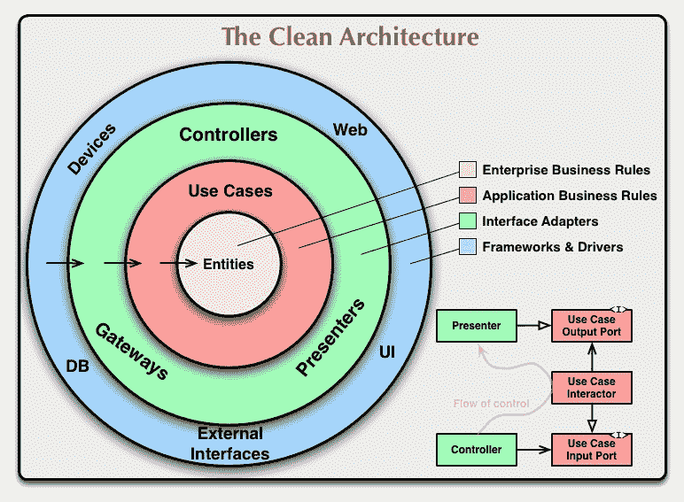

# 清洁建筑介绍

> 原文：<https://medium.com/codex/introduction-to-clean-architecture-2437c6987ec?source=collection_archive---------3----------------------->

照片由 [Alex wong](https://unsplash.com/@killerfvith?utm_source=medium&utm_medium=referral) 在 [Unsplash](https://unsplash.com?utm_source=medium&utm_medium=referral) 上拍摄

本质上，软件分层体系结构模型旨在分离系统的关注点。主要目标是分离软件的“心脏”，即系统其余部分的业务规则实现，如数据库访问、用户界面和任何其他外部系统。

这种分层允许我们在不影响业务规则实现的情况下，替换过时的框架或将新技术引入我们的解决方案。除此之外，这种分离促进了解耦，使得我们在单元和集成测试方面的生活更加容易。

在过去的几十年里，一些作者提出了实现这种分离的方法。尽管存在差异，所有提出的方法都集中在将业务规则实现与任何其他外部代理分离的思想上。2017 年，罗伯特·马丁(Robert C. Martin)提出了清洁建筑的概念。该架构模型旨在将所有建议的方法集成到一个模型中。

同心层的定义定义了有序和定向的执行流，这允许我们将依赖关系指向一个方向。内层不了解外层。这种分离将内层与最外层可能发生的变化隔离开来。例如，假设我们引入了一个新的表示框架，这个新的变化不会影响我们所有的业务层(实体)。这样，我们可以保护应用程序中最重要的部分:业务规则。

> *如果你认为好的建筑很贵，那就试试糟糕的建筑。—布莱恩·富特*

下面是对每一层的职责的简要说明。

**实体**

这一层是我们实现领域模型的地方。我们可以说这是应用程序中最重要的一层，因为它处理系统的“心脏”。这一层将由具有行为(方法)和特征(属性)的业务实体的实现组成。我们应该不惜一切代价避免贫血的实体，因为我们失去了表达能力和改变的理由。暴露其所有属性的贫血实体无法控制谁改变了以及为什么改变。除此之外，当实体以只读方式公开它们的属性时，只允许构造函数和方法改变它们的内部状态，我们可以保证我们将总是使用模型的有效实例。

**用例**

这一层是我们可以找到系统用例实现的地方。通常，这一层接收抽象(通常通过依赖注入)来访问外部系统，如数据库、电子邮件服务等。执行特定用例所需的所有服务和领域模型的编排都将由这一层执行。由于分离和依赖流，这一层的变化不会影响实体层。

**接口适配器**

这一层的目的是作为外部系统和用例之间的数据中介。这一层的主要职责是从一些外部系统(数据库、Rest API、GRPC、队列等)接收数据，并将它们传递给用例，反之亦然。在这一层实现中介模式可能是一个好主意，这将进一步减少与用例层的耦合，在用例层，我们可以发送命令并通过 DTO(数据传输对象)返回结果。

**框架&驱动**

最后但同样重要的是，这一层包括所有的外部工具，如数据库访问、Rest Api、用户界面等。一般这一层不会有太多代码。在这一层，我们可以注入所有内部层将使用的依赖项。

**我们应该在哪里抛出业务异常？**

一次只验证一个实体的业务异常应该被扔进实体自己的行为(方法)中。在我们需要更多实体或任何外部信息来执行验证的情况下，用例层是实现这种验证的好地方。

**任何项目都可以使用 Clean 架构？**

采用干净的架构会增加项目的意外复杂性。对于充当数据库中介的“CRUDS”项目，或者对于具有固定生命周期的项目，干净的架构模式可能会增加开发时间，而没有实际的好处。

对于具有增长前景的小项目，干净的架构可以引导时间实现健壮的和可伸缩的架构，这在项目的开始会消耗更多的时间，但是从长远来看，将有助于新特性的实现。

**结论**

因此，在项目开始时采用干净的架构可以在将来带来很多好处。尽管如此，深入理解它如何帮助您的团队构建满足业务规则的健壮且可伸缩的架构是不可或缺的。请记住，所有偶然的复杂性都需要以某种方式为业务聚集价值，否则，就没有理由采用它。