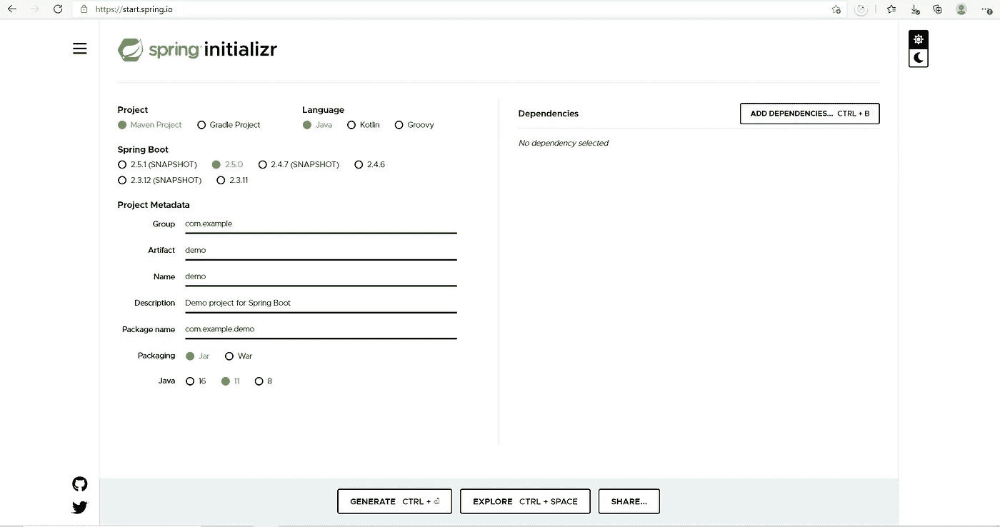

# Java 中使用 Web 服务的介绍第 1 部分

> 原文：<https://medium.com/codex/introduction-to-consuming-web-services-in-java-part-1-43b4d4e8764?source=collection_archive---------6----------------------->

马文·迈耶在 [Unsplash](https://unsplash.com?utm_source=medium&utm_medium=referral) 上的照片

当我们谈论 web 服务时，通常会想到一些事情:

*   API 端点
*   确定谁将消费 API 端点

虽然这提供了后端 API 服务工作的一个很好的概述，但实际上还有更多。

本文将详细介绍编写一个使用另一个端点的 web 服务是什么感觉。将会涉及很多内容，但我们将使用以下关键术语:

*   发布者(将为其他客户/消费者向用户公开 API 的服务)
*   消费者(将使用向发布者用户公开的 API 的服务)

因为设置相当复杂，所以本文将只关注设置 publisher 服务。

步骤 1:转到 spring init.io 并初始化一个项目。

为项目选择“Maven 项目”。另外，选择“Java”作为语言。

选择 2.5.0 作为弹簧引导版本。对于项目元数据，可以放入 com.exampleapi。我们将使用的包是一个 jar，java 版本应该是 11。现在单击生成项目。

第 2 步:将它复制到 pom.xml 中。

在我们复制之前，您可能想知道 pom.xml 是什么。POM 也称为项目对象模型文件，包含有关项目的信息，例如其 java 版本和项目运行所需的所有依赖项。

在项目目录下找到 pom.xml，并用以下内容替换其内容:

除了我们在文件顶部设置的属性之外，我们还包括项目所需的依赖项，例如 Postgres(或其他数据库依赖项，取决于您使用的数据库)和 spring boot starter web。

步骤 3:修改 application.properties 文件。

在项目目录下找到 src/main/resources/application . properties，并用以下内容替换它们:

在这里，我们有一个 spring.datasource.url。当你把 Postgres 安装到你的机器上时，它会自动托管在端口 5432 上。你可以阅读更多关于[通过 JDBC 设置你自己的 spring boot 服务器第 1 部分|作者 Michael Tong | Dev Genius](https://blog.devgenius.io/how-to-get-a-spring-boot-server-running-via-jdbc-part-1-659d33a5e373) 如何为数据库设置你的用户名和密码。

注意我们也设置了弹簧。JPA . hibernate . DDL-自动更新。在我们问这个更新的值意味着什么之前，我们先来看看 spring.jpa.hibernate.ddl-auto 是什么。

ddl-auto 是一个特定于 jpa 的属性，hibernates 使用它进行模式工具管理，以决定在启动应用程序时对数据库模式采取什么操作。这可能涉及自动创建表，当 spring boot 应用程序中的实体发生变化时自动更新表模式。阅读“4。使用 Hibernate 控制数据库创建”,了解更多信息，请访问[关于使用 Spring Boot 加载初始数据的指南| Baeldung](https://www.baeldung.com/spring-boot-data-sql-and-schema-sql) 。

最后需要知道的是 server.port。默认情况下，它是 8080。因为我们正在设置两个应用程序(发布者和消费者应用程序)，所以让我们将这个应用程序设置为 4040。

步骤 4:设置控制器、服务、模型和存储库包。

在 src/main/Java/com . example API . demo application 下，分别创建四个包:

*   控制器
*   服务
*   模型
*   仓库

步骤 5:在控制器包下，创建一个 ToDoItemController，内容如下:

我在这里不会说得太详细，但是这些端点为 todo item 实体提供了 CRUD(创建、更新、删除和修改)操作，我稍后将对此进行讨论。

步骤 6:在模型包下，创建一个 ToDoItem.java，内容如下:

在这里，我们得到了一个实体，它表示当我们让消费者消费发布者的 API 服务时，我们将与之交互的数据结构。

步骤 7:在存储库包下，创建一个包含以下内容的 ToDoItemRepository.java:

看起来没有太多代码，但是这个存储库类将由我们的服务类自动连接。我们不需要深入细节，但是通过扩展 JpaRepository，这个类可以访问 JPA 功能来执行 CRUD(创建、更新、修改、删除数据库中的条目)操作。

步骤 8:在服务包下，创建一个 ToDoItemService.java:

现在在同一个包中添加一个 ToDoItemServiceImpl.java:

对于服务类，我们利用 JPA 和 hibernate 执行的功能与数据库中的数据进行交互。

步骤 9:找到 src/main/Java/com . example API . demo application/application 并运行应用程序。该文件应该位于 resources 文件夹的正上方。打开此应用程序 java 文件，并用以下内容替换它:

粘贴内容后，应该会有一个播放图标。单击该按钮运行应用程序。

你有它！这只是关于通过 JPA 设置该项目的发布者部分。你也可以遵循[通过 JDBC 第 1 部分| Michael Tong | Dev Genius](https://blog.devgenius.io/how-to-get-a-spring-boot-server-running-via-jdbc-part-1-659d33a5e373?source=your_stories_page-------------------------------------)设置你自己的 spring boot 服务器和[通过 JDBC 第 2 部分| Michael Tong | Dev Genius](https://blog.devgenius.io/setting-your-own-spring-boot-server-via-jdbc-part-2-96763d67a310)设置你自己的 spring boot 服务器以及设置你的 publisher 应用程序。

编码快乐！请参见本安装的第 2 部分！