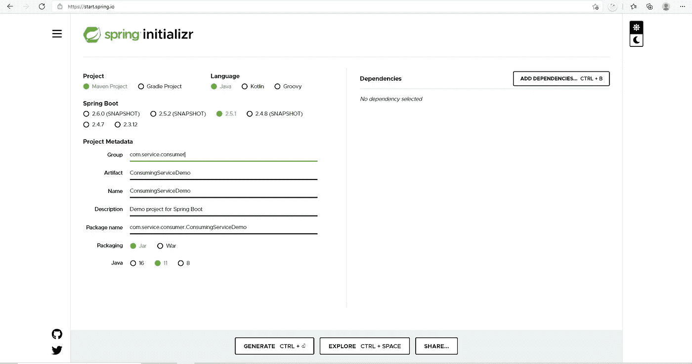
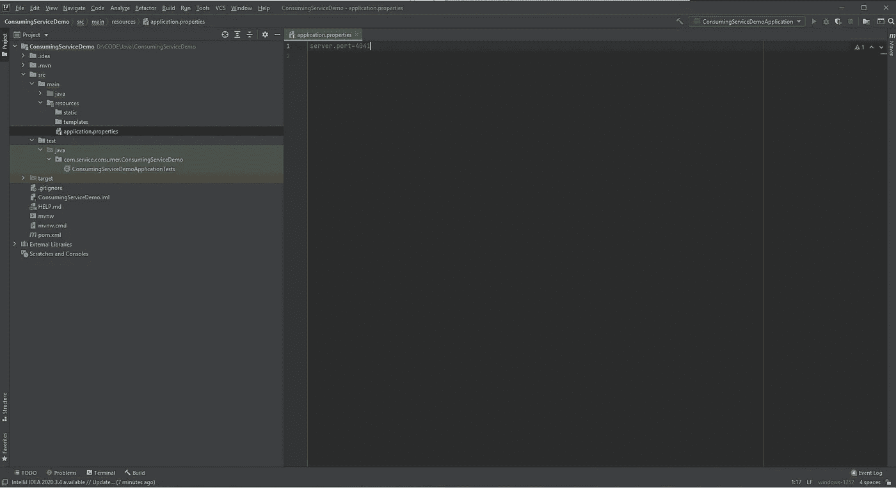
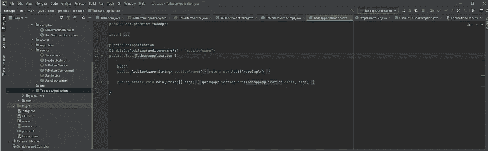
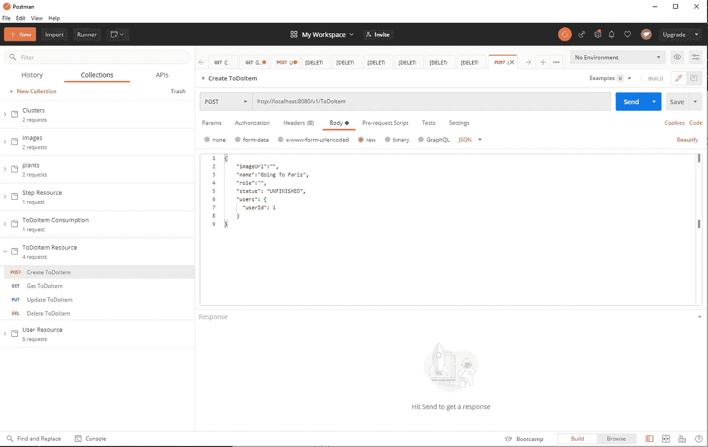
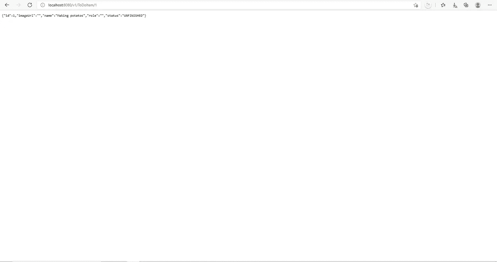
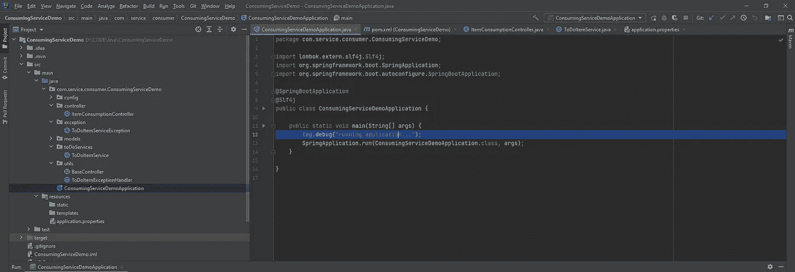
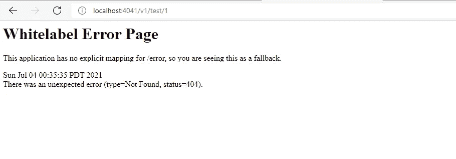
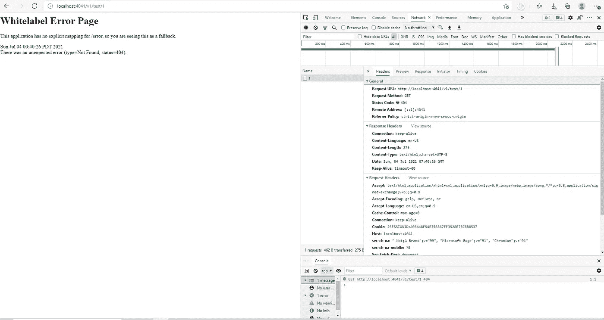

# Java 中使用 web 服务的介绍第 2 部分

> 原文：<https://medium.com/codex/introduction-to-consuming-web-services-in-java-part-2-b695000cbfa1?source=collection_archive---------9----------------------->

米歇尔·勒恩斯在 [Unsplash](https://unsplash.com?utm_source=medium&utm_medium=referral) 拍摄的照片

我们完成了一个运行在 localhost:4040 上的简单 web 服务的设置，关于 Java 中使用 web 服务的介绍，第 1 部分，作者 Michael Tong，2021 年 6 月，中级，T5。

本文将重点介绍如何设置一个样例消费者服务，以及消费者和发布者服务如何相互交互的本质。

在我们深入第 2 部分之前，让我们回顾一下发布者和消费者 API 的作用。

正如我之前提到的，publisher 的角色是公开可供消费者使用的 API。

我们以 facebook 为例。假设我们有一个名为 initfacebookService 的服务，它使用两个服务:一个用于身份验证，另一个用于为应用程序加载 Facebook 帖子。假设当用户验证他们的 facebook 帐户时，将使用这个服务。

Joshua Hoehne 在 [Unsplash](https://unsplash.com?utm_source=medium&utm_medium=referral) 上拍摄的照片

有人可能会问:为什么 initFacebookService 不处理认证和加载 post 数据呢？

假设页面上显示的数据出了问题。现在，如果 initFacebookService 同时处理身份验证和数据提交逻辑，我们就必须一行一行地检查所有代码，看看为什么数据没有提交。

假设 initFacebookService 是一个消费者服务，我们有另一个名为 initDataService 的服务作为发布者。这样，如果应用程序遇到无法为用户获取评论文章的错误，我们可以简单地在 initDataService 层跟踪问题。

让我们看看如何实现消费者层。

步骤 1:通过[https://start.spring.io/](https://start.spring.io/)创建一个 spring 项目，包含以下信息:

单击 Generate，您将收到一个 zip 文件。解压缩文件并在 Intellij IDE 中打开项目。如果您还没有下载 IDE，这里有安装它的链接:[下载 IntelliJ IDEA:由 JetBrains 开发的功能强大的&符合人体工程学的 Java IDE](https://www.jetbrains.com/idea/download/#section=windows)

步骤 2:在 Intellij 中打开项目，并在 ConsumingServiceDemo/src/main/resources 文件夹下找到 application.properties:

在 application.properties 中，添加一行“server.port=4041”。我们将在端口 4041 运行我们的应用程序。在下面的行中，还要添加“todo item . service . base URL = http://localhost:4040”。这将是发布者 api 的 url，它将由项目中的主要服务使用。

步骤 3:在 src/main/Java/com . service . consumer . consumingservicedemo 下创建配置包，然后在同一个包内创建一个 ToDoItemConfig.java 文件，内容如下:

您可能想知道:这个 rest 模板特性是什么，为什么我们需要它？

如果你不好奇这是什么，我会很惊讶。

我们需要先了解一下@Configuration 是什么。允许我们在运行时将一个或多个 beans 加载到 spring 容器中。换句话说，当我们运行消费者应用程序时，@configuration 允许我们在运行时将 restTemplate 作为 bean 加载，这允许我们使用发布者应用程序 API。

第 4 步:在 src/main/Java/com . service . consumer . consumingservicedemo 下创建模型包，并创建一个 ToDoItem.java，内容如下:

目前，我们将使用来自消费者服务的 API，这些 API 将返回到实体。创建这个类将帮助我们存储来自消费者服务的数据。

第五步:在 src/main/Java/com . service . consumer . consumingservicedemo 下创建一个名为 ToDoItemService 的包和一个名为 ToDoItemService 的类，内容如下:

这里，我们有两个公开在消费者端的 api 调用:consumeItem 和 consumeAllItems。

consumeItem 获取一个 id，并使用 rest 模板调用 getForObject。在这里，我们可以得到可选的<todoitem>或者响应实体<todoitem>。Optional 仅返回空值或 ToDoItem，而 ResponseEntity 返回 ToDoItem 以及状态代码。如果 publisher api 没有运行，或者如果我们点击了错误的端点，将会触发 RestClientException，并且我们将抛出一个 ToDoItemServiceException，我们将在稍后讨论这个问题。</todoitem></todoitem>

在顶部，我们有一个服务 url。我们将服务 url 映射到 application.properties 中的“todoitem.service.baseurl”。这样，如果我们想要连接到不同的 publisher api，我们只需在 application.properties 文件中更改它。

步骤 6:在 src/main/Java/com . service . consumer . consumingservicedemo 下创建一个异常包，并创建一个 ToDoItemServiceException 类:

这将是一个异常类，当出现意外情况(如检索不存在的待办事项等)时，将会抛出该异常类。

步骤 7:用下面的代码更新 pom.xml:

之后，右击文件，进入“Maven”并选择“重新加载项目”。这将把所有需要的依赖项加载到消费者项目中。

克劳德·加布里埃尔在 [Unsplash](https://unsplash.com?utm_source=medium&utm_medium=referral) 上的照片

如果你还记得[用 Java 消费 Web 服务的介绍第 1 部分|作者 Michael Tong | CodeX | Jun，2021 | Medium](/codex/introduction-to-consuming-web-services-in-java-part-1-43b4d4e8764) ，我们已经设置了应用程序的两个部分:发布者和消费者应用程序。然而，为了充分发挥消费 web 服务的作用，我们必须首先让将要消费的 web 服务工作。

现在转到您的 publisher 应用程序并运行它:

转到第 12 行，单击绿色箭头。这将在端口 8080 上运行 publisher 应用程序。

步骤 7:为了测试您的 publisher 应用程序 API，我们需要首先创建可供我们使用的数据。在您的机器上安装 postman，并使用以下数据进行 post 调用(另一个先决条件是您已经安装了 postgres):

您还可以使用相同或不同的名称多次运行此调用来填充数据库。

之后，你可以进入你的浏览器(chrome，internet explorer 等)或 postman，调用 get api 来获取你的 todoitem:

在你的浏览器中输入 localhost:8080/v1/ToDoItem/1，你可以看到上面的图片。

现在，要测试消费者应用程序，请返回到您在本教程中设置的应用程序并运行该应用程序:

单击绿色箭头，现在您的应用程序正在 localhost:4041 上运行。现在转到你的浏览器，输入 [localhost:4041/v1/test/1](http://localhost:4041/v1/test/1) ，你应该能看到类似上面屏幕的东西。

这就是涵盖一个成功的消费者应用程序消费一个出版商的 api！但是等等…

如果发布者 api 不可用怎么办？转到您的 publisher 应用程序并将其关闭。然后，尝试访问 localhost:4041/v1/test/1，看看会发生什么:

如果您在浏览器上检查您的网络选项卡，您应该能够看到 404 错误:

概括地说，为什么我们有出版商和消费者服务？为什么不把所有东西都写在一个服务中呢？

因为我们希望能够按照不同的功能对服务进行分类和区分。如果服务的某个功能出了问题，就更难找到问题出在哪里。

就是这样！您刚刚学习了如何构建一个使用 web 服务的应用程序。