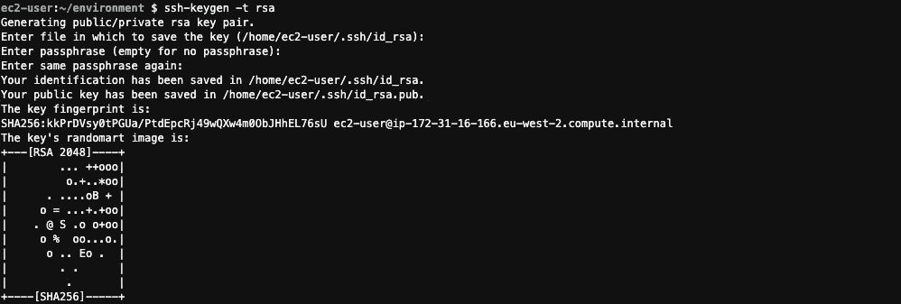
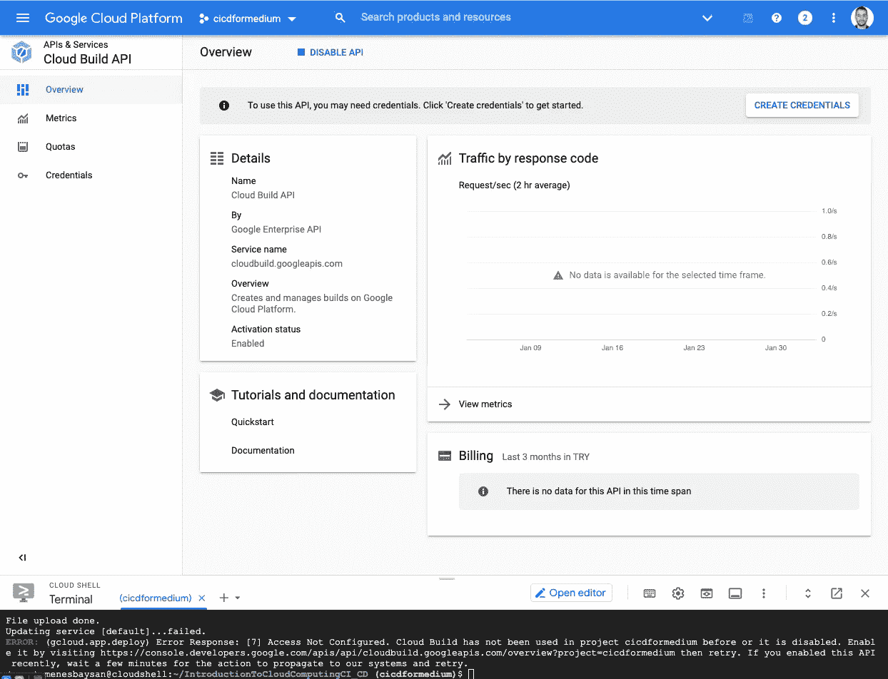

# Python Flask 持续集成和持续交付简介

> 原文：<https://medium.com/codex/introduction-to-continuous-integration-and-continuous-delivery-with-python-flask-a2fa1d48db6c?source=collection_archive---------5----------------------->

AWS Cloud9、AWS EC2、Makefile、GitHub Action、谷歌云应用引擎、谷歌云构建

你好。在这个故事中，我们将尝试做一个关于 CI & CD 的介绍。我们将介绍 CI 和 CD 是什么，我们如何使用 GitHub Action，它是什么，以及我们如何将 Flask 应用程序部署到 Google Cloud App Engine。


由[比利·胡恩](https://unsplash.com/@billy_huy?utm_source=unsplash&utm_medium=referral&utm_content=creditCopyText)在 [Unsplash](https://unsplash.com/?utm_source=unsplash&utm_medium=referral&utm_content=creditCopyText) 上拍摄的照片

我们将跟随我创建的回购来体验这个故事的主题。您可以使用下面的链接访问回购。

[](https://github.com/mebaysan/IntroductionToCloudComputingCI_CD) [## GitHub-mebaysan/IntroductionToCloudComputingCI _ CD:我创建这个 repo 是为了完成给定的任务…

### 我创建这个 repo 是为了完成杜克大学的 Noah Gift 交给我的构建云计算解决方案的任务…

github.com](https://github.com/mebaysan/IntroductionToCloudComputingCI_CD) 

此外，我们将使用 AWS 的 Cloud9 服务运行并查看我们代码的输出。别担心，我们不会编码。我已经为你准备好了一切。我们将使用 Cloud9 来查看我们从`Makefile`等获取的一些输出。你可以在下面看到我刚刚为这个故事创造的环境。


作者图片

# 关键术语

在我们开始编码之前，我将写一些关键术语。

## 生成文件

我们可以说这个文件是执行我们代码的一个诀窍。Makefile 可以在基于 Linux 的系统上工作。它简化了必要的步骤。

## 连续累计

它提供了以下内容:

*   我们可以知道我们的软件是否在工作。事实真相
*   它节省了我们的时间

## 连续交货

我们可以提供始终处于可部署状态的代码。

## GitHub 操作

我们可以通过使用 GitHub 动作来自动化一些过程。我们使用 YAML 文件来创建动作。

## 云 9(自动气象站)

Cloud9 是一个基于云的 IDE。

## 应用引擎(谷歌云平台)

我们可以通过使用该服务来部署我们的 web 应用程序。

## 云构建(谷歌云平台)

我们可以通过使用该服务提供持续交付，并在我们项目的 GitHub repos 上创建事件。当分支上发生一些动作时，我们可以自动拉出最新版本的代码。

# 准备环境

我为此创建了一个新的 Cloud9 服务实例。我没有改变默认设置。它自动为我创建了一个新的 EC2 服务实例。我们将在这个 EC2 上工作，并在 Cloud9 服务上编码。我连接到了我的 Cloud9 实例。

我将执行`ssh-keygen -t rsa`来获得一个 ssh 密钥。我将把这个密钥保存到我的 GitHub 帐户中，以便从环境中直接访问我的 GitHub。



作者图片

现在，我将把我的公钥复制到我的 GitHub 中。我可以用这个命令`cat /home/ec2-user/.ssh/id_rsa.pub`得到。文件路径可能因您的环境而异。不用担心共享这个公钥。它没有私钥重要。我把这个公钥加到了我的 GitHub 账户里。


作者图片

我将把回购拉到我的 Cloud9 环境中。

```
git clone [https://github.com/mebaysan/IntroductionToCloudComputingCI_CD.git](https://github.com/mebaysan/IntroductionToCloudComputingCI_CD.git)
```


作者图片

现在，我需要创建一个虚拟环境。为此，我将在终端中执行下面的代码。

```
cd IntroductionToCloudComputingCI_CD/python3 -m virtualenv venv
```

我们可以通过使用下面的代码来激活虚拟环境。

```
source venv/bin/activate
```

我们已经成功地在 Cloud9 上准备了我们的工作环境。现在我们可以用实例来解释关键术语。

# 带 Makefile 的配方

如上所述，我们可以说 Makefile 的“配方”。


作者图片

我们在 Makefile 中设置步骤，我们可以像这样轻松地使用它们`make <step_name>`。

我将在我们上面创建的虚拟环境中安装所有依赖项。

```
make install
```

基本上，Makefile 完成了这项工作；为每个步骤应用命令。如果您想确定它是否安装了软件包，您可以使用下面的命令进行检查。它将返回您的虚拟环境中所有已安装的软件包。

```
pip freeze
```

## EC2 和安全组简介

为了看到一个新的例子，我将执行这个:`make run`。它将运行 Flask 应用程序。当你点击(在预览中打开)HTTP 地址时，你会看到下面的结果。


作者图片

在这种情况下，我们需要在我们的应用程序使用它的 EC2 实例上设置一个端口。我将创建一个新的安全组。


您可以从 EC2 服务页面访问此页面

我创建了一个新角色“introductiontocicdgroup”并设置了 8080 端口。


现在我们必须将这个新组添加到 EC2 实例的组中。我将转到 EC2 实例的详细信息页面，并更改安全组。


您可以使用“更改安全组”按钮。这就是“新 EC2 体验”。

我将重启我的 Flask 应用程序，并使用 8080 端口访问我的 EC2 实例的公共 IP。


图片作者:http:// <publicip>:8080</publicip>

# 与 GitHub 动作的持续集成

我们说过 CI 让我们对代码有了深入的了解。我们可以使用 GitHub 动作来 CI。您可以从 GitHub repo 的 Actions 部分创建新的操作。


作者图片

简而言之，当我们在 GitHub 上触发一个事件时，GitHub 动作执行我们设置的步骤。例如，当我在主分支上推送最新的代码时，我希望看到 pylint 结果。我可以通过使用 GitHub 动作来实现。我们以 YAML 的方式设定行动。我们需要将这些文件放入 repo 中的`.github/workflows/`。您可以通过使用[此链接](https://github.com/mebaysan/IntroductionToCloudComputingCI_CD/blob/main/.github/workflows/main.yaml)来访问示例动作文件。

我们在下面看到一个 YAML 行动文件的例子。它说，当我在主分支上推动更改时，它会自动应用这些步骤。


作者图片

我们可以看到所有的工作流程。


作者图片

我们可以看到工作流程的细节。


作者图片

长话短说，我们可以保持代码稳定。我们可以知道在什么情况下我们的代码通过了所有的测试？等等。

# 将应用程序部署到 GCP 应用程序引擎

我们可以使用 App Engine 轻松部署我们的应用。我们将把我们的 Flask 应用程序部署到 GCP。

首先，我要去[谷歌云平台](https://cloud.google.com/)。然后，我正在使用谷歌云壳创建一个新项目。

```
gcloud projects create cicdformedium
```

使用应用引擎时，我们必须有`app.yaml`文件。您可以看到我为我们的场景创建的文件。


作者图片

现在，我将把 GitHub repo 克隆到我的 Google Cloud Shell 环境中，并执行我们在上面使用 Cloud9 时执行的相同步骤。

*   克隆回购
*   创建新的虚拟环境
*   安装需求


作者图片

现在，我们将创建一个新的应用引擎实例。

```
gcloud app create
```


作者图片

现在我可以执行下面的代码了。这里注意，这一步我们要有`app.yaml`文件。

```
gcloud app deploy
```


作者图片

您可能会得到如下所示的错误。


作者图片

我们得到它是因为我们的回购文件夹中有`cloudbuild.yaml`文件。我们需要在我们的项目中启用这些服务。



作者图片

我再次执行代码进行部署。

```
gcloud app deploy
```

现在解决了。我可以通过使用`gcloud app browse`在浏览器上看到我的项目。


作者图片

# 通过 GCP 云构建实现持续交付

在本节中，我们将使用云构建创建一个触发器来跟踪 GitHub repo 上的事件。

为此，我将转到云构建的控制面板。我将创建一个新的触发器。


作者图片

我点击“创建触发器”按钮，开始创建一个事件。我需要授予 Cloud Build 权限才能访问我的 GitHub repos。


作者图片

我在回购上做了一个触发器。现在，我将在 Cloud9 上添加一个新的 repo 路径。


作者图片

此外，我们可以通过使用 GitHub 操作创建的 CI 工作流来检查是否有任何错误。


作者图片

当您试图查看 CD 过程的详细信息时，您将得到一个新的错误。


作者图片

我们可以通过在云构建上启用一些服务来解决这个问题。我点击了位于左侧栏的设置按钮。然后我启用了两个服务，我们可以在下面看到。


作者图片

现在，我将对我们创建的新路线做一点更改，以模拟此 CD 流程。我把新的变化推给了回购。

现在我们可以看到下面的成功结果。Cloud Build 会自动将最新代码下载到我们的应用引擎中。


作者图片

可以肯定的是，我要测试新路线。我看到了新路线的结果。


作者图片

# 最后

我们在这个故事中指出了以下主题:

*   什么是 CI 和 CD？
*   什么是 Makefile？
*   什么是 GitHub 动作？
*   什么是 Cloud9？
*   EC2 是什么？
*   什么是 App Engine？
*   什么是云构建？
*   具有 GitHub 操作的配置项
*   具有云构建的 CD

希望您喜欢这个故事，它有助于您了解 CI & CD 的基本概念和最受欢迎的云提供商的功能。你可以通过下面的链接获得我们在这个故事中使用的所有代码。

[](https://github.com/mebaysan/IntroductionToCloudComputingCI_CD) [## GitHub-mebaysan/IntroductionToCloudComputingCI _ CD:我创建这个 repo 是为了完成给定的任务…

### 我创建这个 repo 是为了完成杜克大学的 Noah Gift 交给我的构建云计算解决方案的任务…

github.com](https://github.com/mebaysan/IntroductionToCloudComputingCI_CD) 

问候。