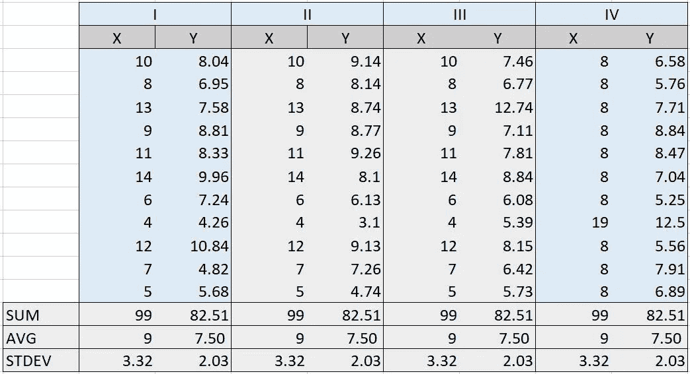
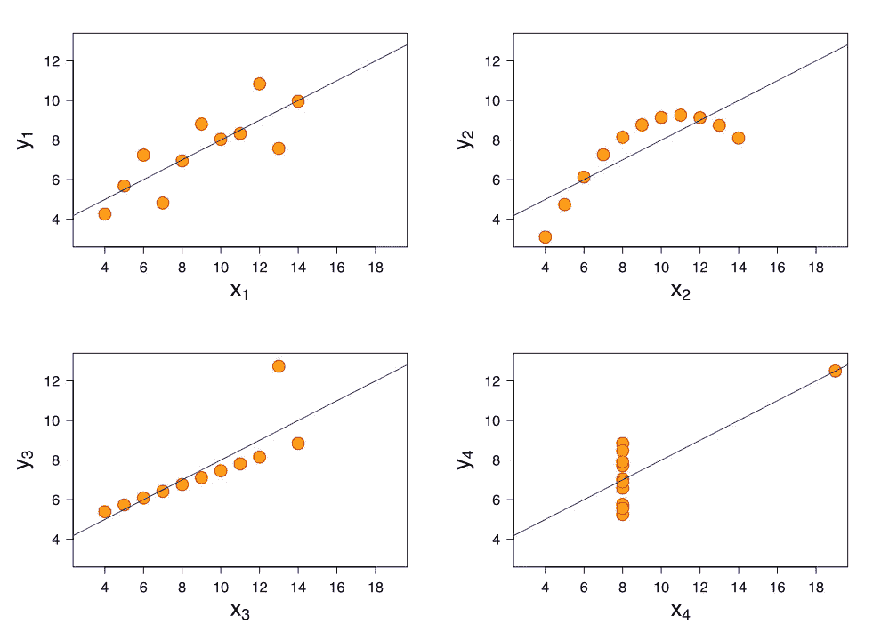
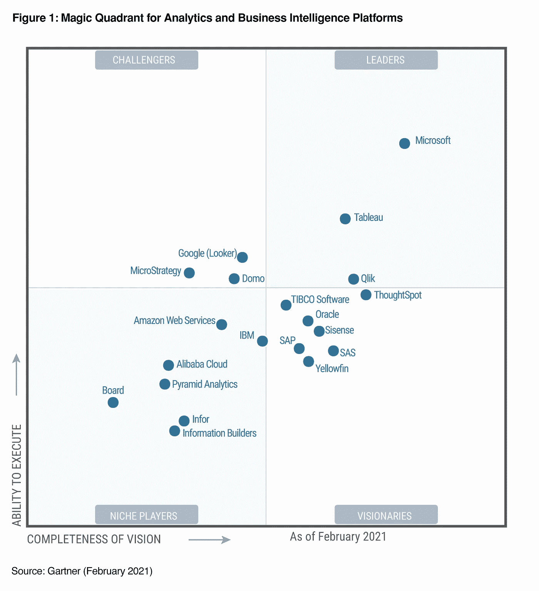

# 数据可视化简介

> 原文：<https://medium.com/codex/introduction-to-data-visualization-8e2b1d3d5d70?source=collection_archive---------3----------------------->

[ev](https://unsplash.com/@ev?utm_source=unsplash&utm_medium=referral&utm_content=creditCopyText) 在 [Unsplash](https://unsplash.com/?utm_source=unsplash&utm_medium=referral&utm_content=creditCopyText) 上的照片

## 关于…的完整指南

## 数据分析师职业指南/数据可视化基础

由[波格丹一世·卡伦科](https://unsplash.com/@bogdan_karlenko?utm_source=unsplash&utm_medium=referral&utm_content=creditCopyText)在 [Unsplash](https://unsplash.com/?utm_source=unsplash&utm_medium=referral&utm_content=creditCopyText) 上拍摄的照片

我相信，在不久的将来，数据将成为给地球提供动力的新氧，我们作为地球上最聪明的物种，应该认识到它的重要性，并在大数据革命之前进入这一领域。数据科学的主题是巨大的，仍然未被发现，对我们来说有无数的机会。在本文中，我将讨论数据可视化，这是数据分析师工作的重要部分，也是其他角色的重要部分。我可以向你保证，这篇文章将成为所有有兴趣学习数据可视化或以数据分析师为职业的人的起点。

文章流程如下:

*   [**什么是数据可视化&它的类型？**](#8e9f)
*   [**为什么数据可视化&其重要性？**](#df2d)
*   [**安斯科姆的四重奏举例。**](#5a04)
*   [**不同的数据可视化方式。**](#942d)
*   启动你的旅程的事实和来源。

## **什么是数据可视化&它的类型？**

由[克里斯·利维拉尼](https://unsplash.com/@chrisliverani?utm_source=unsplash&utm_medium=referral&utm_content=creditCopyText)在 [Unsplash](https://unsplash.com/?utm_source=unsplash&utm_medium=referral&utm_content=creditCopyText) 拍摄的照片

数据可视化是一个术语，指的是一组以可视化方式交流数据见解的策略。它指的是使用图表、图形和地图直观地描绘数据。这是一种以非技术人员可以理解的方式呈现数据的艺术，允许数据科学家和分析师与其最终用户进行交流。

因此，广义的数据可视化分为两类:

*   **探索性分析**:在数据分析过程中进行，以发现洞见。当您有大量数据并且不确定其中有什么时，这很有用。出于这些原因创建的可视化并不一定是完美的。简单地说，你在寻找模式。
*   **解释性分析:**这是在你找到洞察力之后做的。当你已经知道数据说了什么，并试图向其他人传达这个想法时，这是合适的。为这些目标创建的可视化必须伴随着一个叙述，引导读者找到问题的答案。

## **为什么数据可视化&其重要性？**

照片由 [NASA](https://unsplash.com/@nasa?utm_source=unsplash&utm_medium=referral&utm_content=creditCopyText) 在 [Unsplash](https://unsplash.com/s/photos/big-data?utm_source=unsplash&utm_medium=referral&utm_content=creditCopyText) 上拍摄

我们使用图表、图形和地图等可视化组件来评估大量数据，并基于这些数据做出决策。使用数据可视化工具可以看到和理解数据中的趋势、异常和模式。因为人类通过视觉比通过其他器官吸收更多的信息，可视化可以帮助我们处理更复杂的信息，并提高我们对事实的记忆能力。通俗地说，数据可视化为我们提供的图形化方法使任何人都可以很容易地理解数据的含义，即使是非技术人员也很容易理解。

**数据可视化的重要性:**

*   协助立即掌握信息。
*   允许用户通过简化大型数据集来轻松解读它们。
*   识别不明显的趋势。
*   确定哪些方面需要改进或注意。
*   为您提供新的数据见解。
*   快速检测异常值。

## **安斯科姆的四重奏举例:**

费尔南多·雷耶斯在 [Unsplash](https://unsplash.com/?utm_source=unsplash&utm_medium=referral&utm_content=creditCopyText) 上拍摄的照片

前一种想法可以用安斯科姆的四重奏来举例说明。安斯科姆的四重奏由*四个数据集或表格*组成，这些数据集或表格具有几乎相同的简单描述性统计数据，但分布和图形外观却显著不同。每个表格或数据集都有*两列十一行*，我们分别为每个表格的这两列计算*总和、平均值和标准偏差*。下面我们可以看到安斯科姆的四重奏由四张桌子组成。

作者图片

数据集 *I、II 和 III* 的 *X* 字段具有相同的值，而每个数据集的 *Y* 字段具有不同的值，如上图所示。需要注意的一点是，尽管这些值是不同的， *SUM、AVG 和 STDEV* 被发现是相同的。那么，你认为这些点是否会有相同的图形表示呢？让我们在绘制之后看看它们的输出。

[Anscombe.svg](https://commons.wikimedia.org/wiki/File:Anscombe.svg) : [史高斯](https://commons.wikimedia.org/wiki/User:Schutz) : [大道](https://commons.wikimedia.org/wiki/User:Avenue) — [Anscombe.svg](https://commons.wikimedia.org/wiki/File:Anscombe.svg)

因此，尽管数据集具有相似的*总和、AVG 和标准偏差*值，但这些值的可视化描述在分布方式上有很大不同。尽管有相同的 *SUM、AVG 和 STDEV* ，上面的散点图显示了每个数据集中 *X* 和 *Y* 点之间的四种不同类型的关联。这个例子展示了数据可视化的价值，以及它如何帮助发现数据中隐藏的链接。

## **不同的数据可视化方式:**

[Luana Azevedo](https://unsplash.com/@azevdoluana?utm_source=unsplash&utm_medium=referral&utm_content=creditCopyText) 在 [Unsplash](https://unsplash.com/?utm_source=unsplash&utm_medium=referral&utm_content=creditCopyText) 上拍摄的照片

随着技术的出现，可用于数据可视化的工具已经迅速发展。数据可视化软件用于创建从交互式库到 3D 图形甚至实时数据解释的一切。在本节中，我们将介绍大多数人用于数据可视化的几乎所有方法。

*   与任何其他编程语言相比，Python / R 拥有最令人惊叹的库，因此它们被数据科学分支中的大量人群广泛用于数据可视化。像 Matplotlib、Seaborn & Plotly 这样的库可以用来绘制用于数据分析的漂亮图形，除此之外，这些库在处理大型数据集方面速度极快，并且经过了优化。
*   **Excel :** 于是微软 Excel 在 1985 年&被开发出来，从那以后由于其多样的功能和易于使用的*图形界面*而在数据分析师中广受欢迎。由于不需要编程知识，它被广泛使用，但是它的缺点是消耗内存&不能处理非常大的数据集。
*   Tableau & Power Bi :数据分析师使用 Tableau 和 Power Bi，这两个流行的分析和商业智能产品分别由 SalesForce 和微软制造，用于数据可视化和分析。他们是市场的领导者，在激烈的竞争中争夺大量的消费者。这两个工具都非常动态，并提供拖放功能，使它们易于使用，并能够处理大数据集。
*   **Google Charts :** HTML 5 和 SVG 用于为 Google Charts 提供动力。这是一个用于浏览器和移动设备的数据可视化工具，功能强大，易于使用，并且具有交互性。它专为 Android、iOS 和全面的跨浏览器兼容性而设计，包括早期版本的 Internet Explorer，并包括一个大型图表库，您可以轻松编辑以满足您的需求。
*   **Qlikview :** 它是 Tableau 的竞争对手，除了数据可视化之外，还提供全面的商业智能、分析和企业报告功能。Qlik Technologies Inc .是其背后的公司，最近它吸引了大量新客户，对 Tableau 构成了严重威胁。
*   **信息图:**用户可以使用这个基于 web 的数据可视化和信息图应用程序创建和共享数字图表、信息图和地图。它提供了一个用户友好的所见即所得(WYSIWYG)编辑器，可以将数据转换为可共享的信息图表。它允许您将他们的可视化和信息图表连接到实时的大数据。

除了所有这些工具，还有很多经常使用的工具，但这些是最广为人知的，所以我在这里列出了它们。我还附上了 Gartner 幻方图，供您参考，并从更广阔的角度了解这些工具及其可用性。

[高德纳公司的参考图片](https://powerbiblogscdn.azureedge.net/wp-content/uploads/2021/02/Figure1.png)

## **启动您的旅程的事实和来源:**

由[梅尔·普尔](https://unsplash.com/@melpoole?utm_source=unsplash&utm_medium=referral&utm_content=creditCopyText)在 [Unsplash](https://unsplash.com/s/photos/circles?utm_source=unsplash&utm_medium=referral&utm_content=creditCopyText) 上拍摄

你知道吗，根据 Indeed.com 的数据，目前美国数据分析师的平均年薪是 70，033 美元。鉴于根据谷歌**的数据，美国公民的平均收入为 31133 美元(2019 年)。我希望这能引起你的注意，让你有足够的好奇心去了解更多:**数据可视化&数据分析师作为一种职业。****

**下面我提到了一些成为*数据分析师的必备技能:***

*   ****批判性思维****
*   ****微软 Excel / Tableau / Power Bi****
*   ****结构化查询语言(SQL)****
*   ****R 或者 Python(我会推荐 Python)****
*   ****数据可视化&演示技巧****

**我将向大家推荐一些免费资源，以开始成为数据分析师的学习之旅，这些资源包括 W3Schools for SQL，youtube 上有各种免费课程，可以学习 Tableau、Power Bi 或 Excel & Python 或 r 也是如此。**

**O 我希望你能学到一些有趣的东西，并想开始你的学习之旅，成为一名数据分析师。上面提到的所有技能都是强制性的，掌握它们并变得完美需要一些时间。**

> **编者按:首先，也是最重要的，感谢你坚持写完这篇文章。快乐学习。**