# 决策树及其扩展介绍:装袋、随机森林、Boosting

> 原文：<https://medium.com/codex/introduction-to-decision-tree-and-its-extension-bagging-random-forest-boosting-ae0312bc477?source=collection_archive---------7----------------------->

在现实世界的数据中，样条不是数据点唯一的非线性分布。例如，它可以具有如下所示的形状。

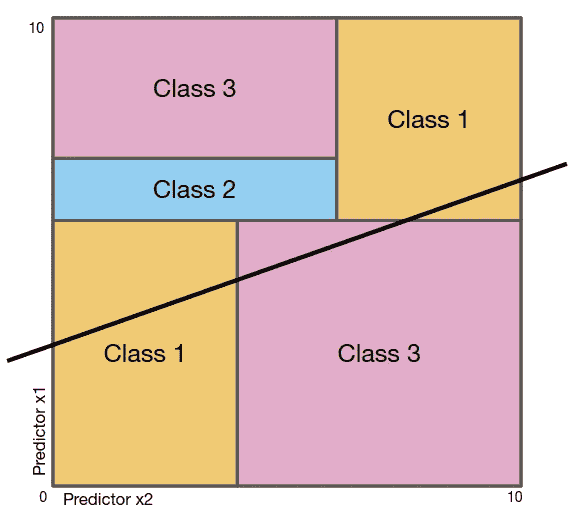

线性模型不能很好预测的分布示例

对于这种类型的分布，假设模型形状的参数方法(如线性模型)效果不佳。因此，我们需要具有更高灵活性的非参数方法来拟合这样的分布。其中，我将在本文中讨论决策树。

# **决策树的基础**

决策树的名称来源于它的图形表示，类似于倒置的树的形状。

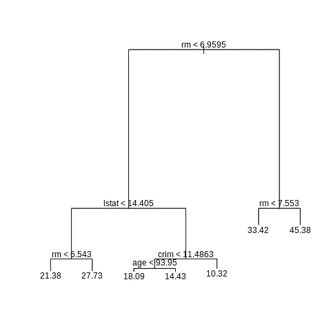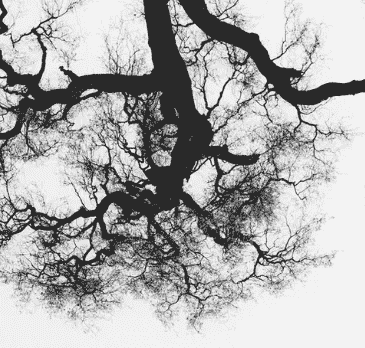

[Chris Leipelt](https://unsplash.com/@cleipelt?utm_source=medium&utm_medium=referral) 在 [Unsplash](https://unsplash.com?utm_source=medium&utm_medium=referral) 上的决策树示例/原始照片(左)

在决策树中，所有观察都从顶部开始，当它们向下移动时遇到内部节点时，就会分成两个分支。这些分割基于观测值的预测值是否满足内部节点定义的标准。并且分割继续，直到满足停止条件。从上到下的整个过程被称为自上而下的方法。

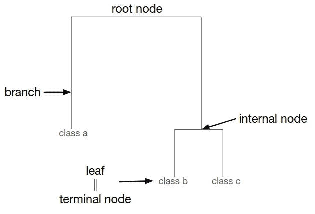

决策树中使用的术语

决策树使用的另一种方法是贪婪方法。这意味着每个内部节点拆分观察结果以在该特定节点产生最佳结果，而不是考虑树末端的最佳结果。

决策树的一个问题是，它可能变得过于灵活，并过度适应训练集。我们如何解决这个问题？

我们可以向内部节点添加更健壮的阈值，这样，除非显著改进模型，否则不会发生分裂。或者我们可以应用树修剪。

# **构建和修剪**

在构建完整的树之后，剪掉几个分支来解决过度拟合问题，这就是这个名字的由来。它将修剪多少分支取决于α值——称为复杂性参数——来自下面的等式。

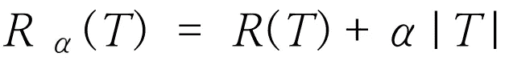

根据等式，R(T)是总误分类率，而|T|是终端节点的数量。所以如果α = 0，那么拥有一棵大树就没有惩罚。因此，它将只使用 R(T ),不会修剪任何分支。当α增加时，现在大树是有代价的。所以只会保留重要节点。这将增加训练误差，但大大减少测试误差。

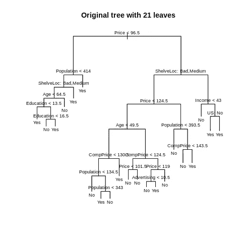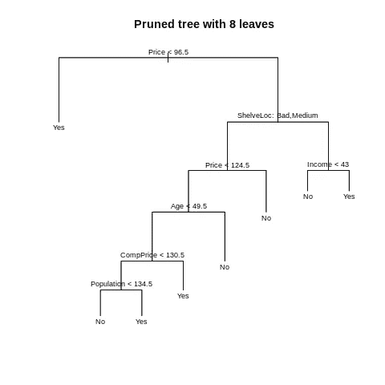

完全决策树和修剪树的一个例子

# **树的用途**

那么我们可以用决策树预测什么呢？有人可能认为它只能对观测值进行分类，因为它实际上将观测值分为两个区域。但是，决策树既可以做回归，也可以做分类。决策树中用于回归和分类的每个过程都是相同的，除了它如何给出预测。

在回归方面，预测值是来自观测值所属节点的所有观测值的平均响应值。因此，落入同一节点的观测值具有相同的预测值。为了测量模型的性能，通常使用 RSS -真值减去平均响应值的和。

在分类方面，决策树将观察值分类到每个节点中最常出现的类别，而不是平均响应值。对于评估指标，它使用分类错误率、基尼指数或熵来代替 RSS。

# **分类树评估指标**

分类错误率衡量模型的准确性，并通过计算得出，但这不是一种稳健的方法。意思是，观察上的一个小变化

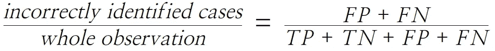

t 代表真，P 代表正，N 代表负

分类错误率的替代方法是基尼指数和熵。

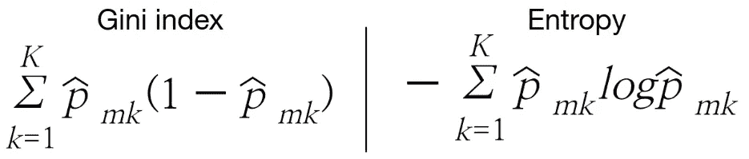

基尼指数和熵的方程式

从等式中，p̂指示来自第 m 个区域中的第 k 个类的训练观测值的比例。所以当 p̂接近 1 或 0 时，意味着第 m 个区域的大部分观测值来自或不来自第 k 个类。这导致基尼指数或熵的增加较低。因此，它们的低值意味着高节点纯度。

因为基尼指数和熵计算相同的属性，所以任一个都可以用于评估节点纯度。它们的性能并没有太大的不同，只是它们的值有不同的范围，并且由于熵方程中的对数，熵通常需要更多的时间来计算。

# **树的优势&劣势**

由于树的简单图形表示，关系是直观的。当一个观察在节点处满足标准时，它将转到左边的分支。如果没有，它就向右移动。此外，决策树擅长处理定性预测，因为不需要生成虚拟变量。

然而，这是一种不可靠的方法。也就是说，观察中的一个小变化可能会导致最终树的大结构变化。下面的代码和树形图演示了根据每个样本中包含的观察结果，生成的决策树可能会有所不同。

```
set.seed(1)
Carseats.1 = Carseats[sample(1:nrow(Carseats), 200), ]
Carseats.2 = Carseats[sample(1:nrow(Carseats), 200), ]
tree.carseats1 = tree(High~.-Sales, Carseats.1)
tree.carseats2 = tree(High~.-Sales, Carseats.2)
```

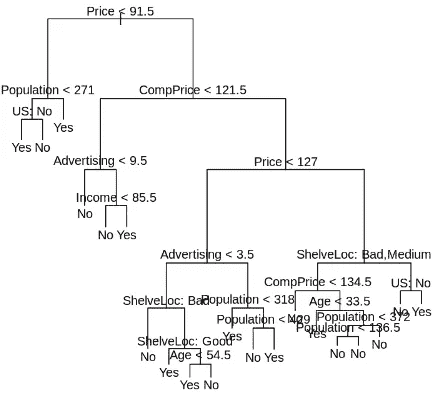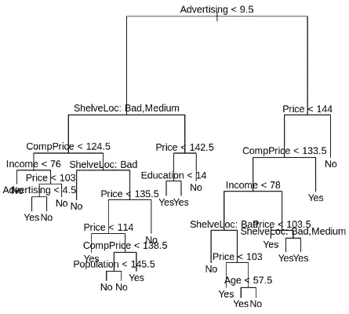

用 Carseats.1 生成的树形图/用 Carseats.2 生成的树形图

最重要的是，它的表现不如其他回归和分类方法。幸运的是，有几个选项可以用来提高预测能力。

# **使用 bootstrap 减少方差- Bagging**

你可以使用的第一种方法是装袋。通过取多个训练集的平均值，可以减少方差。然而，在现实世界的项目中，收集多个训练集需要花费时间和资源，有时甚至是不可能的。这就是自举的用武之地。

> 1.从单个数据集生成最佳引导样本
> 
> 2.为每个引导样本构建一个决策树
> 
> 3.取这些样本预测值的平均值

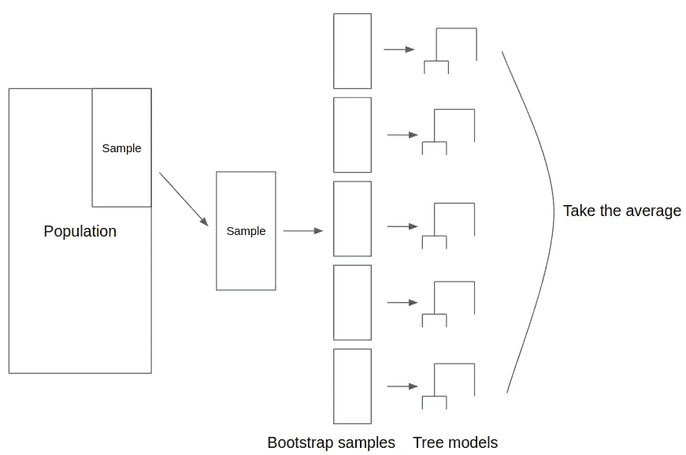

包装工作方式的可视化表示

还记得决策树在没有修剪的情况下会遭受高方差吗？因此，虽然 bagging 可以应用于许多方法，但它对决策树特别有用，因为它可以减少方差并大大提高准确性。但是这种优势是有代价的。

即使可以通过测量每个预测器的评估度量的变化量来获得每个预测器的显著性，它也不能再生成简单的图形表示。这是因为 bagging 和下面描述的其他方法会生成多个树模型，而不是一个树模型。因此，它在解释上的优势换来了更好的准确性。

bagging 的另一个局限性是，当预测因子高度相关时，它可能表现不佳。随机森林独特地解决了这个问题。

# **限制去相关随机森林的预测值**

就像装袋一样，随机森林会生成多棵树进行改进。但是，随机森林还考虑了每个样本的预测之间的相关性。

因为 bagging 基于同一组预测值构建树，所以很少会重复选择强预测值。这导致生成产生高度相关预测的相似树。相关预测的一个问题是，取这些预测的平均值不会像预期的那样减少方差。

为了解决这个问题，随机森林限制了哪些预测器将在内部节点中被评估。因此，它不是每次都考虑整个预测值集，而是只评估 m 个预测值，并选择其中最好的一个。通常， *m=sqrt(p)* 用于具有高度相关预测值的数据集。所以有些预测指标甚至不允许选择。这打破了树之间的相关性，并成功地减少了方差。

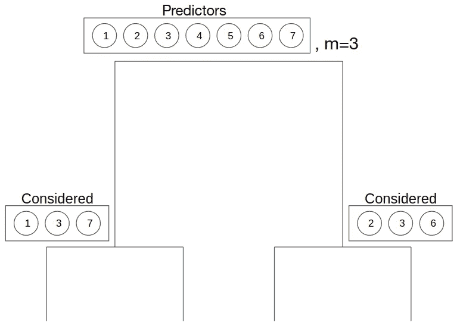

随机森林如何工作的可视化表示

然而，它不可能总是完美的。虽然生成大量的树不会导致过度拟合，但是计算它们需要一些时间。因此，如果您试图在实时算法中使用随机森林，您可能会发现其他方法更合适。

# **构建连续的树-增强**

与构建独立树的前两种方法不同，boosting 基于前面的树来构建树。怎么会？

> 1.计算响应的一个预测值
> 
> 2.计算每个样本的残差:实际-预测
> 
> 3.构建决策树来预测残差而不是响应值
> 
> 4.计算以下等式:预测值=预测值+学习率×残差
> 
> 5.重复步骤 2 到 4 B 次

因此，提升不是基于响应值 B 倍进行拟合，而是使用每个状态的残差来生长顺序树。然而，由于与前两种方法不同，增强可能会过拟合，因此您需要小心选择 B 值。

除了重复次数之外，您还需要调整学习速率和特定于树的参数。学习率控制着预测值在每次重复中的变化程度。所以当学习率很高时，预测值变化很快。因此，该模型很可能无法识别某些趋势。另一方面，学习率低的 boosting 可以找到从基本树中很难找到的关联。因此，为了充分利用增强，诸如 0.01 的低学习率是优选的。

您需要调整的两个特定于树的参数是树深度和终端节点中的最小观察数量。树深度控制每次重复中树的节点数。通常，您会使用 3 到 8 之间的值，因为具有这些值的树可以识别预测器之间的相互作用。但是，您也可以使用 1 来建立一个附加模型。相比之下，树的终端节点中的最小观察数量的典型范围是 5 到 15。高端用于防止过度拟合，低端用于帮助处理不平衡的数据集。

拥有许多超参数的一个缺点是很难对它们进行调优，并且对于如何使用交叉验证对它们进行调优仍然存在争议。一种通用方法是

> 1.选择一个相对较高的学习率，在 0.05 到 0.2 之间
> 
> 2.通过交叉验证确定该学习率的最佳树数。通常，选择产生最小 cv 误差的树的数量。
> 
> 3.固定树的数量，并根据准确度和速度调整学习率
> 
> 4.固定学习率并调整特定于树的参数:树深度和终端节点中的最小观察数量
> 
> 5.尝试降低学习速度，看看它是否能提高准确度
> 布拉德利制定的步骤

# **了解预测者影响的替代方案**

如上所述，您不能使用 bagging、random forest 或 boosting 生成简单的图形表示。相反，您可以生成一个显示每个预测值相对重要性的图。

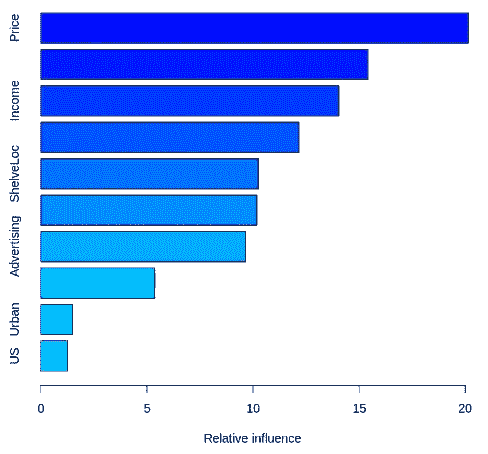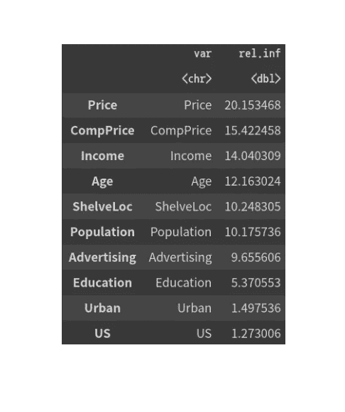

相对重要性直方图/表格，显示每个预测值的相对重要性值

这些相对影响基于每个预测因子对模型的改进程度。一般来说，它是通过评估指标因每个预测值而改变的程度来计算的。

每个变量都可以用部分相关图来进一步检查，它显示了在其他变量固定的情况下，该变量如何影响响应。例如，我们可以得出结论，价格对销售的边际影响随着价格的上升而下降。

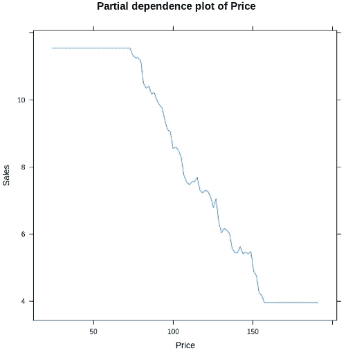

显示下降趋势的价格 PDP

但是，因为部分相关图假设预测因子是独立的，所以当预测因子相关时，可能会给出误导性的结果。因此，最好使用与相关预测因子一起工作的累积局部效应图，因为它是无偏的。

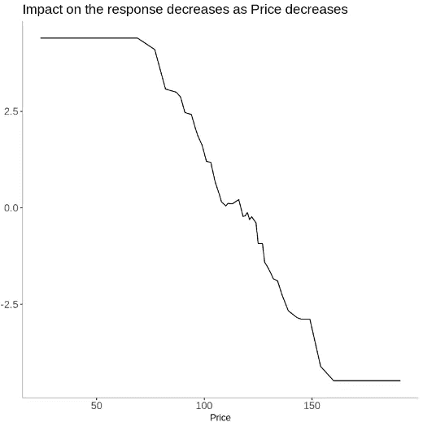

显示下降趋势的 ALE 价格图

与 PDP 不同，ALE 图的 y 轴以 0 为中心，表示平均预测值。因此，y 值的变化意味着不同的预测值如何影响相对于平均预测的响应。

# 参考

[1] Boehmke，B. (2020 年 2 月 1 日)。*和 r 一起动手机器学习*。第十二章梯度推进。https://bradleyboehmke.github.io/HOML/gbm.html.

[2]j .布朗利(2020 年 12 月 2 日)。*用于机器学习的 Bagging 和随机森林集成算法*。机器学习精通。https://machine learning mastery . com/bagging-and-random-forest-ensemble-algorithms-for-machine-learning/。

[3] H20。(未注明)。*可变重要性*。可变重要性——3.32.1.5 H2O 文件。[https://docs . H2O . ai/H2O/latest-stable/H2O-docs/variable-importance . html](https://docs.h2o.ai/h2o/latest-stable/h2o-docs/variable-importance.html.)

[4]詹姆斯·g .(2021)。*统计学习简介:r 中的应用*。斯普林格。

[5]莫尔纳尔，C. (2021 年 8 月 4 日)。*可解释的机器学习*。5.4 累积局部效应(ALE)图。[https://christophm . github . io/interpretable-ml-book/ale . html](https://christophm.github.io/interpretable-ml-book/ale.html.)

[6]宾夕法尼亚州。(未注明)。 *11.8.2 —最小成本复杂性修剪:Stat 508* 。宾夕法尼亚州立大学:统计学在线课程。[https://online.stat.psu.edu/stat508/lesson/11/11.8/11.8.2.](https://online.stat.psu.edu/stat508/lesson/11/11.8/11.8.2.)

[7] YouTube。(2019).*梯度推进决策树算法讲解*。 *YouTube* 。[https://www.youtube.com/watch?v=3zEqUSf5duw.](https://www.youtube.com/watch?v=3zEqUSf5duw.)