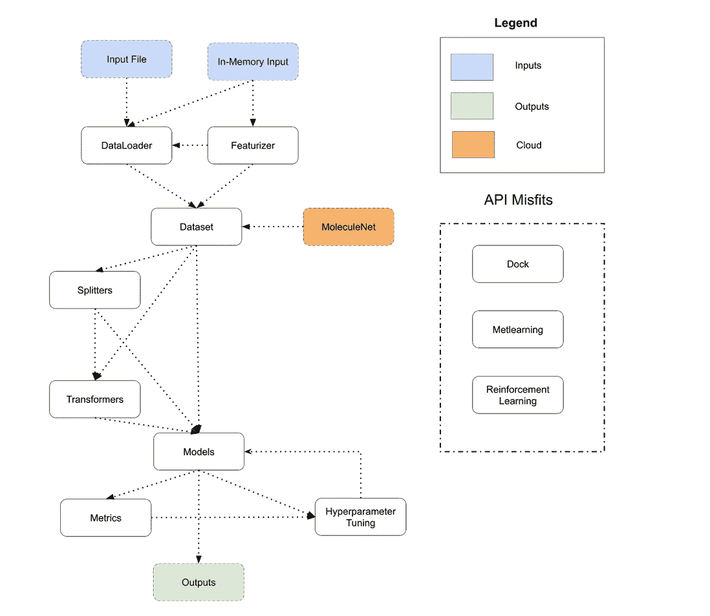

# DeepChem 简介——在科学中驱动人工智能

> 原文：<https://medium.com/codex/introduction-to-deepchem-driving-ai-in-science-83fe52f7c34?source=collection_archive---------18----------------------->

在 2020 年东京奥运会上，许多田径项目的记录和个人最好成绩都被打破。对于制造表面和人造草皮系统的意大利公司 Mondo 来说，这是一次不同寻常的胜利。东京使用的跑道表面花了将近三年时间——测试不同的版本，寻找材料，试验不同的橡胶，收集运动员对表面的反馈。

传统上，科学问题的解决方案是通过实验研究找到的。它包括进行长时间的实验，分析信息并以理论为依据。这使得寻找解决方案所需的时间和资源成本很高。例如，为了找到一种治疗疾病的新药，可能的药物数量非常多，这导致寻找一种救命药物的成本很高。结合基于创建数据集的理论的模拟和计算等方法，深度学习可以帮助使用人工智能算法来找到科学问题的解决方案。

机器学习方法可以帮助将问题框定为预测或分类任务。这可能是预测一种疾病的新药或者
根据结构特性发现新材料等等。为此，DeepChem 是一个加速人工智能在科学中应用的工具。

深度学习在科学中的使用存在障碍。DeepChem 有助于减少在科学中使用深度学习/人工智能的障碍。在博文的其余部分，我们将讨论 DeepChem 如何帮助科学家、研究人员和工程师将深度学习应用于科学。

机器学习方法的成功取决于所使用的数据集。
为了将深度学习应用于一个科学问题，人们需要收集数据，对数据进行特征化、拆分和转换以用于学习任务。DeepChem 在这一过程的所有阶段都提供帮助。对于数据集，用户可以使用自己的数据集或使用 [MoleculeNet](https://deepchem.readthedocs.io/en/latest/api_reference/moleculenet.html) 数据集套件提供的数据集来评估他们的方法。

特征化有助于以适合机器学习应用的形式来表示数据点。没有一种标准的特征化技术可用于所有数据集。例如，像
预测分子的反应能量这样的问题需要将分子特征化，而蛋白质折叠需要以不同的方式将分子特征化。DeepChem 提供了一套[特征](https://deepchem.readthedocs.io/en/latest/api_reference/featurizers.html)，科学家可以在移动中使用它们的数据集进行深度学习应用。

对于大多数传统的机器学习问题，数据点被随机分为训练有效测试或 k 倍分裂进行评估。但是将数据点随机分成训练测试组和有效组对于科学任务并不总是有用的。DeepChem 提供了一个`deepchem.splits` API，用于以科学的方式分割数据集。例如，让我们考虑用于药物发现的分裂分子的任务。有小分子(0-100 个原子)和大分子(> 100 个原子)。理想的拆分包含与原始数据集中相同比例的小分子和大分子。在不平衡的数据集中，这并不总是通过随机分割来实现。DeepChem 有助于根据数据的特征属性(在本例中为原子数量)来拆分数据，以获得有科学意义的拆分。

DeepChem 也有一个`[deepchem.trans](https://deepchem.readthedocs.io/en/latest/api_reference/transformers.html)`帮助转换特性(最小最大转换器等)。所有这些没有 DeepChem 都需要安装和使用各种库。DeepChem 通过统一的 DeepChem API
提供关键库函数的功能，并将其作为一个软件包提供，使科学家、工程师和其他用户更容易上手。

在对数据集中的分类和回归任务进行预测时，
可以使用 DeepChem 提供的[模型套件](https://deepchem.readthedocs.io/en/latest/api_reference/models.html)，也可以构建自己的模型。DeepChem 支持包装来自其他机器学习框架的各种模型，如 Tensorflow、PyTorch、jax、scikit-learn 等，使其适用于不同的科学应用。用户还可以从其他框架中集成自己的机器学习模型，以便更容易地与 DeepChem framework 集成和使用。

度量有助于评估机器学习模型。DeepChem 提供 scikit-learn 的标准指标作为`[deepchem.metrics](https://deepchem.readthedocs.io/en/latest/api_reference/metrics.html)` API 的一部分，以及其他用于科学的指标，如 BEDROC score。对于无法直接学习的超参数调整，DeepChem 提供了超参数优化算法，可在验证步骤中使用，使参数调整更加容易。DeepChem 还集成了其他工具，如 Weights&bias，这有助于实验跟踪、数据集版本和模型管理。

DeepChem 的当前设计。来源:[https://deepchem.io/](https://deepchem.io/)

总的来说， [DeepChem](https://deepchem.io/) 是一个强大的工具，可以在科学中驱动 AI。除了在化学信息学和药物发现方面的核心优势之外，它目前正在开发中，以解决半导体、材料科学、生物信息学和许多其他应用领域的问题。

**取得联系**

*你可以通过* [github](https://github.com/deepchem/deepchem/) *和* [gitter](https://gitter.im/deepchem/Lobby) 与 DeepChem 社区取得联系。*关于 DeepChem 教程，可以访问* [这里](https://github.com/deepchem/deepchem/tree/master/examples/tutorials) *和* [YouTube](https://www.youtube.com/channel/UC7vfLuO_kmlq5ExUH9k3s8w) *频道。也可以在* [*推特*](https://twitter.com/deep_chem) *关注 DeepChem。*