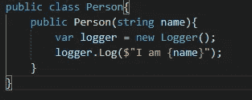
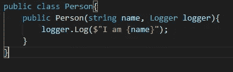
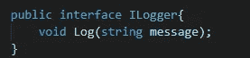
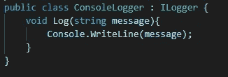
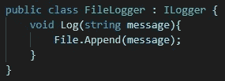
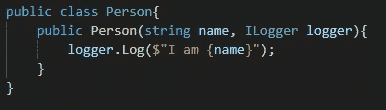
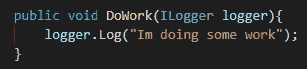

# 依赖注入简介

> 原文：<https://medium.com/codex/introduction-to-dependency-injection-ca4099cf225f?source=collection_archive---------10----------------------->

你好。

这是一种解释什么是依赖注入并探讨以下主题的快速简单的方法:

1.  什么是依赖注入？
2.  类中的依赖注入
3.  函数中的依赖注入
4.  优势
5.  不足之处
6.  依赖注入容器(简要提及)

# **什么是依赖注入？**

名字可能看起来很复杂，但是如果您构建了比“Hello World”更复杂的应用程序，那么您可能已经在使用依赖注入了。

依赖注入是软件工程中的一种技术，其中一个对象接收它所依赖的已经初始化的其他对象。这些被称为依赖。

# 类中的依赖注入

通常你的对象会在构造函数中自己初始化它的所有属性，但是这种方法迫使你的对象知道如何实现其他对象，有时候你不想处理这些。处理日志就是一个很好的例子。

在上面的代码中，仅仅通过这个简单的代码，您就已经使用了依赖项，但是在将来使用这种类型的实现时，您可能会遇到一些问题:

1.  您正在对象内部初始化一个新的 Logger 实例，并且 Person 的每个后续实例也将初始化另一个 Logger 对象。这可能会导致一些开销。
2.  您的 Person 对象负责初始化它的 Logger 对象，因此如果将来该对象发生更改，您需要记住并返回到 Person 类进行必要的更改。

你可以这样做:

正如您现在看到的，构造函数需要一个 logger 对象，所以您仍然依赖 logger 类，但是您不再需要处理 logger 对象的初始化和配置，并且可以专注于记录重要的信息。

这对于一次性应用程序来说已经足够好了，但是如果你认为你正在开发的应用程序将会是下一个百万美元的应用程序，你可以更进一步，再抽象一点。

我们可以传递接口 ILogger，而不是传递 Logger 类的具体实现。对于您的 Person 对象，一切都将像以前一样工作，但是现在您可以根据您开发的内容灵活地更改 logger 实现和策略。

如果您只是测试您的应用程序，您可以使用只记录到控制台的 ConsoleLogger，如果您正在开发 web 应用程序，您可以使用记录到文件的 FileLogger，甚至是两者都做的 HybridLogger。

你能想到的任何类型的日志都可以被实现，你的 Person 对象并不关心它是如何实现的，他所关心的是你有一个名为 log 的方法，通过这个方法，对象知道它的消息将被记录。

让我们从非常简单的 ILogger 接口开始:

然后我们的 ConsoleLogger 实现:

然后我们的文件记录器实现:

现在我们回到 Person 类，让对象依赖于 ILogger:

好了，我们有一个依赖注入的例子，有一些松散耦合的代码。

# 函数中的依赖注入

您也可以在您的函数中使用这种技术，原理是相同的，您不希望只是为了记录一些信息而处理 logger 对象的初始化，所以您应该这样做:

也许在某些用例中，你不想将日志程序注入到对象中，而只需要在一个函数中使用它，这是一个很好的方法。

# DI 的优势

依赖注入的所有优点都是代码解耦的结果，使其更加灵活:

*   简化单元测试，因为具体对象可以用存根或模拟来替换。
*   减少了样板代码，因为依赖项只在一个地方创建。
*   允许并发开发，不同的开发人员可以在相互使用的类上工作，因为他们需要知道类(接口)之间的“绑定契约”。

# DI 的缺点

解耦代码就像一把双刃剑，既有优势，也有劣势:

*   代码可能变得难以跟踪。代码的复杂性从类本身转移到了类之间的链接。
*   需要更多的开发工作。即使你曾经有过一个(1)实现，你也会使用很多接口。
*   可能会鼓励对框架的依赖，尤其是当你使用 DI 容器的时候。

# 依赖注入容器

容器本身是一个类，它知道如何初始化和配置对象，也知道哪些对象需要注入依赖关系

在一个框架中，阿迪容器由框架本身管理，你只需要在接口和它们的具体接口之间注册一个链接。例如，在上面的例子中，您会告诉容器，对于任何需要 ILogger 的对象，容器都应该返回一个 ConsoleLogger。

在大多数情况下，您不需要这个容器，但是知道它的存在是很好的，如果需要的话(一个有许多不同对象要管理的大项目)，您应该考虑它。

我希望你喜欢读我的文章。请让我知道我说的是不是错了，或者是不是有什么应该提到的。

下次见。