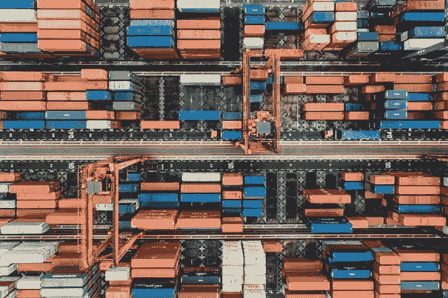

# 分布式系统中的架构

> 原文：<https://medium.com/codex/introduction-to-distributed-systems-66502ac8289?source=collection_archive---------4----------------------->

由 [Unsplash](https://unsplash.com) 上的 [CHUTTERSNAP](https://unsplash.com/@chuttersnap) 拍摄

T4:分布式系统已经成为一个时髦词汇有一段时间了。每个人都希望构建一个可伸缩、健壮和安全的系统或应用程序。因此，让我们了解更多关于分布式系统及其架构的知识。

在设计分布式系统时，从一开始就选择合适的体系结构来使系统茁壮成长是非常重要的。因此，让我们讨论分布式系统中四种最常见的架构。

## 客户端-服务器

在这种情况下，客户端通过请求联系服务器，服务器发送回所请求的数据。客户端足够聪明，能够理解如何请求数据、对数据进行后处理、格式化，然后将其提供给最终用户。

这种架构在我们日常的 web 应用程序中并不常见。尽管如此，当多个服务共享一个公共数据库服务器并直接从数据库请求数据时，这种情况仍然很普遍。

## 三层

三层架构是应用最广泛的架构之一。与客户机-服务器体系结构不同，三层体系结构中的客户机是无状态的。这种架构引入了一个保存业务逻辑的中间层。客户端与中间层交互，中间层与保存数据的服务器交互。中间层处理并格式化数据，然后将其发送回客户端。客户端不知道数据是如何从服务器获取的，这使得它成为无状态的。大多数 web 应用程序都是三层应用程序。

## n 层

n 层架构也称为多层架构。它是三层架构的扩展，n 层应用程序是中间层与另一个服务交互以获取信息的地方。当系统中有多个独立的业务逻辑时，通常会出现这种情况。

n 层架构的一个经典示例是基于微服务的架构。每个服务对其信息负责，并且该服务与其他服务通信以获得所需的数据。因此，3 层应用程序通常会发展成 n 层应用程序。

## 点对点

对等体系结构通常是一个分散的系统。任务或工作负载在对等体之间划分。对等体既可以充当客户端，也可以充当服务器，它们相互通信以服务于请求。

P2P 架构流行例子是 BitTorrent 和比特币网络。

## 分布式系统的优势和挑战

好处:

*   水平可扩展性—由于计算在每个节点上独立进行，因此根据需要添加额外的节点和功能非常容易，而且通常成本低廉。
*   可靠性—大多数分布式系统都是容错的，因为它们可以由数百个协同工作的节点组成。如果一台机器出现故障，系统通常不会出现任何中断。
*   性能——分布式系统非常高效，因为工作负载可以分解并发送到多台机器上。

然而，分布式系统并非没有挑战。创建有效的分布式系统所需的复杂的架构设计、构建和调试过程可能令人难以置信。

挑战:

*   调度——分布式系统必须决定哪些作业需要运行、何时运行以及在哪里运行。调度程序最终会有局限性，导致硬件利用不足和不可预测的运行时间。
*   延迟—您的系统分布越广，通信延迟就越大。这通常会导致团队在可用性、一致性和延迟之间做出权衡。
*   可观察性—收集、处理、呈现和监控大型集群的硬件使用指标是一项重大挑战。

所以，现在我们对分布式系统实际上是什么以及它们做什么有了一些概念。在接下来的文章中，我将详细讨论这些架构。在这篇文章中，我写了很多没有图表或样本代码理论解释。我会试着在接下来的帖子中加入更多的视觉效果。敬请关注。快乐学习！:)